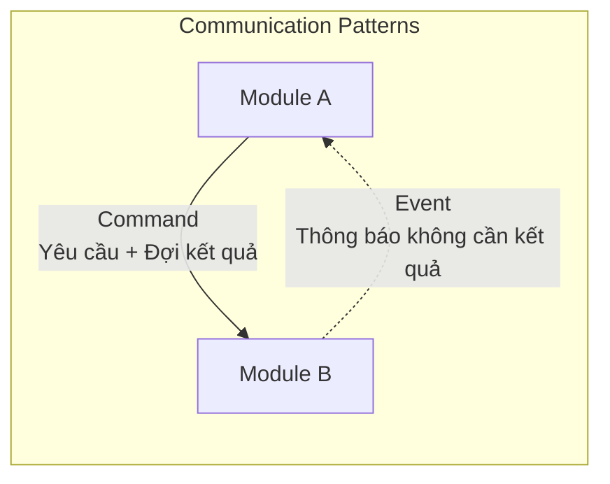
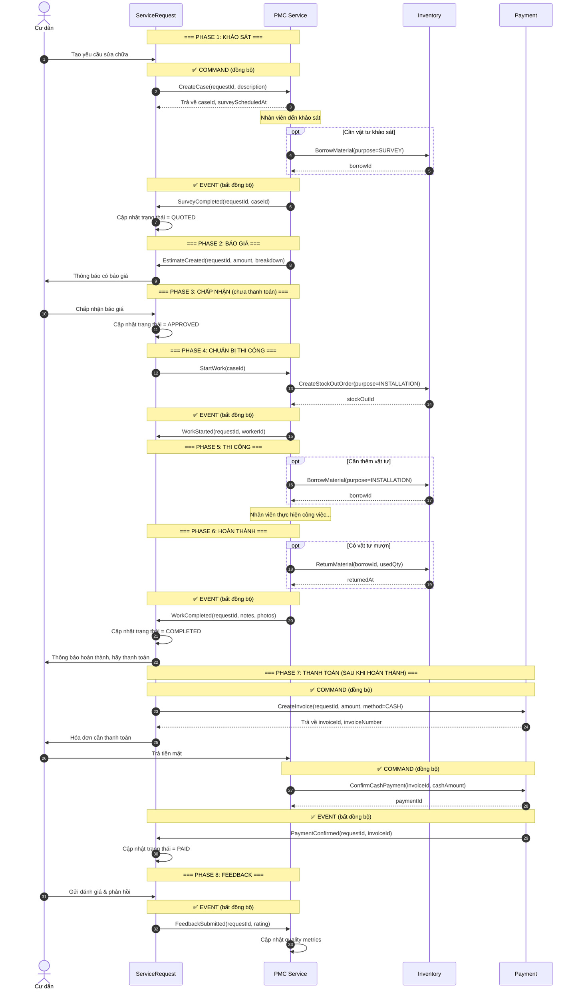
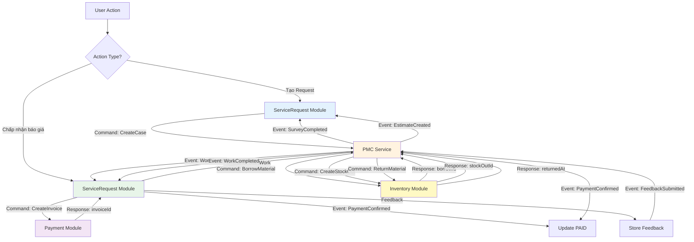

# Thiết Kế Kiến Trúc Hệ Thống - Residential Management

## Tổng Quan

Hệ thống được thiết kế theo kiến trúc **Modular Monolith** - một ứng dụng duy nhất nhưng được tổ chức thành các module độc lập, giao tiếp với nhau qua cơ chế Events và Commands rõ ràng.

### Lợi Ích

✅ **Dễ phát triển**: Bắt đầu với 1 ứng dụng đơn giản, triển khai nhanh chóng
✅ **Dễ bảo trì**: Mỗi module quản lý 1 nghiệp vụ riêng biệt, tách biệt rõ ràng
✅ **Dễ mở rộng**: Có thể tách thành microservices độc lập khi cần thiết
✅ **Giảm rủi ro**: Modules không phụ thuộc trực tiếp vào nhau

---

## Các Module Chính

```
┌─────────────────────────────────────────────────────────────────────┐
│                        APPLICATION                               │
│                                                                 │
│  ┌──────────────────┐  ┌──────────────────┐  ┌──────────────┐ │
│  │ ServiceRequest   │  │   PMC Service    │  │   Payment    │ │
│  │    Module        │  │     Module       │  │    Module    │ │
│  ├──────────────────┤  ├──────────────────┤  ├──────────────┤ │
│  │ • Requests       │  │ • Cases         │  │ • Invoices   │ │
│  │ • Feedback       │  │ • Surveys       │  │ • Cash Pay.  │ │
│  │ • Rating         │  │ • Estimates     │  │ • Online Pay.│ │
│  └──────────────────┘  │ • Work Orders   │  │ (Phase sau) │ │
│           │             │ • Workers       │  └──────────────┘ │
│           │             └──────────────────┘          │        │
│           │                    │                       │        │
│           │                    ▼                       │        │
│           │        ┌──────────────────┐              │        │
│           │        │ Inventory Module │              │        │
│           │        ├──────────────────┤              │        │
│           │        │ • Materials      │              │        │
│           │        │ • Stock In/Out  │              │        │
│           │        │ • Borrow/Return │              │        │
│           │        └──────────────────┘              │        │
│           │                    │                       │        │
│           └────────────────────┴───────────────────────┘        │
│                          │                                │
│                  ┌───────▼────────┐                       │
│                  │   Event Bus    │                       │
│                  └────────────────┘                       │
└─────────────────────────────────────────────────────────────────┘
```

### 1. **ServiceRequest Module** (Yêu Cầu Dịch Vụ)
**Trách nhiệm**:
- Tiếp nhận yêu cầu từ cư dân
- Quản lý trạng thái yêu cầu (từ tạo → hoàn thành)
- Thu thập feedback & đánh giá
- Điều phối flow giữa các module

**Dữ liệu quản lý**:
- Service Requests (yêu cầu)
- Feedbacks & Ratings (phản hồi & đánh giá)

---

### 2. **PMC Service Module** (Property Management Service)
**Trách nhiệm**:
- Quản lý khảo sát hiện trạng (Survey)
- Tạo và quản lý Case
- Tính toán ước lượng chi phí (Estimates)
- Quản lý tiến độ công việc
- Phân công nhân viên (Workers)
- Quản lý mượn/trả vật tư

**Dữ liệu quản lý**:
- Cases (vụ việc)
- Surveys (khảo sát hiện trạng)
- Estimates (ước lượng/báo giá)
- Work Orders (lệnh công việc)
- Workers (nhân viên)
- Material Borrows (phiếu mượn vật tư)

---

### 3. **Inventory Module** (Quản Lý Kho Vật Tư)
**Trách nhiệm**:
- Quản lý danh mục vật tư, tài sản
- Quản lý tồn kho
- Xử lý phiếu nhập/xuất kho
- Xử lý mượn/trả vật tư
- Kiểm kê kho

**Dữ liệu quản lý**:
- Materials (vật tư)
- Assets (tài sản)
- Stock In/Out Orders (phiếu nhập/xuất)
- Material Borrows (phiếu mượn)
- Stock Adjustments (điều chỉnh tồn kho)

---

### 4. **Payment Module** (Thanh Toán)
**Trách nhiệm**:
- Tạo hóa đơn (Invoice)
- Thanh toán tiền mặt (Cash) - Phase hiện tại
- Tích hợp cổng thanh toán online (VNPay, Momo...) - Phase sau
- Xác nhận thanh toán
- Quản lý giao dịch

**Dữ liệu quản lý**:
- Invoices (hóa đơn)
- Transactions (giao dịch)
- Payments (thanh toán)

---

## Cơ Chế Giao Tiếp Giữa Các Module

### Nguyên Tắc Thiết Kế

Các module **KHÔNG** gọi trực tiếp vào nhau. Thay vào đó, sử dụng 2 cơ chế:

1. **Commands** - Yêu cầu thực hiện hành động (đồng bộ, cần kết quả ngay)
2. **Events** - Thông báo sự kiện đã xảy ra (bất đồng bộ, không cần kết quả)



---

### So Sánh Commands vs Events

| Tiêu chí | Command | Event |
|----------|---------|-------|
| **Mục đích** | "Hãy làm X cho tôi" | "Tôi vừa làm X xong" |
| **Cách thức** | Đồng bộ (chờ kết quả) | Bất đồng bộ (fire & forget) |
| **Người nhận** | 1 module cụ thể | Nhiều modules lắng nghe |
| **Kết quả** | Trả về dữ liệu ngay | Không trả về |
| **Ví dụ** | CreateInvoice() | PaymentConfirmed |

---

### Ví Dụ Cụ Thể: Tạo Yêu Cầu Dịch Vụ (Full PMC Workflow)



---

## Quy Tắc Giao Tiếp

### ✅ ĐÚNG

**1. Commands cho hành động cần kết quả ngay**
```
ServiceRequest → PMC Service: CreateCase()
← Trả về: caseId, surveyScheduledAt

PMC Service → Inventory: BorrowMaterial()
← Trả về: borrowId, items[]

ServiceRequest → Payment: CreateInvoice()
← Trả về: invoiceId, invoiceNumber
```

**2. Events cho thông báo bất đồng bộ**
```
PMC Service → tất cả modules: SurveyCompleted
PMC Service → tất cả modules: EstimateCreated
PMC Service → tất cả modules: WorkCompleted
Payment → tất cả modules: PaymentConfirmed
```

**3. Sử dụng Interface để tách biệt modules**
```
Controller → PMCServiceInterface (không phải PMCService cụ thể)

PMCServiceInterface được implement bởi:
- LocalPMCService (hiện tại - cùng app)
- RemotePMCService (tương lai - microservice riêng)

→ Đổi implementation chỉ cần đổi config, không sửa code
```

---

### ❌ SAI

**1. Module gọi trực tiếp vào module khác**
```
❌ ServiceRequest import PMCService\Models\Case
❌ ServiceRequest::with('case') - quan hệ trực tiếp database
```

**Lưu ý**: PMC Service và Inventory cùng module nên có thể import trực tiếp:
```
✅ PMC Service import Inventory\Models\Material (cùng module)
✅ PMC Service::with('materials') - quan hệ trực tiếp database
```

**2. Dùng Event cho việc cần kết quả**
```
❌ ServiceRequest phát event "PleaseCreateCaseForMe"
❌ Phải chờ event reply "CaseCreatedWithId" → phức tạp!
✅ Nên dùng Command: CreateCase() → trả về ngay
```

**3. Foreign Key giữa modules**
```
❌ service_requests.case_id → FOREIGN KEY → cases.id
✅ service_requests.case_id → string reference (không có FK)
```

---

## Lợi Ích Của Thiết Kế Này

### 1. Tách Biệt Nghiệp Vụ Rõ Ràng
Mỗi module chỉ quan tâm nghiệp vụ của mình:
- **ServiceRequest**: Quản lý yêu cầu từ cư dân, điều phối flow
- **PMC Service**: Xử lý khảo sát, báo giá, phân công nhân viên
- **Inventory**: Quản lý vật tư, tồn kho, mượn/trả
- **Payment**: Xử lý thanh toán (tiền mặt → online sau)

### 2. Dễ Phát Triển & Bảo Trì
- Team khác nhau có thể làm việc trên module khác nhau
- Thay đổi trong 1 module ít ảnh hưởng modules khác
- Test từng module độc lập

### 3. Linh Hoạt Mở Rộng
**Kịch bản**: Hệ thống lớn, cần tách PropertyMaintenance thành app riêng

**Giải pháp**:
```
Bước 1: Deploy PropertyMaintenance service riêng
Bước 2: Đổi config: PMC_MODE=remote
Bước 3: Deploy lại app chính

→ KHÔNG CẦN sửa code logic nghiệp vụ!
```

### 4. Xử Lý Lỗi Tốt Hơn
Khi module khác gặp lỗi:
```
Command CreateCase() failed
→ ServiceRequest biết ngay lập tức
→ Cập nhật trạng thái = FAILED
→ Thông báo người dùng
```

---

## Database Schema

### Nguyên Tắc

Mỗi module có **schema riêng** (nhóm tables riêng):

```
ServiceRequest Module:
├─ service_requests
└─ feedbacks

PMC Service Module:
├─ cases
├─ surveys
├─ estimates
├─ work_orders
└─ workers

Inventory Module:
├─ materials
├─ assets
├─ stock_in_orders
├─ stock_out_orders
├─ material_borrows
└─ stock_adjustments

Payment Module:
├─ invoices
├─ transactions
└─ payments
```

### Liên Kết Giữa Modules

**KHÔNG dùng Foreign Key**, dùng **string reference**:

```sql
-- ✅ ĐÚNG
CREATE TABLE service_requests (
    id BIGINT PRIMARY KEY,
    case_id VARCHAR(255),        -- Tham chiếu, không có FK
    invoice_id VARCHAR(255),     -- Tham chiếu, không có FK
    status VARCHAR(50)
);

-- ❌ SAI
CREATE TABLE service_requests (
    id BIGINT PRIMARY KEY,
    case_id BIGINT,
    FOREIGN KEY (case_id) REFERENCES cases(id) -- ❌ Tạo phụ thuộc!
);
```

**Lý do**: Khi tách database riêng, Foreign Key sẽ không hoạt động.

---

## Event Flow Diagram



---

## Tóm Tắt

| Khía Cạnh | Giải Pháp |
|-----------|-----------|
| **Kiến trúc** | Modular Monolith |
| **Số lượng module** | 4 modules chính |
| **Giao tiếp** | Commands (sync) + Events (async) |
| **Database** | Shared database, logically separated |
| **Tách biệt** | Interface abstraction |
| **Mở rộng** | Có thể tách thành microservices sau |

---

## Kết Luận

Thiết kế này mang lại:

✅ **Đơn giản ban đầu**: Chỉ 1 ứng dụng, dễ deploy và quản lý
✅ **Rõ ràng về nghiệp vụ**: Mỗi module có trách nhiệm riêng
✅ **Linh hoạt**: Có thể tách module thành service riêng khi cần
✅ **Giảm rủi ro**: Modules không phụ thuộc trực tiếp nhau
✅ **Dễ maintain**: Team khác nhau làm việc trên module khác nhau

Đây là một kiến trúc **vừa đơn giản để bắt đầu, vừa linh hoạt để mở rộng** theo sự phát triển của doanh nghiệp.
