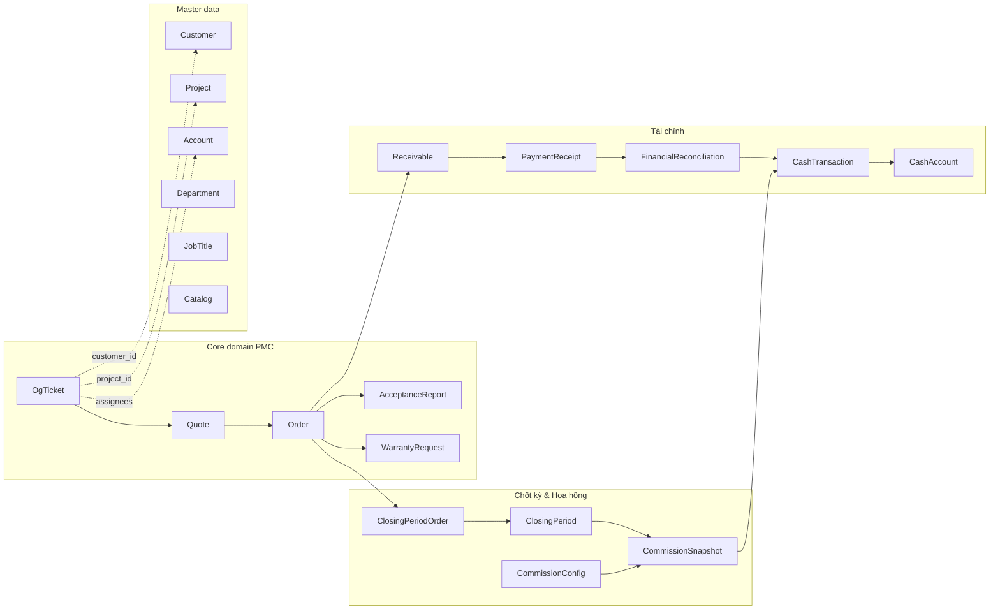
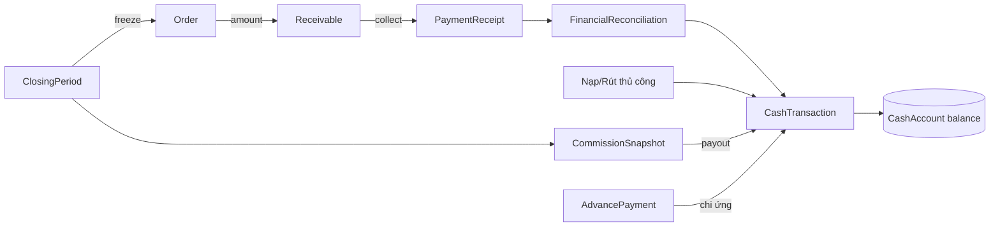
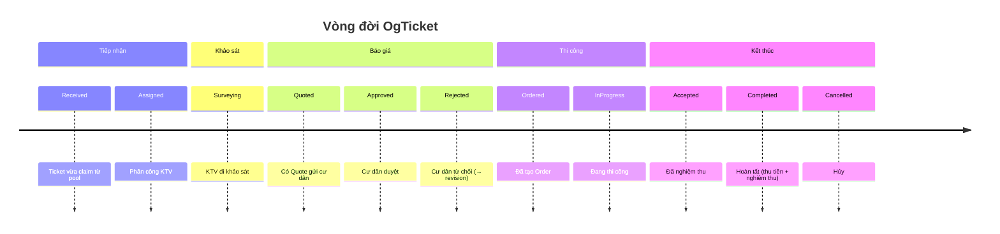

# 00 — Tổng quan hệ thống

## Bức tranh end-to-end

```mermaid
flowchart TB
    Start([Cư dân phát sinh yêu cầu])

    subgraph PhaseA[Giai đoạn 1: Tiếp nhận]
        A1[Gửi yêu cầu qua 4 kênh<br/>App/Web/Phone/Direct]
        A2[Platform Ticket Pool]
        A3[CSKH/Điều phối claim]
        A4[Tạo OgTicket<br/>find-or-create Customer]
    end

    subgraph PhaseB[Giai đoạn 2: Khảo sát & Báo giá]
        B1[Phân công KTV]
        B2[Khảo sát hiện trường]
        B3[Tạo Quote Draft]
        B4[Manager duyệt Quote]
        B5[Resident duyệt Quote]
    end

    subgraph PhaseC[Giai đoạn 3: Thi công & Nghiệm thu]
        C1[Tạo Order từ Quote]
        C2[Ứng vật tư]
        C3[Thi công InProgress]
        C4[Tạo AcceptanceReport]
        C5[Cư dân ký nghiệm thu<br/>qua share_token]
    end

    subgraph PhaseD[Giai đoạn 4: Tài chính]
        D1[Phát sinh Receivable]
        D2[Thu tiền PaymentReceipt]
        D3[Đối soát FinancialReconciliation]
        D4[Ghi CashTransaction]
    end

    subgraph PhaseE[Giai đoạn 5: Đóng kỳ & Hoa hồng]
        E1[Tạo ClosingPeriod]
        E2[Add Orders vào kỳ]
        E3[Close kỳ - Freeze + Snapshot]
        E4[Chi hoa hồng theo snapshot]
        E5[Báo cáo doanh thu/LN/CSAT]
    end

    Start --> A1 --> A2 --> A3 --> A4
    A4 --> B1 --> B2 --> B3 --> B4 --> B5
    B5 --> C1 --> C2 --> C3 --> C4 --> C5
    C5 --> D1 --> D2 --> D3 --> D4
    D4 --> E1 --> E2 --> E3 --> E4 --> E5
```

## Ma trận module ↔ chức năng

## Dòng dữ liệu tài chính

## 11 trạng thái OgTicket theo thời gian

## Liên kết các giai đoạn

- **Giai đoạn 1–3** sinh dữ liệu gốc (ticket, quote, order, nghiệm thu)
- **Giai đoạn 4** chuyển đổi order thành công nợ & dòng tiền
- **Giai đoạn 5** đóng sổ, tính hoa hồng, xuất báo cáo

Xem chi tiết từng giai đoạn ở các file `01` đến `13`.
