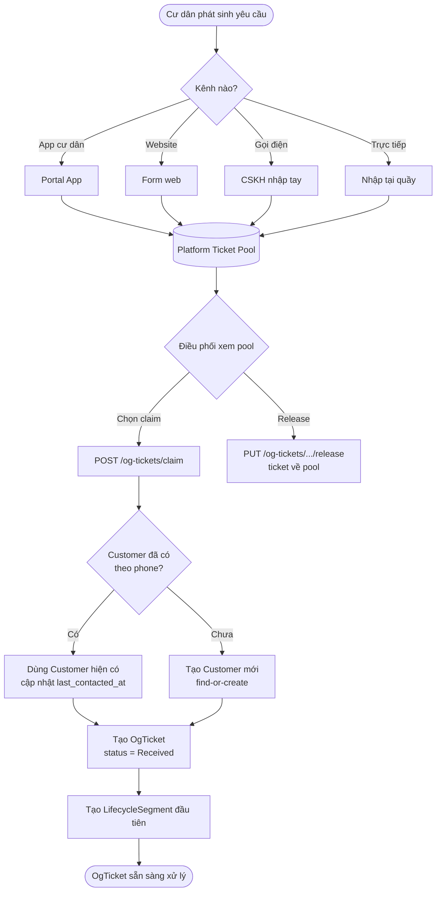
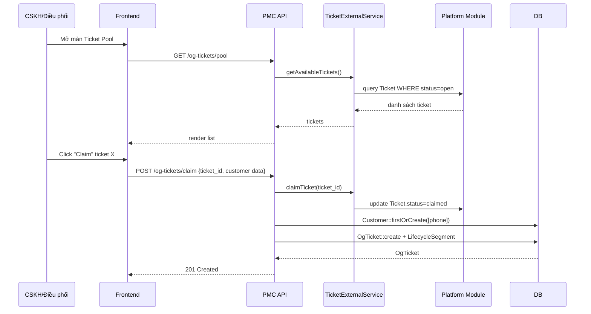

# 01 — Tiếp nhận ticket

## Nghiệp vụ

Cư dân phát sinh yêu cầu qua 1 trong 4 kênh → vào **Platform Ticket Pool** (hàng chờ chung) → CSKH/Điều phối **claim** → sinh **OgTicket** trong PMC (kèm tự động tạo/gắn Customer theo `phone`).

## Luồng tiếp nhận

## Sequence: Claim ticket

## Business rules quan trọng

1. **1 ticket Platform = 1 OgTicket PMC** (không claim 2 lần)
2. **Customer.phone unique tenant-wide** — 2 ticket cùng số điện thoại sẽ gắn về cùng Customer
3. **Release ticket** → `OgTicket.status = Cancelled`, Ticket về pool với status `open`
4. Khi claim, SLA (`sla_quote_due_at`) tự động tính từ `received_at + setting.og_ticket.sla_quote_minutes`
