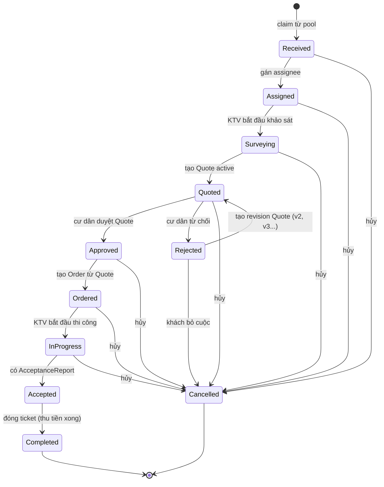
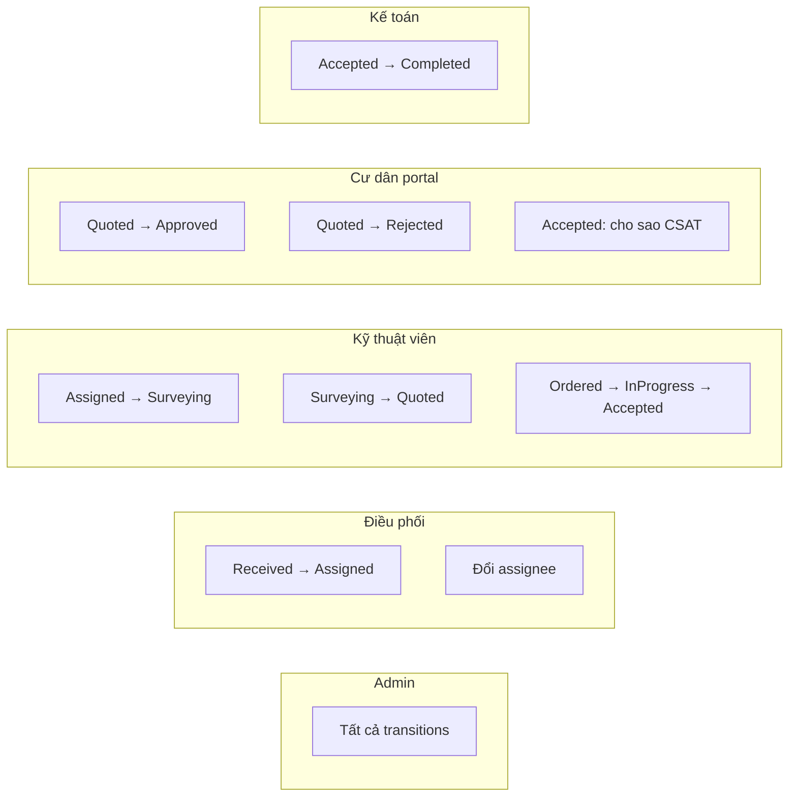
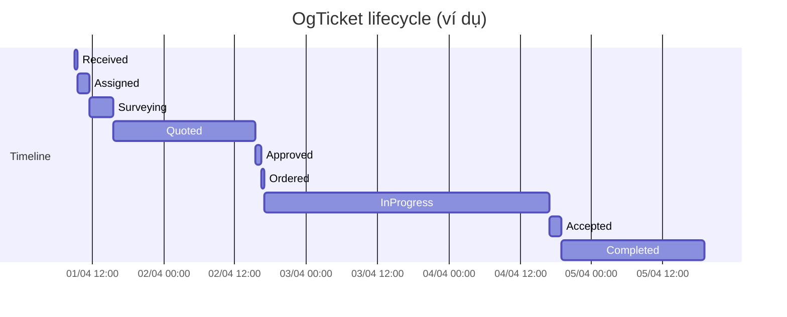

# 02 — OgTicket Lifecycle

## 11 trạng thái & workflow

## Bảng điều kiện chuyển trạng thái

| Từ → Đến | Điều kiện | Ai được phép |
|----------|-----------|--------------|
| Received → Assigned | có ít nhất 1 assignee | Admin, Điều phối |
| Assigned → Surveying | có lịch khảo sát (hoặc KTV check-in) | Admin, KTV |
| Surveying → Quoted | tồn tại `Quote.is_active=true` với status `Sent`+ | Admin, KTV |
| Quoted → Approved | `Quote.status = Approved` (resident đã duyệt) | Admin, Cư dân (portal) |
| Quoted → Rejected | `Quote.status = ResidentRejected` | Admin, Cư dân |
| Rejected → Quoted | tạo Quote mới (revision) | Admin, KTV |
| Approved → Ordered | có `Order` liên kết Quote | Admin |
| Ordered → InProgress | Order chuyển `Confirmed → InProgress` | Admin, KTV |
| InProgress → Accepted | Order liên kết chuyển `Accepted`; `AcceptanceReport` cần có bằng chứng (confirm qua share token hoặc file scan đã ký — không bắt buộc đồng thời với transition) | Admin, KTV |
| Accepted → Completed | `Receivable.status ∈ {Paid, Completed}` | Admin, Kế toán |
| `*` → Cancelled | bất kỳ trạng thái chưa Completed | Admin |

## Quyền theo role

## Lifecycle segment — audit chi tiết

Mỗi lần chuyển trạng thái sẽ đóng segment cũ (`ended_at`) và mở segment mới.

