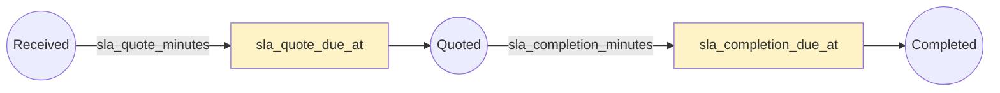
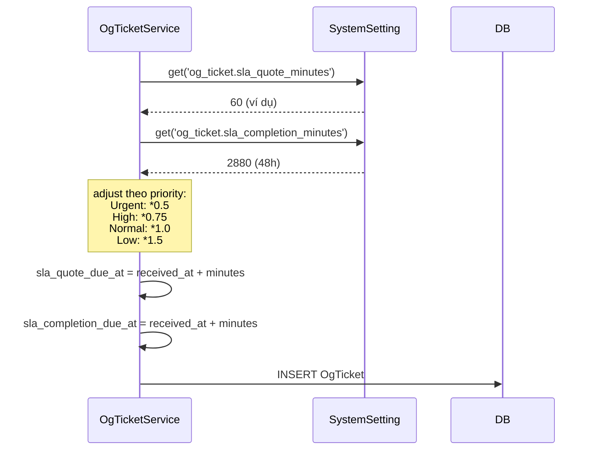
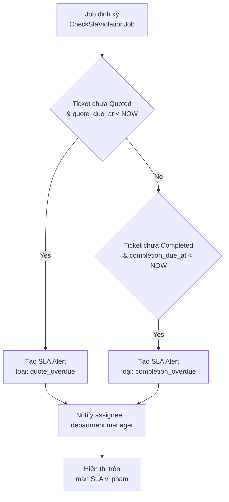

# 03 — SLA & cấu hình OgTicket

## Hai loại SLA

| SLA | Mốc bắt đầu | Mốc hoàn thành | Setting |
|-----|------------|----------------|---------|
| **SLA báo giá** | `received_at` | chuyển sang `Quoted` | `og_ticket.sla_quote_minutes` |
| **SLA hoàn thành** | `received_at` hoặc `ordered_at` | chuyển sang `Completed` | `og_ticket.sla_completion_minutes` |

## Tính SLA khi tạo ticket

## Cảnh báo & escalation

## Ma trận SLA theo priority (đề xuất)

| Priority | Hệ số | Quote SLA (phút) | Completion SLA (giờ) |
|----------|-------|------------------|---------------------|
| Urgent   | 0.5   | 30               | 24                  |
| High     | 0.75  | 45               | 36                  |
| Normal   | 1.0   | 60               | 48                  |
| Low      | 1.5   | 90               | 72                  |

## Category & phân loại

Ticket có thể gắn nhiều category (sửa chữa điện, nước, vệ sinh, bảo trì...) → dùng để phân tích báo cáo theo loại yêu cầu.

## Business rules

1. **SLA không reset khi reject báo giá** — vẫn tính từ `received_at` gốc để tránh KTV cố tình làm chậm.
2. **SLA tạm dừng khi `Cancelled`** — không vi phạm.
3. **Priority `Urgent`** cần được duyệt bởi manager trước khi gán (tránh lạm dụng).
4. **CSAT rating** chỉ mở cho cư dân khi ticket đã `Accepted` (trước khi `Completed`).
