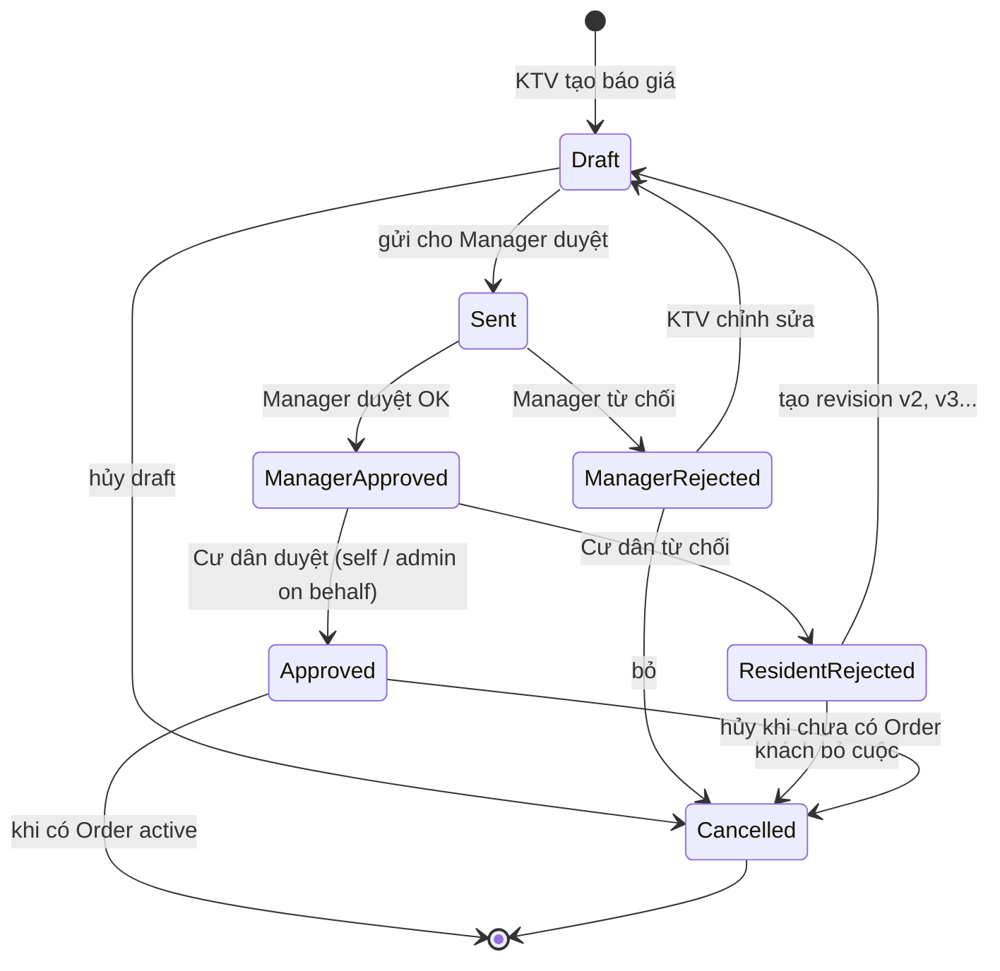
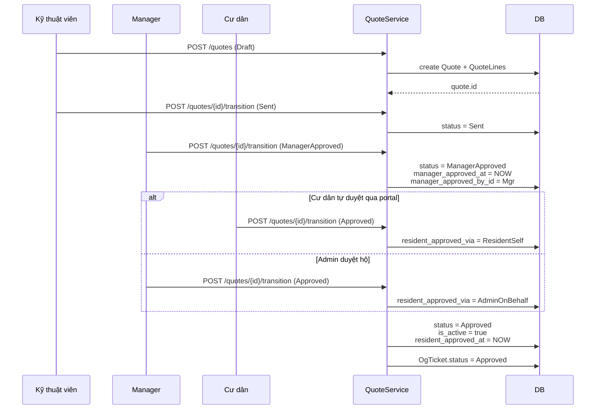
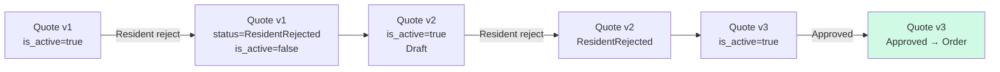
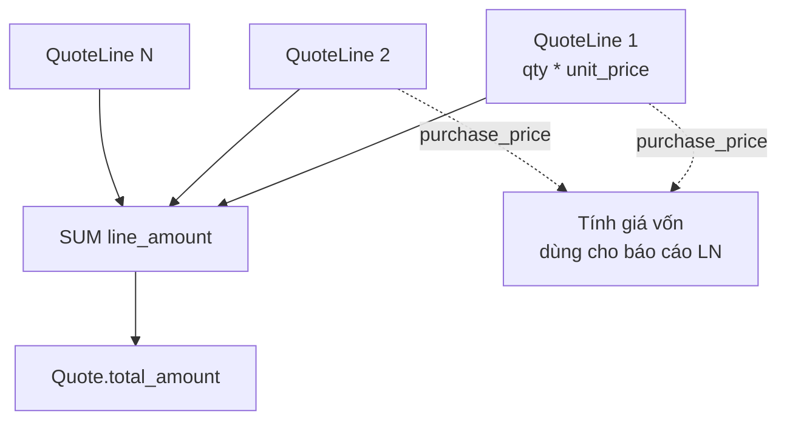

# 04 — Báo giá (Quote)

## State machine

## 2 cấp duyệt

## Versioning (revision)

**Rule**: trên 1 OgTicket tại 1 thời điểm **chỉ có 1 Quote `is_active=true`**. Khi tạo revision mới, quote cũ tự set `is_active=false`.

## QuoteLine types

| Line type | Ý nghĩa | `reference_id` trỏ tới |
|-----------|---------|----------------------|
| `Material` | Vật tư | `CatalogItem` |
| `Service` | Dịch vụ có trong danh mục | `ServiceItem` |
| `Adhoc` | Dịch vụ tự thêm (không trong danh mục) | null |

## Tính toán giá

- `unit_price`: giá bán cho cư dân
- `purchase_price`: giá vốn (giá nhập) — chỉ nội bộ, không hiện cho cư dân
- `line_amount` = `quantity * unit_price` (sau khi áp KM nếu có)

