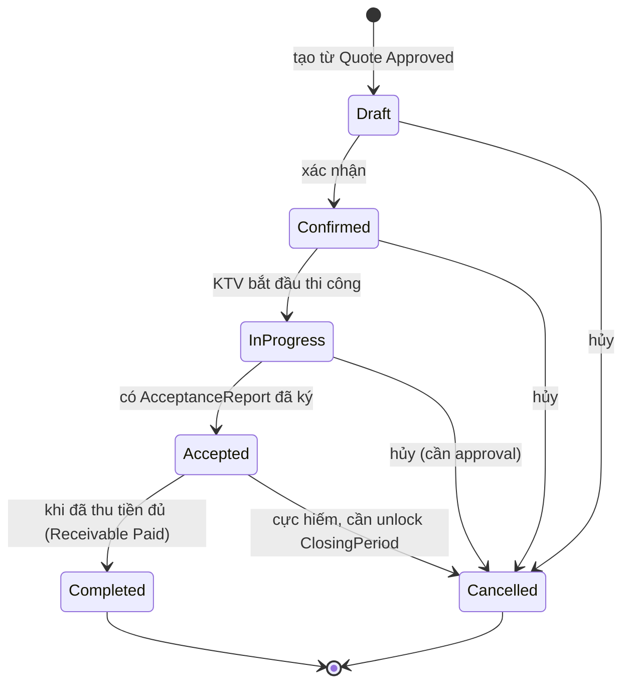
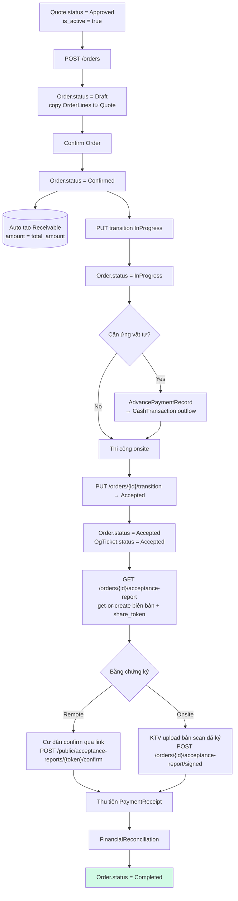
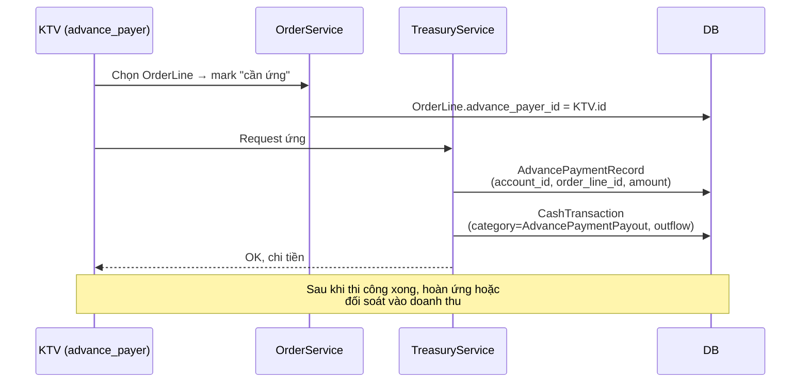
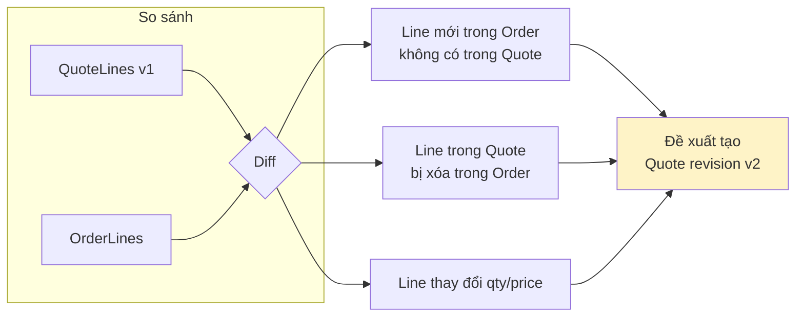
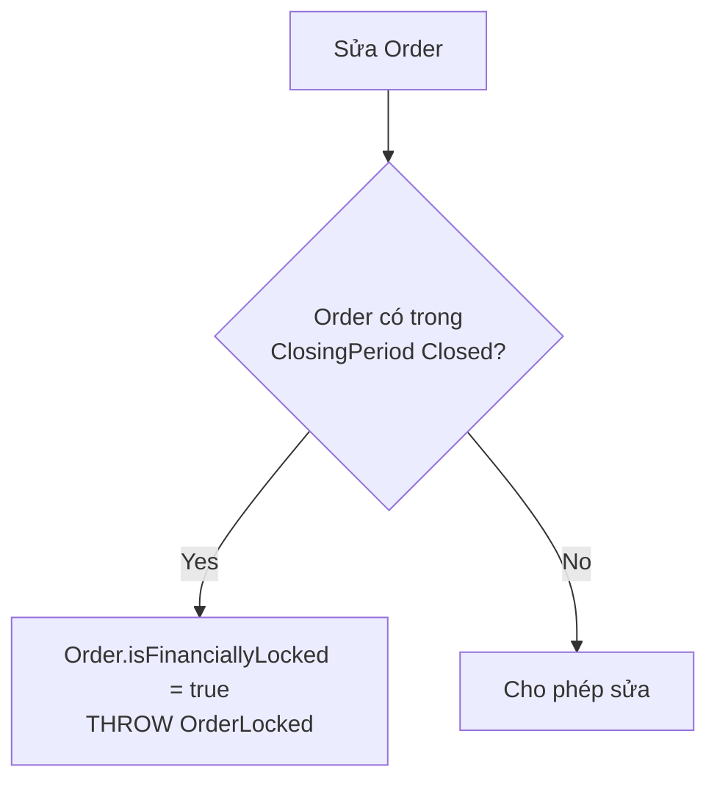

# 05 — Đơn hàng (Order)

## State machine

## Flow Quote → Order → Nghiệm thu → Thanh toán

## Ứng vật tư per OrderLine

## So sánh OrderLine vs QuoteLine gốc

Khi Order phát sinh (thêm/xóa/sửa line so với Quote approved), hệ thống cần:

**⚠ Gap hiện tại**: logic diff + đề xuất revision chưa rõ đã có trong codebase chưa.

## Financial locking

