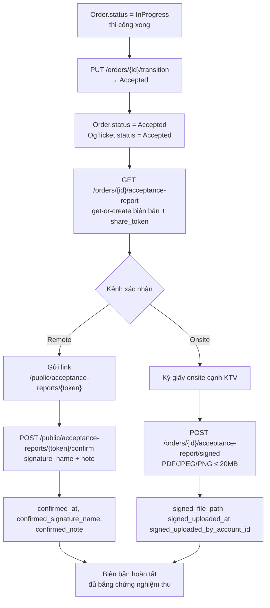
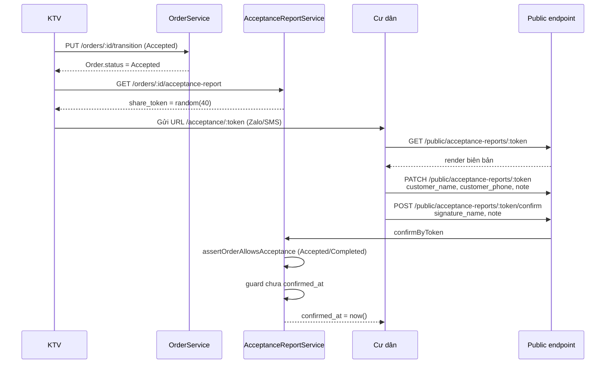
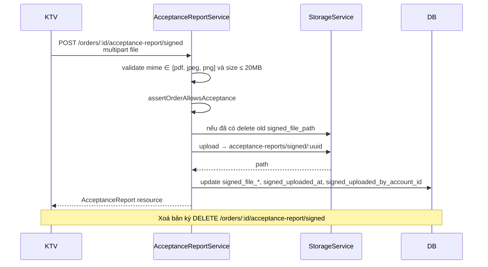
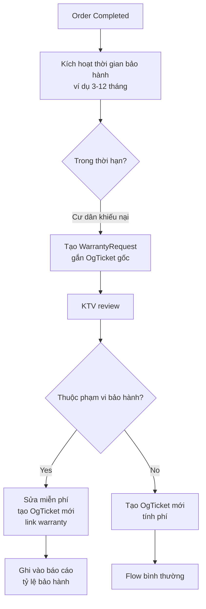
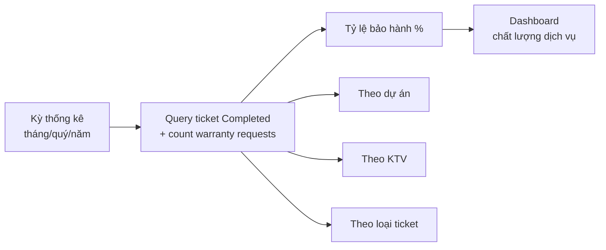

# 06 — Nghiệm thu & Bảo hành

## AcceptanceReport — biên bản nghiệm thu

Một `Order` có **0..1** biên bản nghiệm thu. Biên bản được dựng từ template HTML (tenant setting `acceptance_report.template_html`) và đóng vai trò **bằng chứng** cho việc Order đã chuyển sang `Accepted`. Có 2 kênh xác nhận song song:

- **Ký qua link (remote)** — cư dân mở `share_token`, điền chữ ký số + ghi chú → lưu `confirmed_at`, `confirmed_signature_name`, `confirmed_note`.
- **Upload bản scan (onsite)** — KTV ký giấy với cư dân tại công trình, rồi upload file PDF/ảnh → lưu `signed_file_path`, `signed_file_mime`, `signed_file_size`, `signed_uploaded_at`, `signed_uploaded_by_account_id`.

Cả 2 kênh đều chỉ thao tác được khi **Order đã ở `Accepted` hoặc `Completed`** (xem `AcceptanceReportService::assertOrderAllowsAcceptance`).



> Lưu ý: transition `InProgress → Accepted` hiện **không tự động** kiểm tra đã có AcceptanceReport hay chưa — là thao tác thủ công của KTV/Admin.

## Public share link — remote confirm



## Upload signed file — onsite



## Bảo hành (Warranty)



## Báo cáo tỷ lệ bảo hành

Công thức:
```
Tỷ lệ bảo hành = (Số ticket có WarrantyRequest / Tổng ticket Completed trong kỳ) × 100%
```



## Business rules quan trọng

1. **Order phải ở `Accepted` hoặc `Completed`** mới thao tác được biên bản (`assertOrderAllowsAcceptance`).
2. **Không cho confirm 2 lần** — nếu `confirmed_at` đã có thì block (`ACCEPTANCE_REPORT_ALREADY_CONFIRMED`).
3. **Transition `InProgress → Accepted` hiện không tự động kiểm tra** đã có biên bản hay chưa — là thao tác thủ công.
4. **2 kênh xác nhận song song**: ký từ xa qua `share_token` HOẶC upload bản scan đã ký onsite. Không bắt buộc cả hai cùng có.
5. **CSAT rating** chỉ mở cho cư dân khi ticket đã `Accepted` (trước khi `Completed`).
