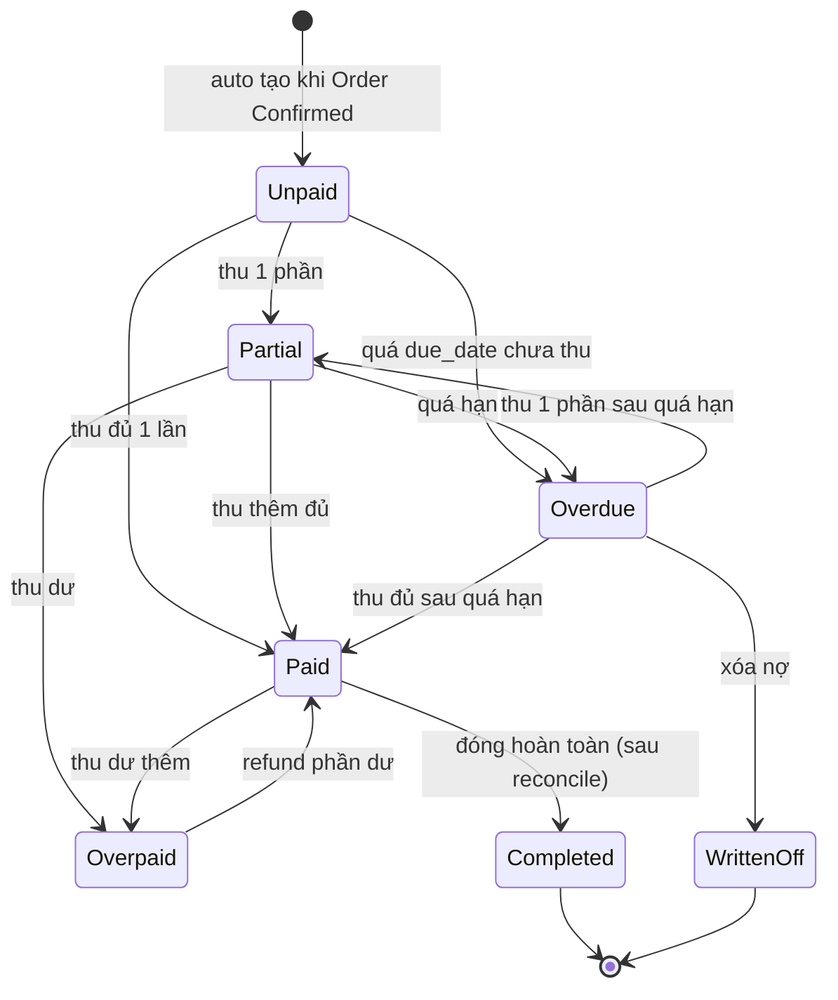
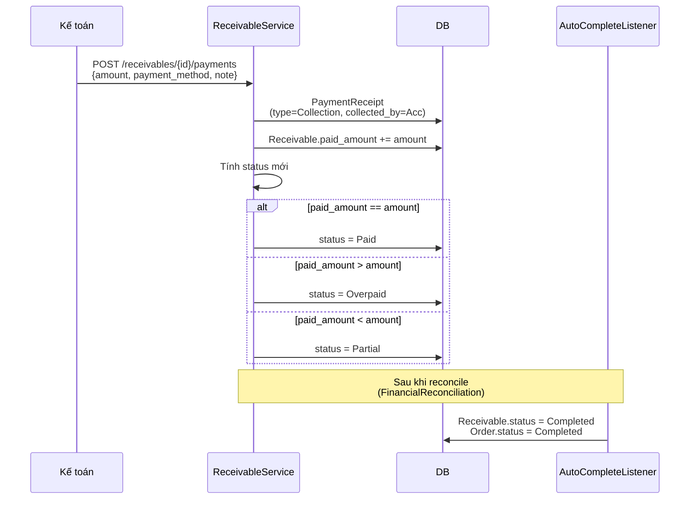
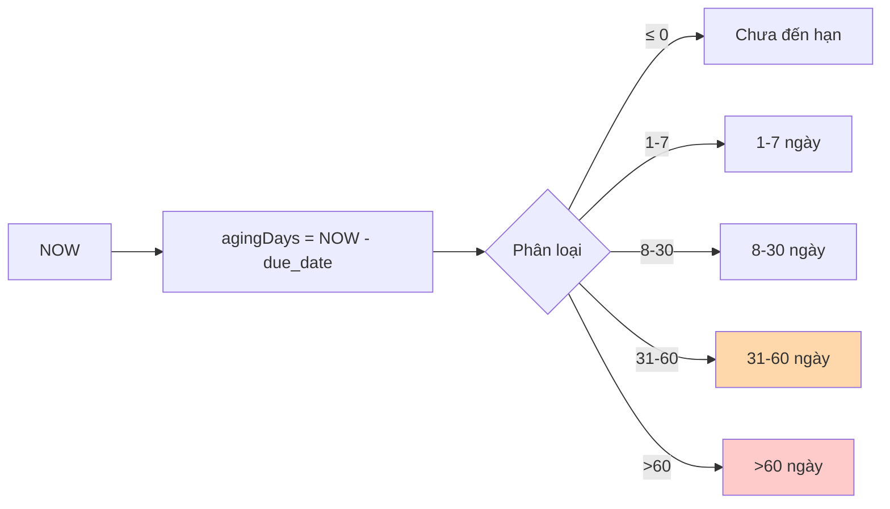
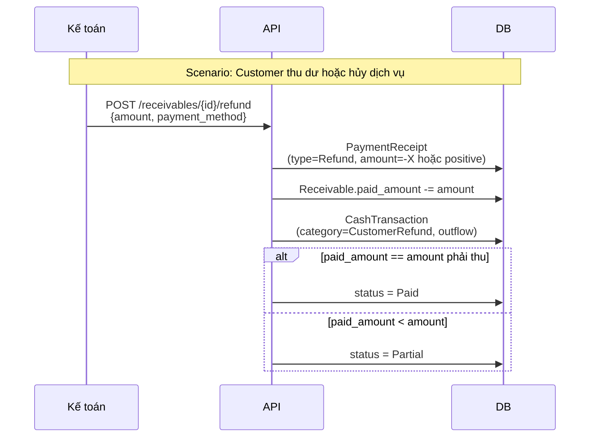
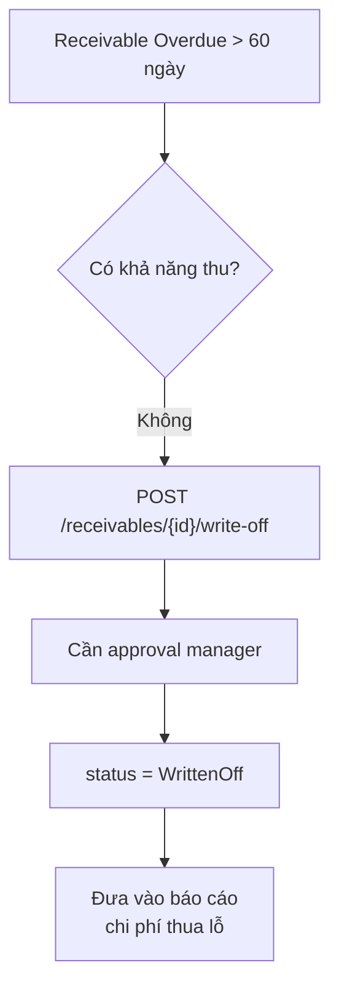

# 07 — Công nợ & Thanh toán

## State machine Receivable

## Luồng thu tiền

## Aging (tuổi nợ)

## Refund (hoàn tiền)

## Write-off (xóa nợ)

## Business rules

1. **Receivable auto tạo** khi `Order.status → Confirmed`
2. **Receivable.amount** = `Order.total_amount` (không thay đổi sau khi tạo)
3. **Overpaid** phải được refund trước khi Order có thể Complete
4. **Write-off** cần quyền `Receivable.WriteOff` + lý do + approval
5. **Completed** Receivable chỉ đạt được sau khi có đầy đủ reconciliation

