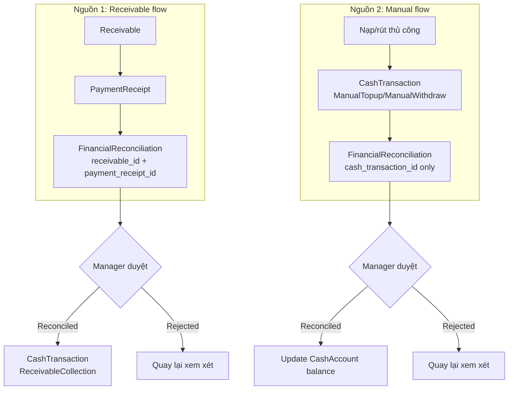
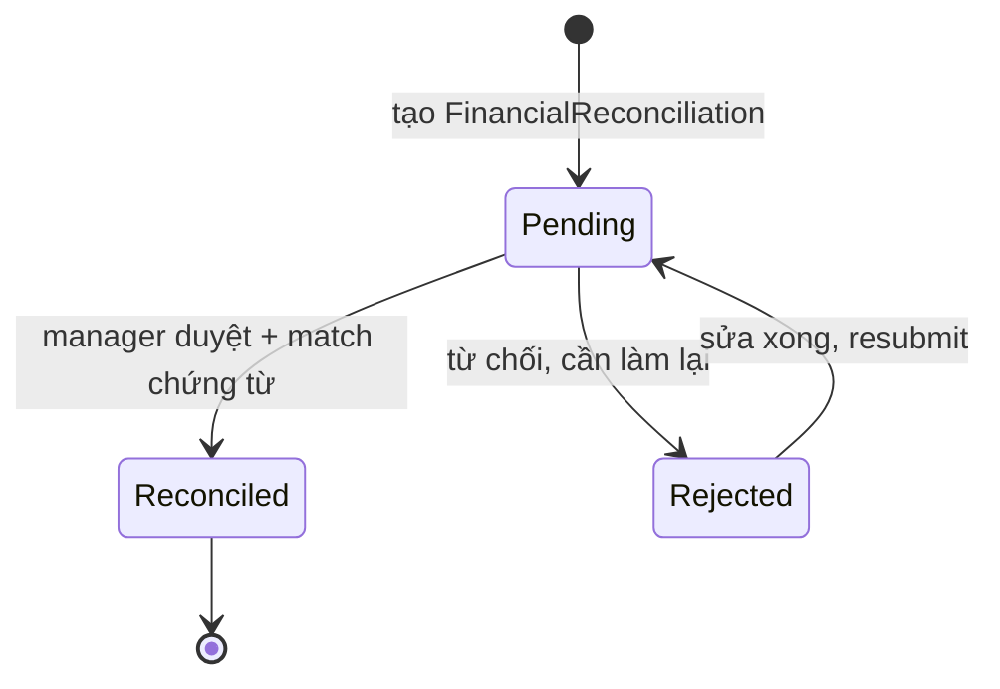
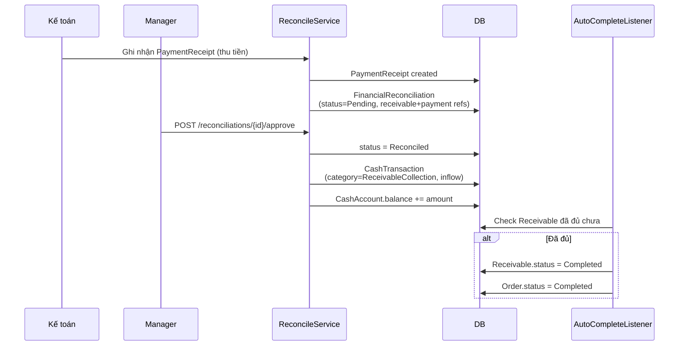
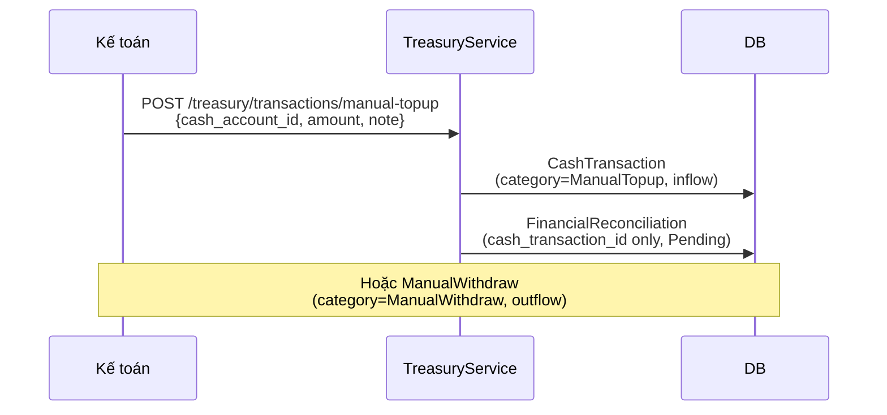

# 08 — Đối soát tài chính

## Dual-source reconciliation

Hệ thống cho phép đối soát từ **2 nguồn**:
1. **Từ PaymentReceipt** (auto-sourced) — thu từ cư dân qua đơn hàng
2. **Từ Manual CashTransaction** — nạp/rút thủ công không gắn receivable

## State machine

## Flow đối soát từ PaymentReceipt

## Flow đối soát nạp/rút thủ công

## Các loại CashTransaction gắn với Reconciliation

| Category | Direction | Nguồn | Reconcile? |
|----------|-----------|-------|-----------|
| `ManualTopup` | Inflow | Thủ công | ✅ (manual source) |
| `ManualWithdraw` | Outflow | Thủ công | ✅ (manual source) |
| `ReceivableCollection` | Inflow | PaymentReceipt | ✅ (receivable source) |
| `CustomerRefund` | Outflow | PaymentReceipt Refund | ✅ (receivable source) |
| `CommissionPayout` | Outflow | Commission snapshot | ❌ (không reconcile) |
| `AdvancePaymentPayout` | Outflow | AdvancePaymentRecord | ❌ (không reconcile) |

## Business rules quan trọng

1. **2 source song song**: receivable source (có `receivable_id` + `payment_receipt_id`) vs manual source (chỉ có `cash_transaction_id`).
2. **CashTransaction chỉ được sinh khi reconcile = Reconciled** — Pending không update CashAccount balance.
3. **Khi Reconciled**, listener tự kiểm tra Receivable đã thu đủ → tự đóng `Receivable.status = Completed` và `Order.status = Completed`.
4. **CommissionPayout / AdvancePaymentPayout không cần reconcile** — chi thẳng từ snapshot/record.
