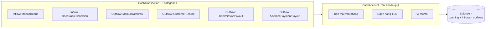
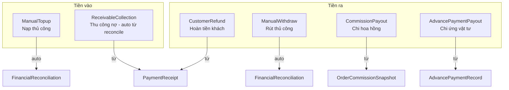
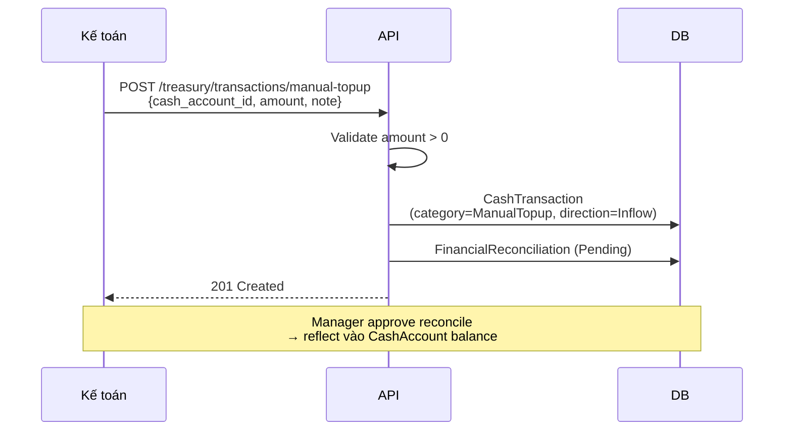
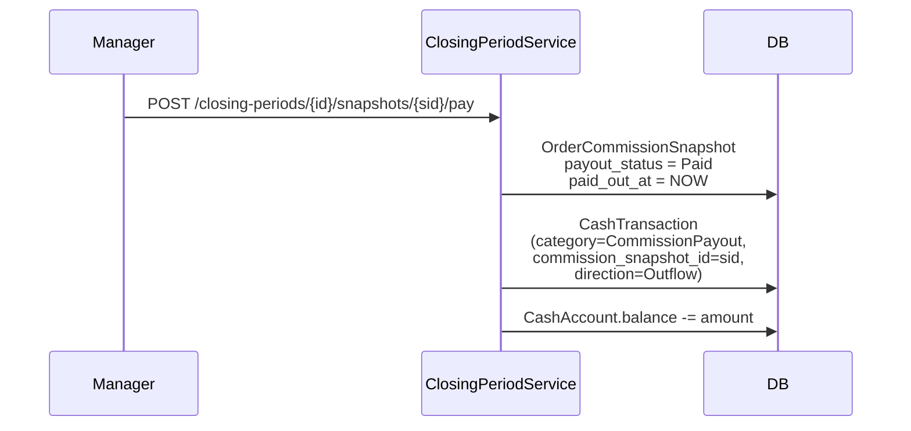
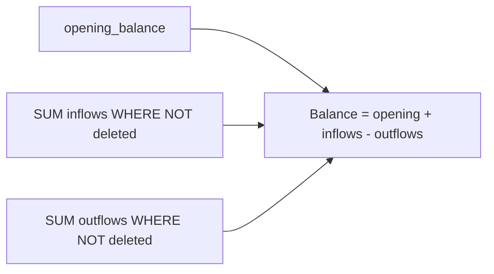

# 09 — Quản lý quỹ (Treasury)

## Tổng quan

## Matrix direction × category

## Phân loại chi tiết category

| Category | Direction | Nguồn dữ liệu | Manual/Auto | Required fields |
|----------|-----------|--------------|-------------|-----------------|
| `ManualTopup` | Inflow | User nhập | Manual | `cash_account_id`, `amount`, `note` |
| `ManualWithdraw` | Outflow | User nhập | Manual | `cash_account_id`, `amount`, `note` |
| `ReceivableCollection` | Inflow | PaymentReceipt (Collection) | Auto | `financial_reconciliation_id` |
| `CustomerRefund` | Outflow | PaymentReceipt (Refund) | Auto | `financial_reconciliation_id` |
| `CommissionPayout` | Outflow | OrderCommissionSnapshot | Auto | `commission_snapshot_id` |
| `AdvancePaymentPayout` | Outflow | AdvancePaymentRecord | Auto | `advance_payment_record_id` |

## Flow nạp/rút thủ công

## Flow chi hoa hồng (auto từ snapshot)

## Balance calculation

## Business rules quan trọng

1. **Chỉ Manual (`ManualTopup`/`ManualWithdraw`) được user soft delete** — auto-sourced phải xóa thông qua nguồn gốc (unwind reconciliation / snapshot).
2. **Auto-sourced** (`ReceivableCollection`, `CustomerRefund`, `CommissionPayout`, `AdvancePaymentPayout`) bắt buộc có FK liên kết nguồn (`financial_reconciliation_id` / `commission_snapshot_id` / `advance_payment_record_id`).
3. **Balance** = `opening_balance + SUM(inflows WHERE NOT deleted) − SUM(outflows WHERE NOT deleted)`.
4. **Manual topup/withdraw** vẫn cần Manager approve qua FinancialReconciliation trước khi reflect vào balance.
