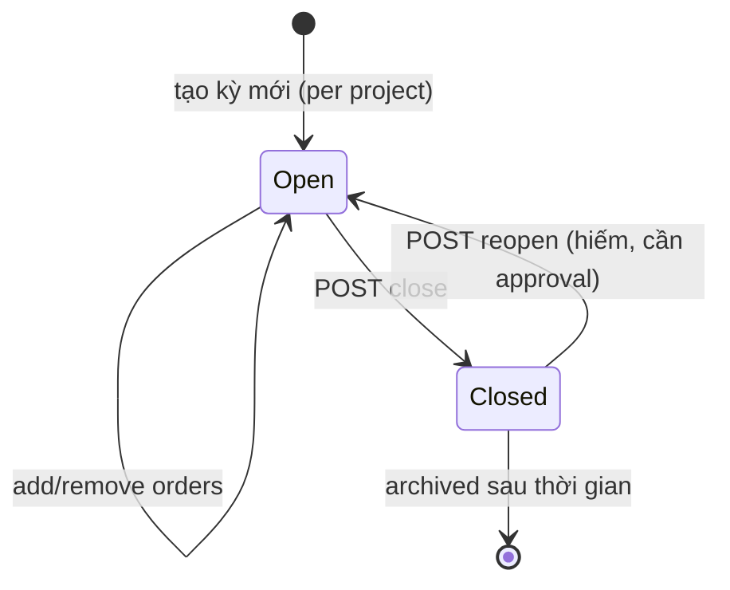
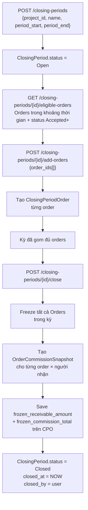
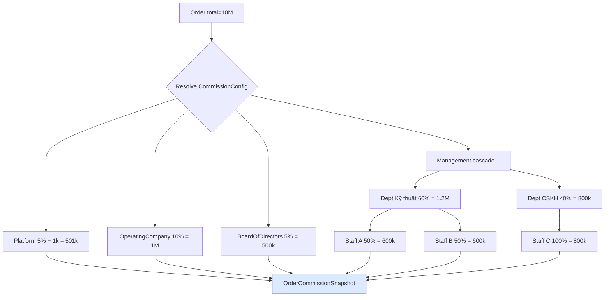
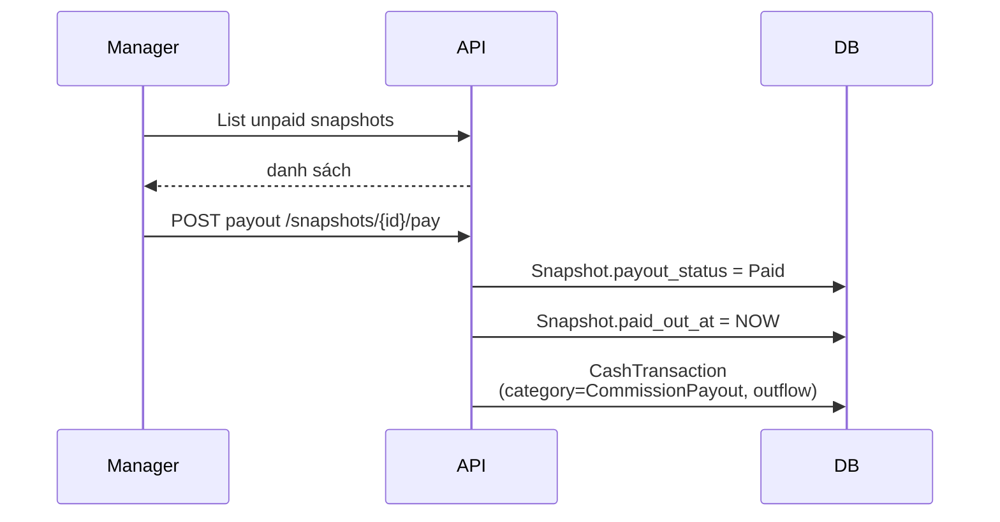
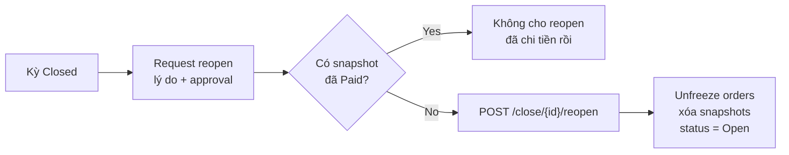

# 10 — Kỳ chốt phí (ClosingPeriod)

## Khác biệt với "kỳ kế toán" truyền thống

| Kỳ kế toán truyền thống | ClosingPeriod TNP |
|------------------------|-------------------|
| Theo tháng dương lịch cố định | Linh hoạt, per project, per khoảng thời gian |
| Tất cả giao dịch trong tháng tự vào kỳ | Chủ động chọn Order nào đưa vào kỳ |
| 1 kỳ toàn công ty | Nhiều kỳ song song (mỗi project có kỳ riêng) |

## Lifecycle

## Flow đóng kỳ

## Snapshot cho từng recipient

Khi close kỳ, resolve cấu hình hoa hồng (ProjectCommissionConfig) thành các snapshot cụ thể:

Mỗi row snapshot ghi nhận:
- **recipient_type**: Platform / OperatingCompany / BoardOfDirectors / Management / Department / Staff
- **account_id**: nếu là Staff cụ thể
- **recipient_name**: tên để hiển thị báo cáo
- **amount**: số tiền cụ thể tại thời điểm chốt
- **resolved_from**: JSON trace cách tính (để audit)
- **payout_status**: Unpaid → Paid

## Payout (chi hoa hồng)

## Reopen kỳ (hiếm)

## Business rules quan trọng

1. **1 Order chỉ thuộc 1 ClosingPeriod tại 1 thời điểm** — sau khi add vào kỳ Open, không thể add lại vào kỳ khác.
2. **Khi Close**: tự freeze tất cả Order trong kỳ (`isFinanciallyLocked = true`), tạo snapshot, lưu `frozen_receivable_amount` + `frozen_commission_total`.
3. **Order đã frozen** không cho PUT/DELETE/transition — kể cả admin (cần unlock kỳ trước).
4. **Reopen kỳ**: chỉ được khi **không có snapshot nào đã `Paid`** — lý do: chi tiền rồi không reverse được tự động.
5. **Delete kỳ Open**: chỉ được khi chưa có Order nào trong kỳ.
