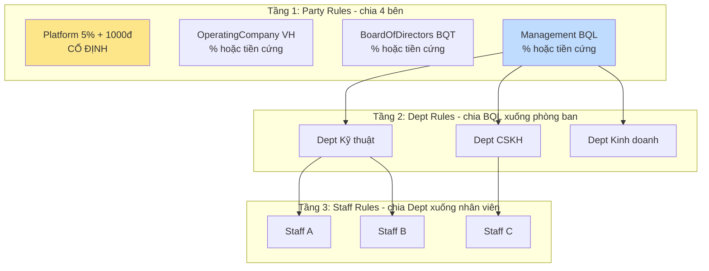
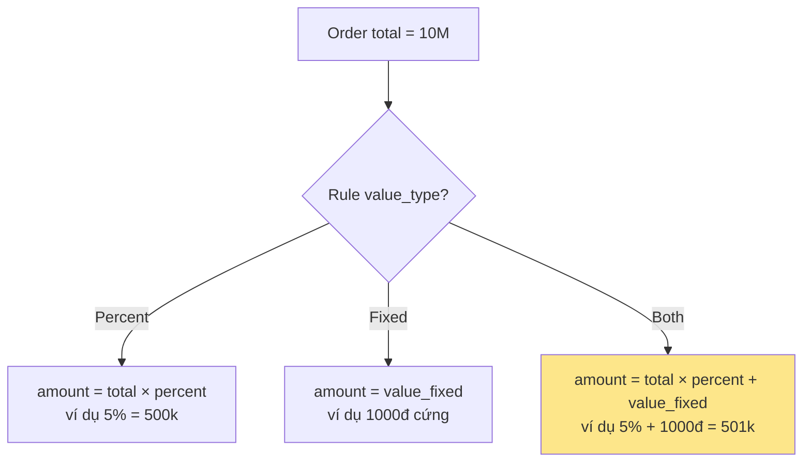
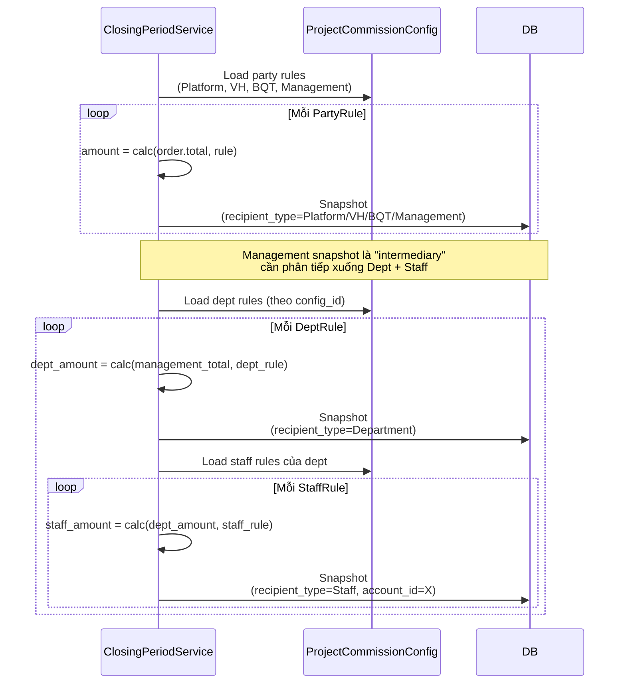
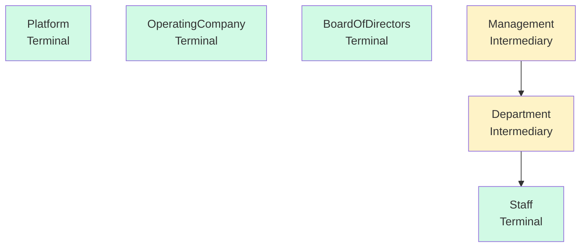
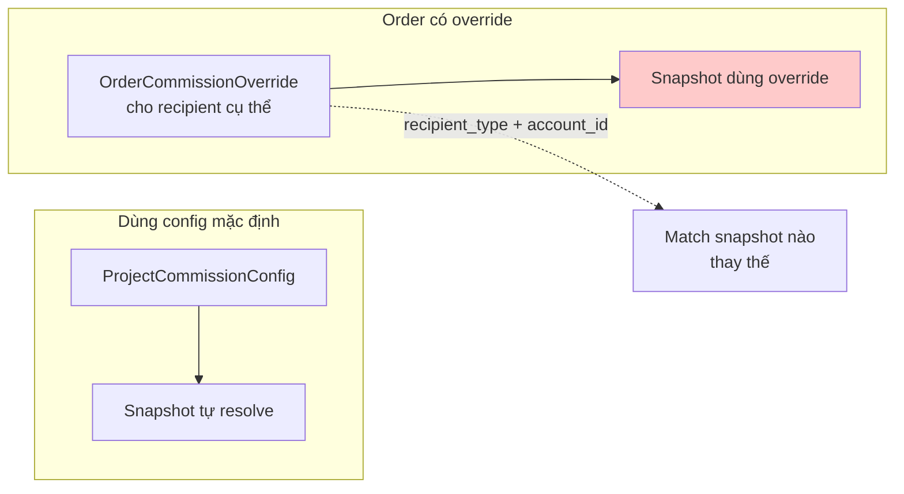
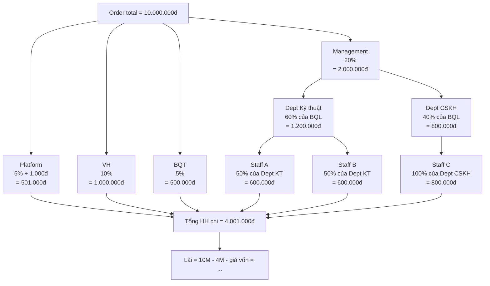
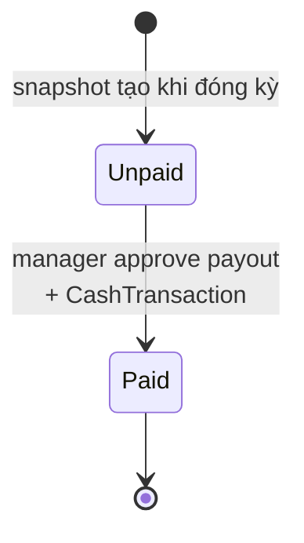

# 11 — Hoa hồng (Commission)

## Kiến trúc 3-tầng

## `value_type` = Percent / Fixed / Both

**Case đặc biệt Platform**: luôn là `Both` với `percent=5%, value_fixed=1000đ`.

## Flow resolve commission khi đóng kỳ

## Recipient type hierarchy

- **Terminal**: được chi trả trực tiếp (có payout)
- **Intermediary**: chỉ để phân cấp nội bộ, không chi trả trực tiếp

## Override per order

**Use case**: dự án đặc biệt, muốn trả hoa hồng hơn bình thường cho 1 KTV xuất sắc.

## Ví dụ tính hoa hồng (Order 10.000.000đ)

## Payout status

## Business rules quan trọng

1. **Platform luôn cố định 5% + 1.000đ** (`Both` value_type) — không cho cấu hình lại trong UI.
2. **Resolve hoa hồng chỉ chạy 1 lần khi Close kỳ** — sinh snapshot bất biến; sau đó sửa config dự án không ảnh hưởng kỳ đã đóng.
3. **Chỉ recipient `terminal`** (Platform / OperatingCompany / BoardOfDirectors / Staff) mới có payout. `Management`/`Department` là intermediary, không chi trực tiếp.
4. **Override per order** thay thế recipient cụ thể — match theo `recipient_type + account_id`.
5. **Snapshot Paid** thì không cho reopen kỳ tương ứng.
