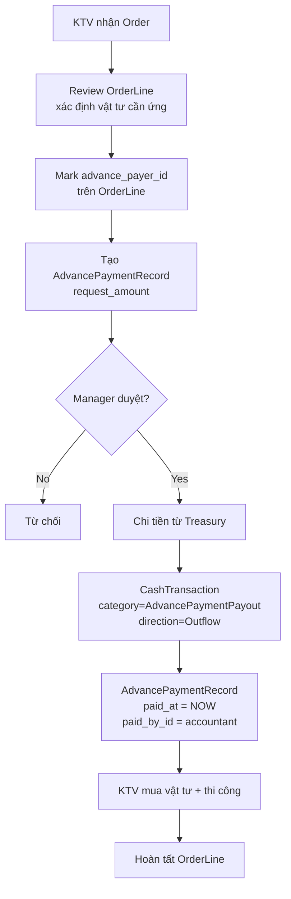
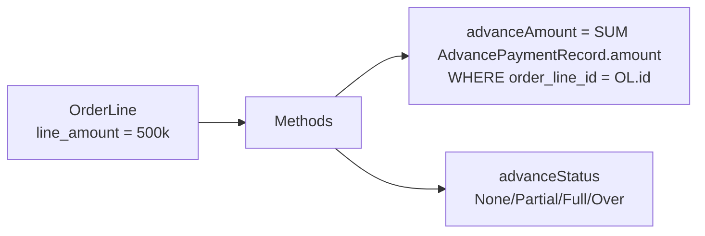
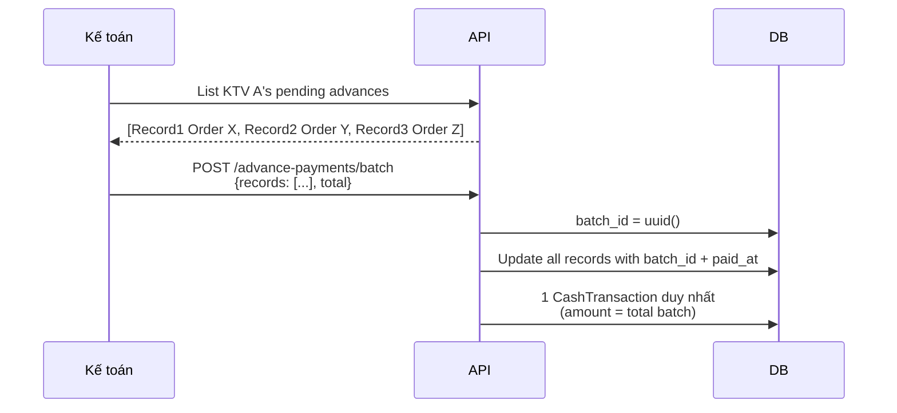
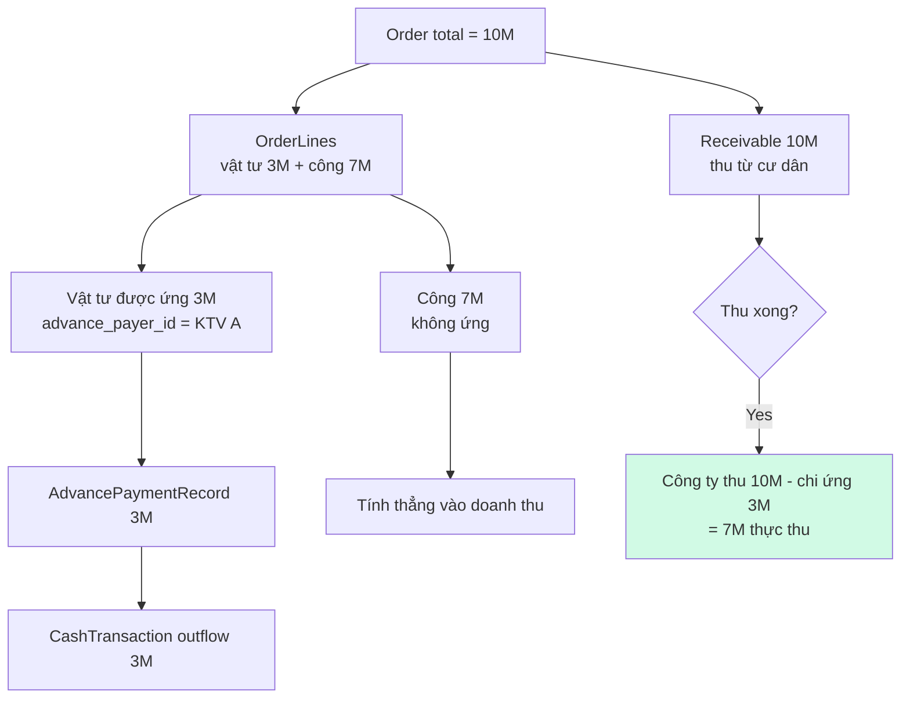

# 12 — Ứng vật tư (Advance Payment)

## Kịch bản nghiệp vụ

KTV đi thi công cần mua vật tư ngay tại hiện trường hoặc ở cửa hàng gần đó → KTV tự bỏ tiền ra trước (ứng) → công ty hoàn lại thông qua flow Advance Payment.

## Flow ứng vật tư

## Tính toán trên OrderLine

- `advanceAmount()` = tổng đã ứng
- `advanceStatus()`:
  - `None`: chưa ứng
  - `Partial`: ứng < line_amount
  - `Full`: ứng == line_amount
  - `Over`: ứng > line_amount (cần flag)

## Batch payment

Khi 1 KTV có nhiều advances cho nhiều OrderLines → chi 1 cục qua `batch_id`:

## Đối soát với Order

## Business rules

1. **`advance_payer_id` phải là Account đang active** trong dự án Order
2. **Không được ứng vượt `line_amount`** (trừ khi có approval đặc biệt)
3. **Chỉ ứng được OrderLine của Order status ≥ Confirmed**
4. **Khi Order hủy** → các Advance Record phải được refund hoặc đối trừ với KTV
5. **Soft delete** Advance Record phải reverse CashTransaction

