# 13 — Báo cáo tổng hợp

## Cấu trúc báo cáo

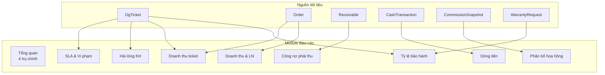

## Báo cáo tổng quan (4 trụ)

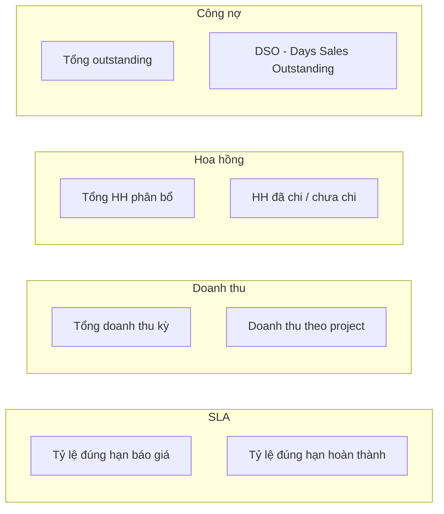

## Báo cáo SLA

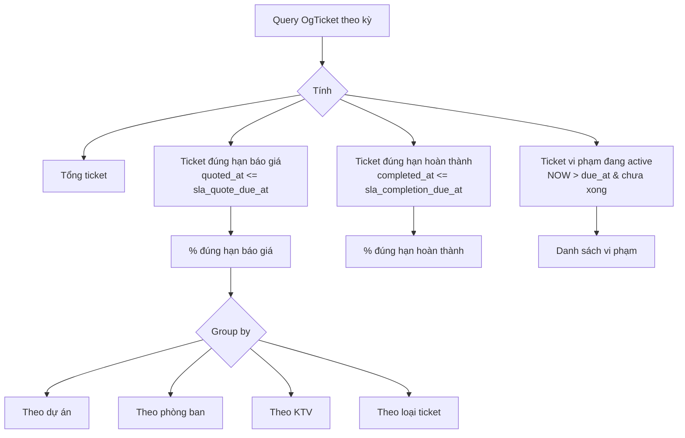

## Báo cáo CSAT (hài lòng khách hàng)

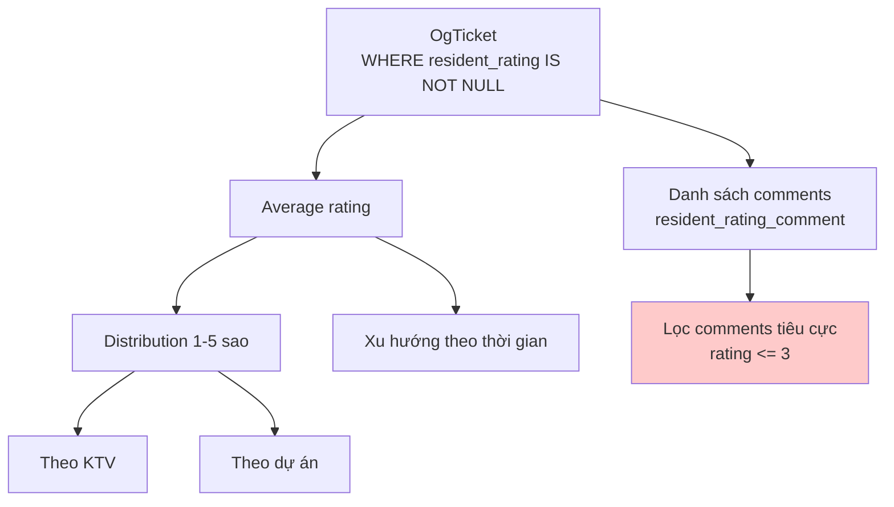

**Test file liên quan**: `backend/app/Modules/PMC/tests/CsatReportTest.php` (đã có).

## Báo cáo doanh thu

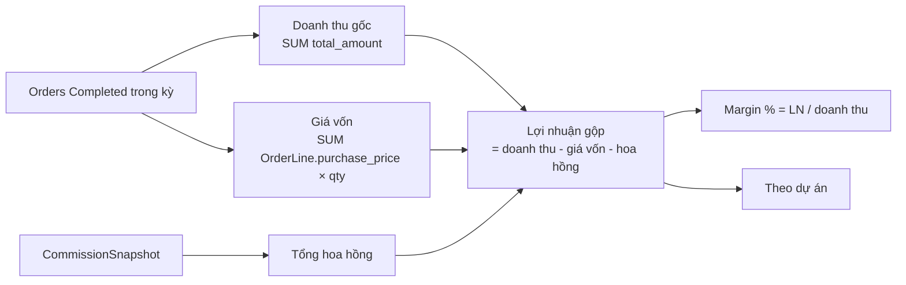

## Báo cáo hoa hồng

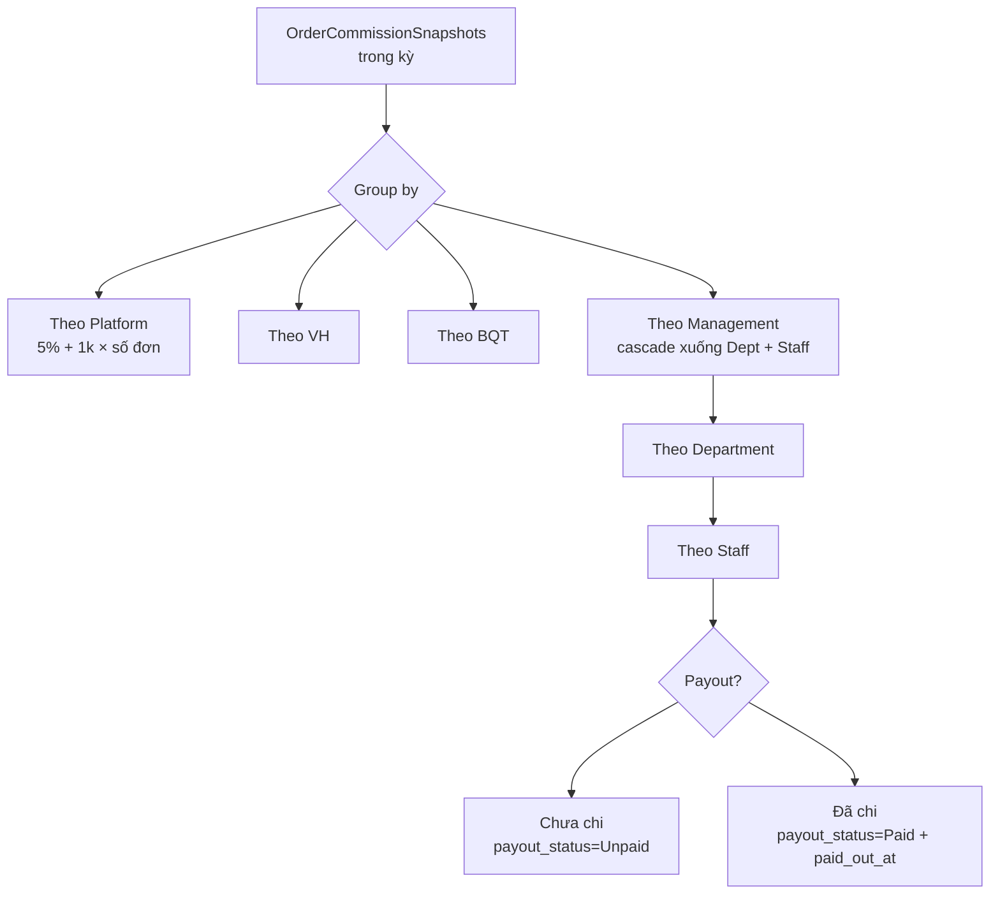

## Báo cáo công nợ (Aging)

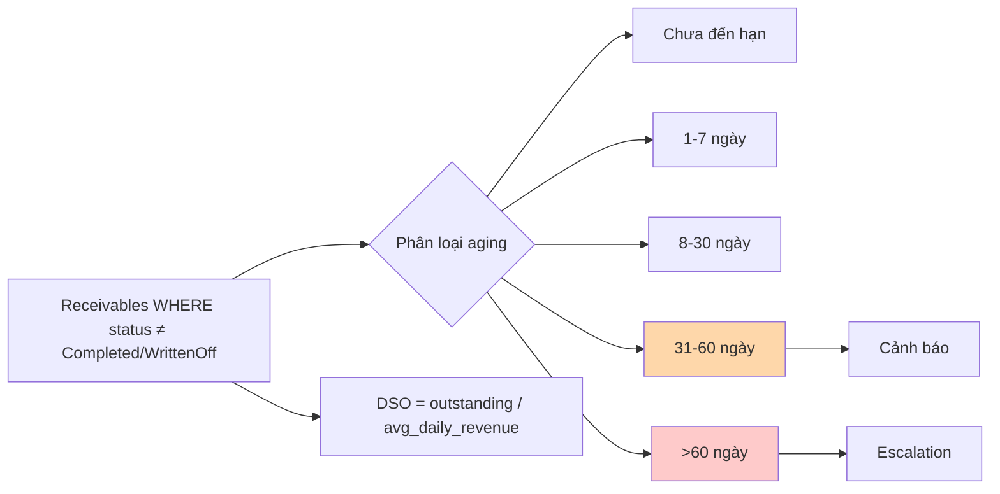

## Báo cáo dòng tiền (Cash Flow)

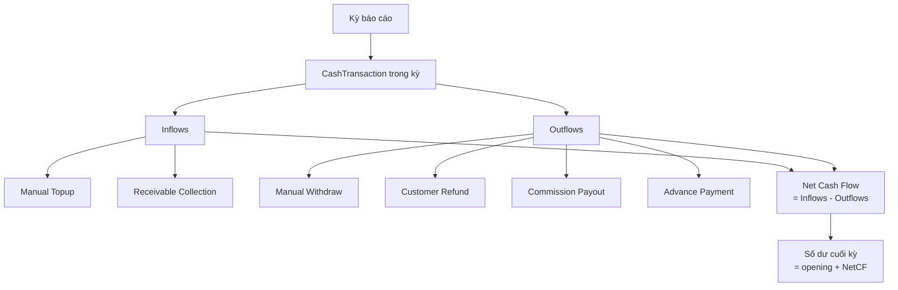

## Báo cáo tỷ lệ bảo hành

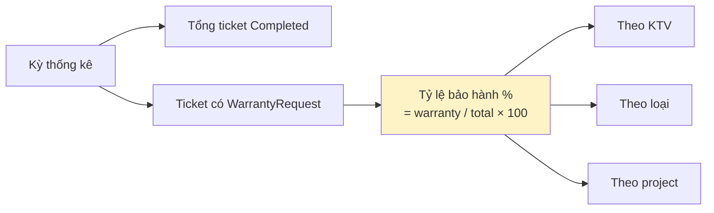

Kết hợp với CSAT:

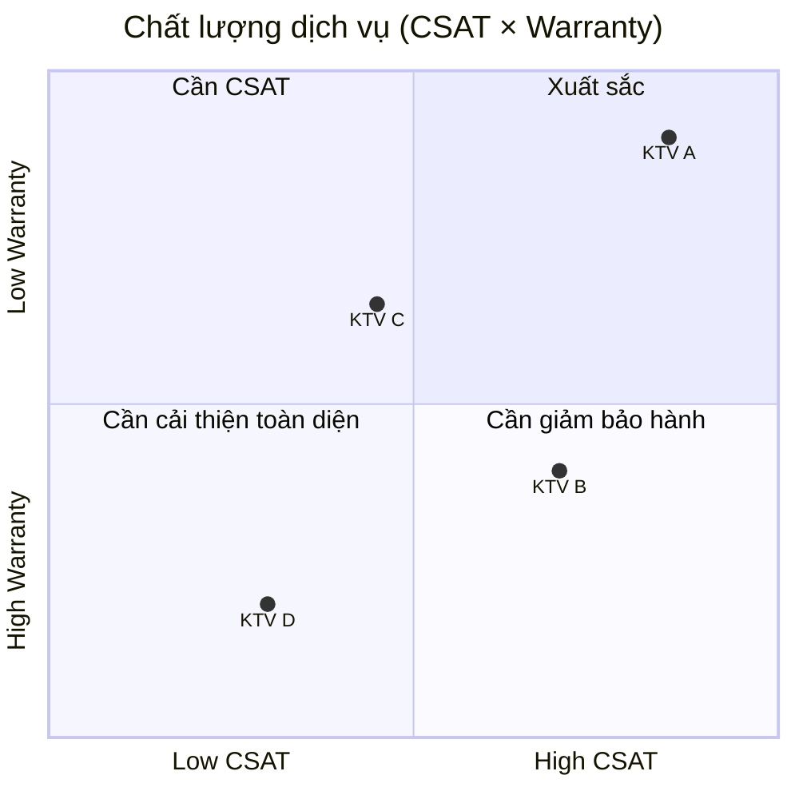

## Báo cáo năng lực nhân sự

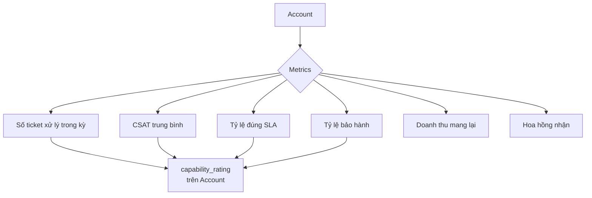

