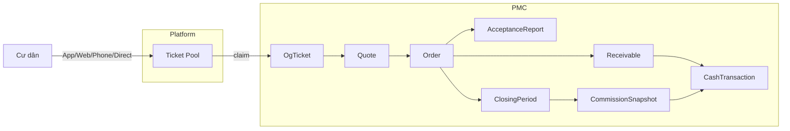

# Hệ thống TNP Services — Flow nghiệp vụ

Tài liệu này mô tả chi tiết từng nghiệp vụ trong hệ thống quản lý dịch vụ chung cư (PMC), kèm diagram mermaid để trực quan hóa luồng.

## Mục lục

| # | File | Nội dung |
|---|------|----------|
| 00 | [Tổng quan hệ thống](./00-system-overview.md) | Bức tranh toàn cảnh end-to-end |
| 01 | [Tiếp nhận ticket](./01-ticket-reception.md) | 4 kênh tiếp nhận → Platform pool → Claim → OgTicket |
| 02 | [OgTicket lifecycle](./02-og-ticket-lifecycle.md) | 11 trạng thái, điều kiện chuyển |
| 03 | [SLA & cấu hình](./03-sla-configuration.md) | SLA báo giá, SLA hoàn thành, escalation |
| 04 | [Báo giá (Quote)](./04-quote-flow.md) | 2 cấp duyệt (Manager → Resident), revision |
| 05 | [Đơn hàng (Order)](./05-order-flow.md) | Quote → Order → InProgress → Accepted |
| 06 | [Nghiệm thu & Bảo hành](./06-acceptance-warranty.md) | AcceptanceReport + WarrantyRequest |
| 07 | [Công nợ & Thanh toán](./07-receivable-payment.md) | Receivable → PaymentReceipt → aging |
| 08 | [Đối soát tài chính](./08-reconciliation.md) | FinancialReconciliation (dual-source) |
| 09 | [Quản lý quỹ (Treasury)](./09-treasury.md) | CashAccount + 6 category CashTransaction |
| 10 | [Kỳ chốt phí](./10-closing-period.md) | ClosingPeriod, freeze order, snapshot |
| 11 | [Hoa hồng (Commission)](./11-commission.md) | 3-tầng: Party → Dept → Staff |
| 12 | [Ứng vật tư](./12-advance-payment.md) | AdvancePayment per OrderLine |
| 13 | [Báo cáo](./13-reports.md) | SLA, CSAT, doanh thu, bảo hành, dòng tiền |

## Quy ước

- **BA**: yêu cầu nghiệp vụ (từ mockup `BA-TNP-SERVICES/`)
- **Codebase**: trạng thái đã implement trong `backend/app/Modules/PMC/`
- ✅ Đã implement đầy đủ
- ⚠ Có một phần, cần bổ sung
- ❌ Chưa có

## Kiến trúc cấp cao

