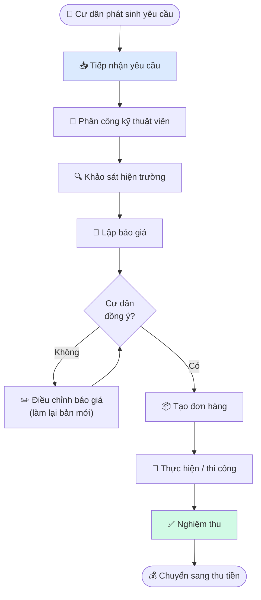
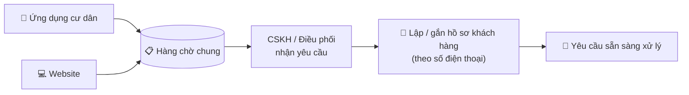
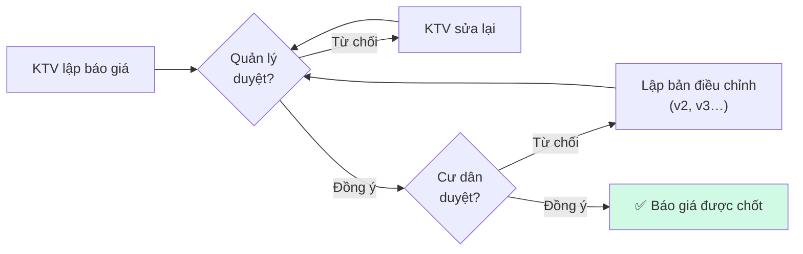
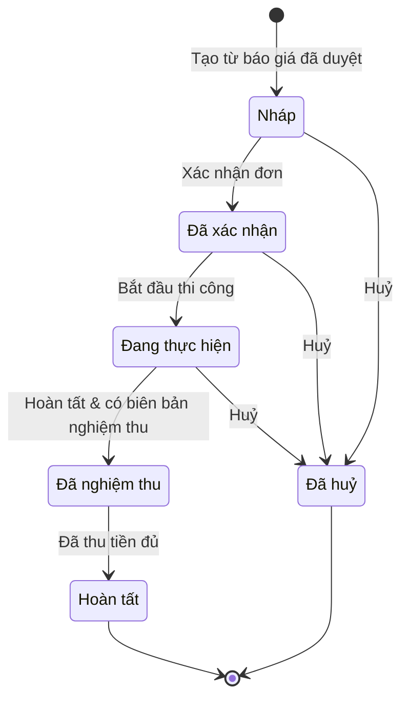
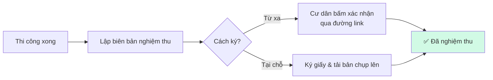
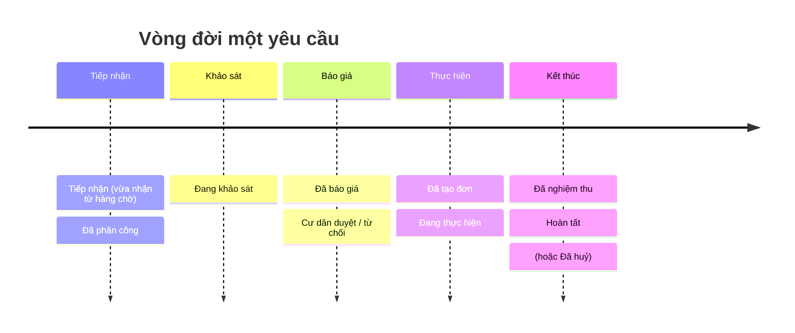

# 01 — Luồng ghi nhận đơn hàng

> **Tóm tắt một câu:** Một yêu cầu của cư dân đi qua 7 chặng — từ lúc tiếp nhận, phân công, khảo sát, báo giá, tạo đơn, thực hiện, đến nghiệm thu — mỗi chặng đều được hệ thống ghi lại minh bạch.

## 1. Toàn cảnh hành trình

## 2. Chặng 1 — Tiếp nhận yêu cầu

Cư dân có thể gửi yêu cầu qua **4 kênh**, tất cả đổ về **một hàng chờ chung**, rồi bộ phận tiếp nhận sẽ "nhận việc" để xử lý.

- **Một yêu cầu = một phiếu xử lý**, không bị nhận trùng hai lần.
- **Hồ sơ khách nhận diện theo số điện thoại** — hai yêu cầu cùng số sẽ gắn về cùng một khách hàng, tiện theo dõi lịch sử.
- Nếu chưa xử lý được, có thể **trả yêu cầu về hàng chờ** cho người khác nhận.
- Ngay khi nhận, hệ thống bắt đầu tính **thời hạn báo giá (SLA)** — xem [04 — Cài đặt SLA](./04-config.md#1-cài-đặt-sla).

## 3. Chặng 2–3 — Phân công & khảo sát

- **Phân công:** giao yêu cầu cho một hoặc nhiều kỹ thuật viên phù hợp; có thể đổi người phụ trách.
- **Khảo sát:** kỹ thuật viên đến hiện trường xem thực tế để biết cần làm gì, vật tư gì, chi phí bao nhiêu — làm cơ sở cho báo giá.

## 4. Chặng 4 — Báo giá (qua 2 cấp duyệt)

Báo giá không gửi thẳng cho cư dân, mà phải **được quản lý duyệt trước**, rồi mới đến **cư dân duyệt**:

- **Cấp 1 — Quản lý duyệt:** kiểm tra giá, hạng mục hợp lý chưa.
- **Cấp 2 — Cư dân duyệt:** cư dân tự duyệt trên ứng dụng, hoặc nhân viên duyệt thay khi được cư dân đồng ý qua điện thoại.
- **Bản điều chỉnh:** nếu cư dân từ chối, kỹ thuật viên lập **báo giá mới** thay cho bản cũ. Tại một thời điểm chỉ có **một báo giá đang hiệu lực**.

### Một báo giá gồm những loại hạng mục nào?

| Loại hạng mục | Ý nghĩa |
| --- | --- |
| **Vật tư** | Thiết bị, linh kiện lấy từ danh mục |
| **Dịch vụ trong danh mục** | Hạng mục dịch vụ đã định sẵn |
| **Dịch vụ phát sinh** | Việc làm thêm, không có sẵn trong danh mục |

> Mỗi hạng mục có **giá bán cho cư dân**. Hệ thống còn lưu **giá vốn** (giá nhập) để phục vụ báo cáo lợi nhuận nội bộ — **giá vốn không hiển thị cho cư dân**. Tổng báo giá = cộng thành tiền các hạng mục.

## 5. Chặng 5 — Tạo đơn hàng & thực hiện

Khi báo giá được cư dân duyệt, hệ thống **tạo đơn hàng** từ chính báo giá đó (sao chép các hạng mục sang). Đơn hàng đi qua các bước:

- **Xác nhận đơn** là mốc quan trọng: ngay khi xác nhận, hệ thống **tự sinh khoản công nợ phải thu** (xem [02 — Tính tiền](./02-tinh-tien.md)).
- Trong lúc thực hiện, nếu cần mua vật tư trước, kỹ thuật viên có thể **ứng tiền vật tư** rồi quyết toán sau.

## 6. Chặng 6 — Nghiệm thu

Sau khi làm xong, hai bên xác nhận kết quả qua **biên bản nghiệm thu**:

Cư dân có thể ký từ xa (qua link gửi đến) hoặc ký trực tiếp tại hiện trường rồi nhân viên tải bản scan lên. Sau khi nghiệm thu, cư dân được mời **đánh giá chất lượng (chấm sao)**.

## 7. Các trạng thái của một yêu cầu

Toàn bộ hành trình được phản ánh qua các trạng thái sau (xem theo thời gian):

| Trạng thái | Nghĩa là |
| --- | --- |
| **Tiếp nhận** | Vừa nhận yêu cầu từ hàng chờ |
| **Đã phân công** | Đã giao cho kỹ thuật viên |
| **Đang khảo sát** | KTV đang xem hiện trường |
| **Đã báo giá** | Báo giá đã gửi cư dân |
| **Cư dân duyệt / từ chối** | Cư dân đồng ý, hoặc từ chối (làm lại bản mới) |
| **Đã tạo đơn** | Đã lập đơn hàng từ báo giá |
| **Đang thực hiện** | Đang thi công |
| **Đã nghiệm thu** | Đã có biên bản nghiệm thu |
| **Hoàn tất** | Đã nghiệm thu và thu đủ tiền |
| **Đã huỷ** | Dừng yêu cầu (ở bất kỳ bước nào trước khi hoàn tất) |

## Liên quan

- Tiếp theo: [02 — Tính tiền (công nợ & thu tiền)](./02-tinh-tien.md)
- [03 — Chia hoa hồng](./03-hoa-hong.md) · [04 — Các thiết lập & ý nghĩa](./04-config.md)
