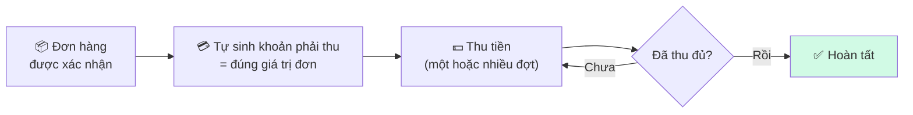
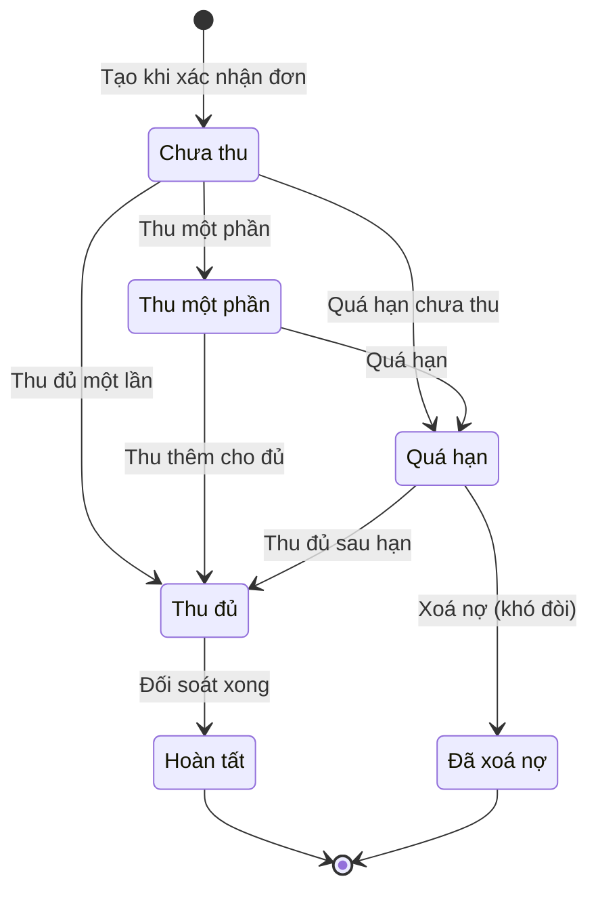
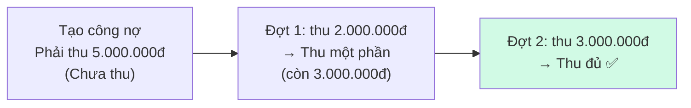

# 02 — Luồng tính tiền (công nợ & thu tiền)

> **Tóm tắt một câu:** Khi đơn hàng được xác nhận, hệ thống tự tạo một **khoản phải thu** bằng đúng giá trị đơn; sau đó tiền được thu một hoặc nhiều đợt cho đến khi đủ.

## 1. Từ đơn hàng đến tiền phải thu

- Khoản phải thu được **tạo tự động ngay khi xác nhận đơn**, **bằng đúng tổng giá trị đơn** và **không đổi** về sau.
- Cư dân có thể trả **làm nhiều đợt**; mỗi đợt thu được ghi lại (số tiền, hình thức, người thu, thời điểm).

## 2. Các tình trạng của một khoản phải thu

| Tình trạng | Nghĩa là |
| --- | --- |
| **Chưa thu** | Đã có công nợ, chưa thu đồng nào |
| **Thu một phần** | Đã thu nhưng chưa đủ |
| **Thu đủ** | Đã thu đủ giá trị đơn |
| **Quá hạn** | Đến hạn mà chưa thu đủ |
| **Đã xoá nợ** | Xác định khó đòi, ghi nhận khoản lỗ (cần phê duyệt) |
| **Hoàn tất** | Đã thu đủ và đối soát xong — đơn khép lại |

## 3. Ví dụ thu tiền nhiều đợt

> Đơn trị giá **5.000.000đ**:

## 4. Tuổi nợ (theo dõi nợ quá hạn)

Hệ thống phân loại các khoản chưa thu theo **số ngày quá hạn** để ưu tiên nhắc/đòi:

| Nhóm tuổi nợ | Mức độ |
| --- | --- |
| Chưa đến hạn | Bình thường |
| 1–7 ngày | Theo dõi |
| 8–30 ngày | Cần nhắc |
| 31–60 ngày | Cảnh báo |
| Trên 60 ngày | Nguy cơ khó đòi (cân nhắc xoá nợ) |

> **Lưu ý:** Các mốc tuổi nợ ở trên và **hạn thanh toán 30 ngày** (kể từ khi xác nhận đơn) hiện là **giá trị cố định của hệ thống** — chưa có trong phần Cài đặt để tự chỉnh. Xem [04 — Những thứ hiện chưa cấu hình được](./04-config.md#những-thứ-hiện-chưa-cấu-hình-được).

## 5. Hoàn tiền & xoá nợ

- **Hoàn tiền:** khi thu dư hoặc cư dân huỷ dịch vụ, kế toán hoàn lại phần chênh; khoản phải thu được điều chỉnh tương ứng.
- **Xoá nợ:** khoản quá hạn lâu, xác định khó đòi → đề nghị xoá nợ, **cần phê duyệt của quản lý** kèm lý do, rồi đưa vào báo cáo khoản lỗ.

## 6. Khi nào đơn được coi là "hoàn tất"?

Một đơn chỉ chuyển sang **Hoàn tất** khi **đã thu đủ tiền** và **đối soát xong** (khớp số đã thu với sổ quỹ). Nếu có thu dư, phải hoàn lại phần dư trước khi khép đơn.

> Thành phần giá: cư dân chỉ thấy **giá bán**; **giá vốn** (giá nhập vật tư) là số nội bộ, dùng để tính lợi nhuận trong báo cáo — không hiển thị cho cư dân.

## Liên quan

- Trước đó: [01 — Ghi nhận đơn hàng](./01-ghi-nhan-don-hang.md)
- Tiếp theo: [03 — Chia hoa hồng](./03-hoa-hong.md)
