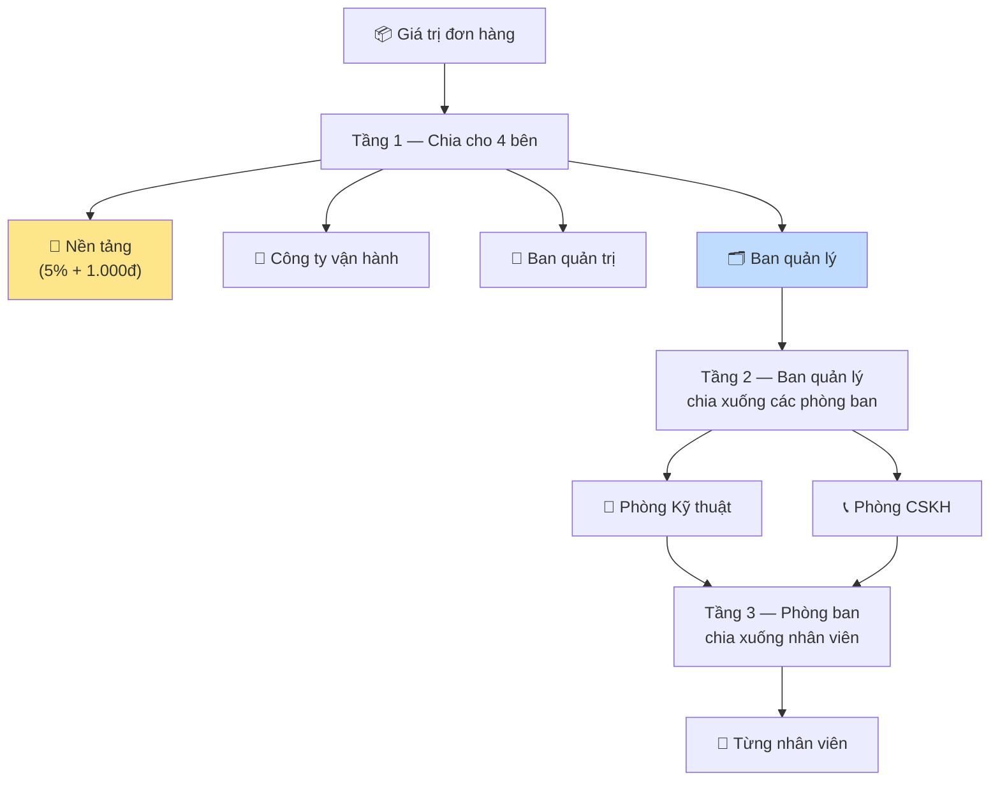
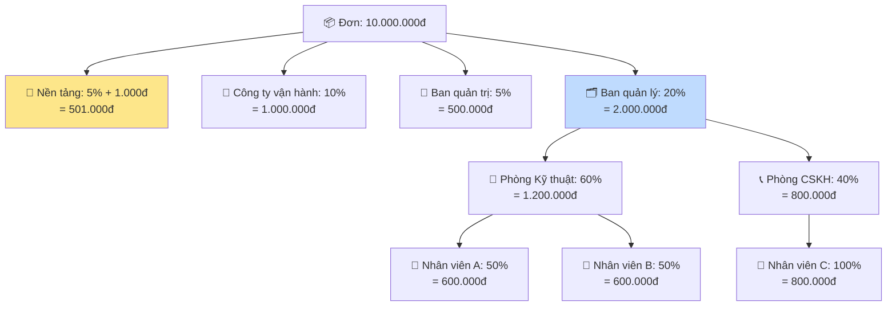
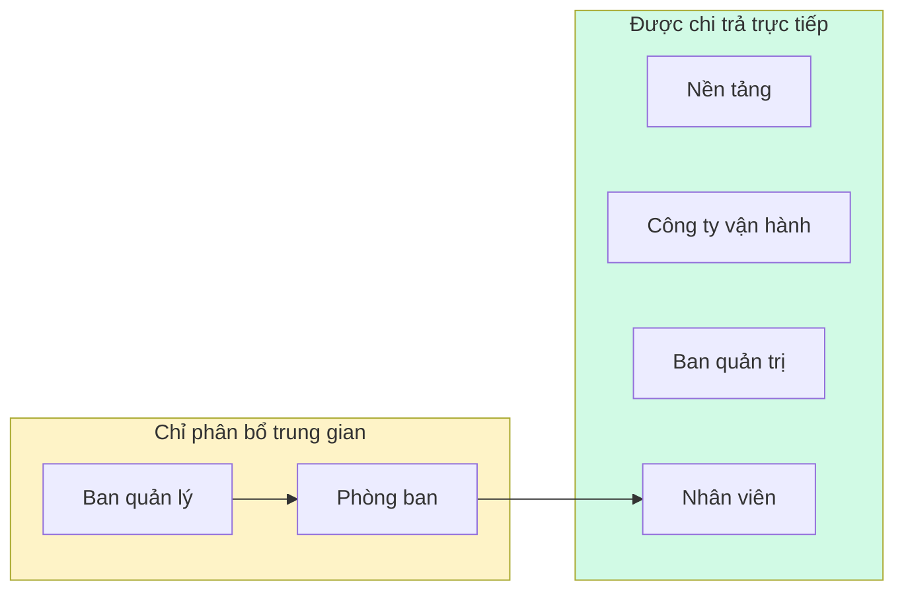

# 03 — Luồng chia hoa hồng

> **Tóm tắt một câu:** Trên mỗi đơn hoàn tất, một phần giá trị được trích làm hoa hồng và **chia theo 3 tầng**: chia cho các bên lớn → chia xuống phòng ban → chia xuống từng nhân viên.

## 1. Ba tầng chia hoa hồng

- **Tầng 1** chia tổng hoa hồng cho 4 bên: **Nền tảng, Công ty vận hành, Ban quản trị, Ban quản lý**.
- **Tầng 2** lấy phần của **Ban quản lý** chia tiếp cho các **phòng ban**.
- **Tầng 3** lấy phần của mỗi **phòng ban** chia tiếp cho từng **nhân viên**.

## 2. Mỗi phần được tính theo cách nào?

Mỗi mức chia có thể đặt theo một trong ba cách:

| Cách | Ý nghĩa | Ví dụ trên đơn 10.000.000đ |
| --- | --- | --- |
| **Theo phần trăm** | Lấy % của số tiền đang chia | 5% → 500.000đ |
| **Tiền cố định** | Một khoản cứng, không phụ thuộc giá trị | 1.000đ/đơn |
| **Cả hai** | Vừa % vừa cộng thêm tiền cố định | 5% + 1.000đ → 501.000đ |

> **Nền tảng luôn cố định ở mức 5% + 1.000đ mỗi đơn** — đây là mức hệ thống, không chỉnh sửa.

## 3. Ví dụ đầy đủ — đơn 10.000.000đ

| Bên nhận | Tỷ lệ | Số tiền |
| --- | --- | --- |
| Nền tảng | 5% + 1.000đ | 501.000đ |
| Công ty vận hành | 10% | 1.000.000đ |
| Ban quản trị | 5% | 500.000đ |
| → Nhân viên A (Phòng Kỹ thuật) | 50% của phần phòng | 600.000đ |
| → Nhân viên B (Phòng Kỹ thuật) | 50% của phần phòng | 600.000đ |
| → Nhân viên C (Phòng CSKH) | 100% của phần phòng | 800.000đ |

> Trong ví dụ này, phần **2.000.000đ của Ban quản lý** được chia hết xuống phòng ban rồi xuống nhân viên (1.200.000đ + 800.000đ). Ban quản lý và phòng ban chỉ là **bước phân bổ trung gian** — tiền thực chi về tay các nhân viên cụ thể.

## 4. Ai được nhận tiền thực?

- **Được chi trả trực tiếp:** Nền tảng, Công ty vận hành, Ban quản trị, và từng Nhân viên.
- **Trung gian (không nhận trực tiếp):** Ban quản lý và Phòng ban — chỉ là bước chia tiếp xuống dưới.

## 5. Chốt một lần, không đổi về sau

- Hoa hồng được **tính một lần duy nhất khi chốt sổ kỳ** và **ghi lại cố định**.
- Sau khi đã chốt, **chỉnh sửa cấu hình tỷ lệ không làm thay đổi kỳ đã chốt** — đảm bảo số liệu lịch sử nhất quán.
- Mỗi khoản hoa hồng có trạng thái chi trả: **Chưa chi → Đã chi**.

## 6. Trường hợp đặc biệt: điều chỉnh trên một đơn

Với đơn đặc biệt (ví dụ muốn thưởng thêm cho một kỹ thuật viên xuất sắc), có thể **điều chỉnh hoa hồng riêng cho đơn đó** thay cho mức mặc định — phần điều chỉnh sẽ thay thế đúng người được chỉ định.

## 7. Phân biệt với hoa hồng nhà cung cấp

Đây là **hoa hồng nội bộ** cho các bên và nhân sự của đơn vị quản lý, áp cho **đơn dịch vụ tự thực hiện**. Nó khác với hoa hồng từ **đơn của nhà cung cấp ngoài (gian hàng)** — hai loại tính riêng, không gộp.

## Liên quan

- Trước đó: [02 — Tính tiền (công nợ & thu tiền)](./02-tinh-tien.md)
- Tiếp theo: [04 — Các thiết lập & ý nghĩa](./04-config.md)
