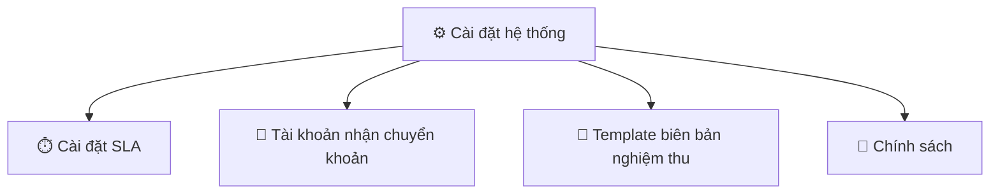

# 04 — Các thiết lập & ý nghĩa

> **Tóm tắt một câu:** Các thiết lập của hệ thống nằm trong menu **Cài đặt hệ thống**. Trang này liệt kê từng mục cài đặt và nó điều khiển điều gì.

## Phần "Cài đặt hệ thống" gồm 4 mục

---

## 1. Cài đặt SLA

**Vào:** Menu **Cài đặt hệ thống → Cài đặt SLA**

Đặt **thời gian cam kết xử lý** cho mỗi yêu cầu. Gồm hai mốc:

| Thiết lập | Ý nghĩa | Tính từ → đến |
| --- | --- | --- |
| **Hạn báo giá** | Tối đa bao lâu phải gửi báo giá | Từ lúc **tiếp nhận** → khi **có báo giá** |
| **Hạn hoàn thành** | Tối đa bao lâu phải hoàn tất dịch vụ | Từ lúc **cư dân chấp thuận báo giá** → khi đơn **hoàn thành** |

- Nhập theo **phút**; hệ thống tự quy đổi để dễ đọc (ví dụ 1.440 phút = 1 ngày).
- Hạn báo giá được tính tự động ngay khi tiếp nhận yêu cầu; hạn hoàn thành được tính lại nếu yêu cầu phát sinh vòng xử lý mới.
- **Ảnh hưởng:** cam kết thời gian trong [01 — Ghi nhận đơn hàng](./01-ghi-nhan-don-hang.md); trễ hạn sẽ được cảnh báo.

> Đây là **hai giá trị áp dụng chung**. Việc rút ngắn hạn theo độ ưu tiên của từng yêu cầu (khẩn cấp/cao/thấp) không nằm ở trang này.

---

## 2. Tài khoản nhận chuyển khoản

**Vào:** Menu **Cài đặt hệ thống → Tài khoản nhận CK**

Khai báo tài khoản ngân hàng để **nhận tiền cư dân chuyển khoản**:

| Thiết lập | Ý nghĩa |
| --- | --- |
| **Ngân hàng** | Chọn ngân hàng thụ hưởng |
| **Số tài khoản** | Số tài khoản nhận tiền |
| **Tên chủ tài khoản** | Tên hiển thị khi cư dân chuyển |

- Hệ thống dùng thông tin này để **tạo mã QR chuyển khoản** cho cư dân quét và thanh toán nhanh.
- **Ảnh hưởng:** bước thu tiền trong [02 — Tính tiền](./02-tinh-tien.md).

---

## 3. Template biên bản nghiệm thu

**Vào:** Menu **Cài đặt hệ thống → Template biên bản nghiệm thu**

Soạn **mẫu biên bản nghiệm thu** dùng chung cho mọi đơn:

| Thiết lập | Ý nghĩa |
| --- | --- |
| **Tiêu đề** | Tiêu đề hiển thị trên biên bản |
| **Nội dung mẫu** | Bố cục & lời văn của biên bản |
| **Biến tự điền** | Chèn các ô như tên cư dân, mã đơn, hạng mục… để hệ thống tự điền khi lập biên bản |

- Có **xem trước** trước khi lưu.
- **Ảnh hưởng:** bước nghiệm thu trong [01 — Ghi nhận đơn hàng](./01-ghi-nhan-don-hang.md).

---

## 4. Chính sách

**Vào:** Menu **Cài đặt hệ thống → Chính sách**

Soạn và **xuất bản** hai văn bản hiển thị cho cư dân:

| Văn bản | Dùng để |
| --- | --- |
| **Điều khoản sử dụng** | Quy định khi cư dân dùng dịch vụ / ứng dụng |
| **Chính sách bảo mật** | Cam kết về thu thập & bảo vệ thông tin cư dân |

| Thiết lập | Ý nghĩa |
| --- | --- |
| **Tiêu đề & nội dung** | Soạn thảo nội dung văn bản (có thể chèn hình ảnh) |
| **Trạng thái xuất bản** | **Đã xuất bản** thì cư dân mới nhìn thấy; **Chưa xuất bản** thì chỉ là bản nháp nội bộ |

- Mỗi văn bản lưu **ngày cập nhật** gần nhất để theo dõi phiên bản.
- **Ảnh hưởng:** nội dung pháp lý/điều khoản mà cư dân xem trên ứng dụng — không ảnh hưởng cách tính tiền hay hoa hồng.

---

## Các cấu hình khác (nằm ở menu khác, không thuộc phần Cài đặt)

Một số thiết lập quan trọng của luồng đơn hàng **không** nằm trong "Cài đặt hệ thống" mà ở các khu vực riêng:

| Cấu hình | Vào | Quyết định điều gì |
| --- | --- | --- |
| **Cấu hình hoa hồng** | Menu **Kế toán/Tài chính → Cấu hình hoa hồng** | Cách chia hoa hồng 3 tầng — xem [03](./03-hoa-hong.md) |
| **Danh mục (Loại dịch vụ, Danh mục hàng)** | Menu **Danh mục** | Hạng mục & giá bán / giá vốn dùng khi báo giá — xem [01](./01-ghi-nhan-don-hang.md) |
| **Kỳ kế toán** | Menu **Kế toán/Tài chính → Kỳ kế toán** | Chốt sổ & khoá số liệu một kỳ — xem [03](./03-hoa-hong.md) |

## Những thứ hiện CHƯA cấu hình được

| Hạng mục | Tình trạng |
| --- | --- |
| **Mốc phân nhóm tuổi nợ** (0–7 / 8–30 / 31–60 / >60 ngày) | Cố định trong hệ thống, không có trang cài đặt |
| **Hạn thanh toán công nợ** | Mặc định **30 ngày** kể từ khi xác nhận đơn; hiện chưa có trang để chỉnh |

## Bảng tra nhanh: "Muốn đổi cái này thì chỉnh ở đâu?"

| Muốn thay đổi | Vào |
| --- | --- |
| Thời hạn báo giá / hoàn thành | Cài đặt hệ thống → **Cài đặt SLA** |
| Tài khoản nhận tiền chuyển khoản | Cài đặt hệ thống → **Tài khoản nhận CK** |
| Mẫu biên bản nghiệm thu | Cài đặt hệ thống → **Template biên bản nghiệm thu** |
| Điều khoản sử dụng / Chính sách bảo mật | Cài đặt hệ thống → **Chính sách** |
| Ai nhận bao nhiêu hoa hồng | Kế toán/Tài chính → **Cấu hình hoa hồng** |
| Giá bán / giá vốn, hạng mục báo giá | Menu **Danh mục** |
| Khoá số liệu một kỳ | Kế toán/Tài chính → **Kỳ kế toán** |

## Liên quan

- Trước đó: [03 — Chia hoa hồng](./03-hoa-hong.md)
- Quay lại [mục lục](./README.md)
