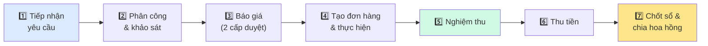

# Quản lý đơn hàng dịch vụ — Tài liệu nghiệp vụ

Tài liệu này giải thích **bằng ngôn ngữ đời thường** toàn bộ hành trình một yêu cầu của cư dân: từ lúc **tiếp nhận**, **phân công**, **báo giá**, **tạo đơn hàng**, **thực hiện**, **nghiệm thu**, đến **thu tiền** và **chia hoa hồng**.

> Mục tiêu: người không làm kỹ thuật đọc cũng hiểu được toàn bộ luồng.

## Đọc theo thứ tự

| # | Tài liệu | Trả lời câu hỏi |
| --- | --- | --- |
| 01 | [Ghi nhận đơn hàng](./01-ghi-nhan-don-hang.md) | Một yêu cầu đi từ lúc cư dân gọi đến khi nghiệm thu xong như thế nào? |
| 02 | [Tính tiền (công nợ & thu tiền)](./02-tinh-tien.md) | Đơn hàng biến thành tiền phải thu và được thu ra sao? |
| 03 | [Chia hoa hồng](./03-hoa-hong.md) | Tiền hoa hồng được chia cho những ai, theo tỷ lệ nào? |
| 04 | [Các thiết lập & ý nghĩa](./04-config.md) | Thiết lập nào điều khiển cái gì? |

## Các bên tham gia

| Vai trò | Là ai | Làm gì |
| --- | --- | --- |
| **Cư dân** | Người ở trong chung cư | Gửi yêu cầu, duyệt báo giá, ký nghiệm thu, đánh giá |
| **CSKH / Điều phối** | Bộ phận tiếp nhận | Nhận yêu cầu, phân công kỹ thuật viên |
| **Kỹ thuật viên (KTV)** | Người thực hiện dịch vụ | Khảo sát, báo giá, thi công, nghiệm thu |
| **Quản lý** | Trưởng bộ phận | Duyệt báo giá, duyệt các trường hợp đặc biệt |
| **Kế toán** | Bộ phận tài chính | Thu tiền, đối soát, chi hoa hồng |

## Hành trình tổng thể của một yêu cầu

| Giai đoạn | Diễn ra điều gì | Tài liệu |
| --- | --- | --- |
| **1–5. Ghi nhận đơn hàng** | Tiếp nhận → phân công → khảo sát → báo giá → tạo đơn → thực hiện → nghiệm thu | [01](./01-ghi-nhan-don-hang.md) |
| **6. Tính tiền** | Đơn sinh ra công nợ → thu tiền (một hoặc nhiều đợt) | [02](./02-tinh-tien.md) |
| **7. Hoa hồng** | Chốt sổ theo kỳ → chia hoa hồng cho các bên & nhân sự | [03](./03-hoa-hong.md) |

## Một vài nguyên tắc xuyên suốt

- **Mọi yêu cầu đều có hồ sơ khách hàng** — nhận diện theo số điện thoại, hai lần gọi cùng số sẽ gắn về cùng một khách.
- **Báo giá phải qua 2 cấp duyệt** — quản lý duyệt trước, cư dân duyệt sau; cư dân từ chối thì làm lại bản điều chỉnh.
- **Số liệu hoa hồng được "đóng băng" khi chốt sổ** — chốt rồi thì chỉnh cấu hình về sau không làm thay đổi kỳ đã chốt.
- **Có cam kết thời gian (SLA)** — thời hạn báo giá và thời hạn hoàn thành; trễ hạn sẽ được cảnh báo.
