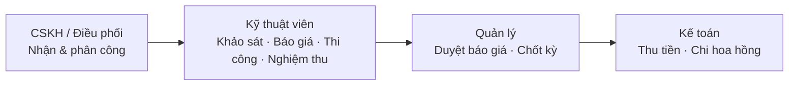

# 00 — Đăng nhập & bản đồ menu

> Mục tiêu: đăng nhập và biết các chức năng nằm ở mục menu nào.

## 1. Đăng nhập

1. Mở trình duyệt vào địa chỉ hệ thống, thêm `/login`.
2. Nhập **"Email"** và **"Mật khẩu"** được cấp → bấm **"Đăng nhập"**.
3. Thành công → hiện *"Đăng nhập thành công"* và vào màn hình chính.

## 2. Bản đồ menu (thanh bên trái)

Menu chia theo nhóm. Các nhóm liên quan đến nghiệp vụ đơn hàng dịch vụ:

| Nhóm | Mục | Dùng để |
|------|-----|---------|
| **Quản lý ticket** | "Ticket Pool" | Nhận yêu cầu cư dân từ hàng chờ → [bài 01](./01-tiep-nhan-va-xu-ly-don.md) |
| | "Danh sách ticket" | Các ticket đang xử lý |
| **Quản lý đơn hàng** | "Báo giá" | Lập & duyệt báo giá → [bài 02](./02-bao-gia.md) |
| | "Đơn hàng" | Đơn hàng dịch vụ → [bài 01](./01-tiep-nhan-va-xu-ly-don.md) |
| **Kế toán/Tài chính** | "Công nợ phải thu" | Thu tiền & công nợ → [bài 03](./03-cong-no-va-thu-tien.md) |
| | "Cấu hình hoa hồng" | Quy tắc chia hoa hồng → [bài 04](./04-hoa-hong-va-chot-ky.md) |
| | "Kỳ kế toán" | Chốt sổ theo kỳ → [bài 04](./04-hoa-hong-va-chot-ky.md) |
| | "Tổng hợp hoa hồng" | Chi hoa hồng → [bài 04](./04-hoa-hong-va-chot-ky.md) |
| | "Tiền ứng vật tư", "Đối soát tài chính", "Quản lý dòng tiền" | Quỹ & đối soát |
| **Danh mục** | "Loại dịch vụ", "Danh mục hàng", "Nhà cung cấp" | Hạng mục & giá dùng khi báo giá → [bài 05](./05-cai-dat-he-thong.md) |
| **Cài đặt hệ thống** | "Cài đặt SLA", "Tài khoản nhận CK", "Template biên bản nghiệm thu", "Chính sách" | Thiết lập → [bài 05](./05-cai-dat-he-thong.md) |
| **HRM** | "Tài khoản", "Phòng ban", "Chức danh", "Vai trò", "Quản lý dự án" | Nhân sự & phân quyền |
| **Báo cáo** | "Doanh thu", "SLA", "Hài lòng KH", "Dòng tiền"… | Báo cáo tổng hợp |

> Bạn chỉ thấy mục mà tài khoản được cấp quyền. Thiếu mục nào → nhờ quản trị cấp quyền ở **HRM → "Vai trò"**.

## 3. Ai làm bước nào?

## Liên quan

- Tiếp theo: [01 — Tiếp nhận & xử lý đơn](./01-tiep-nhan-va-xu-ly-don.md)
- Nền tảng nghiệp vụ: [flows/platform](../flows/platform/README.md)
