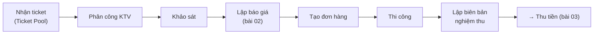
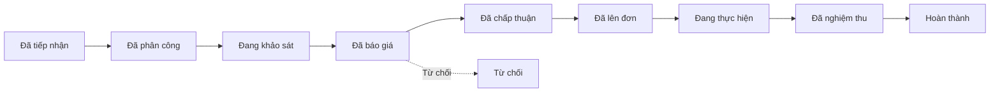
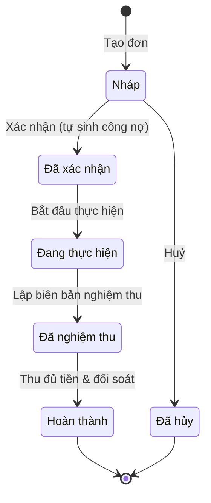

# 01 — Tiếp nhận & xử lý đơn

> Mục tiêu: nhận một yêu cầu từ cư dân và đưa nó đi qua các chặng cho đến khi nghiệm thu. (Phần lập báo giá tách riêng ở [bài 02](./02-bao-gia.md).)

## Toàn cảnh

## A. Nhận ticket từ Pool

1. Menu trái → **Quản lý ticket** → **"Ticket Pool"**. Trang *"Danh sách ticket chờ tiếp nhận từ cư dân"*.
2. (Tuỳ chọn) bấm vào dòng để mở khung chi tiết — xem **"Mô tả từ cư dân"**, **"Người gửi"**, **"Số điện thoại"**, **"Căn hộ"**, **"Kênh tiếp nhận"**, **"Tệp đính kèm"**.
3. Bấm nút **"Nhận"** ở dòng cần xử lý.
4. Cửa sổ **"Xác nhận nhận ticket"** hiện ra → bấm **"Nhận ticket này"**.
5. Hệ thống báo *"Đã tiếp nhận"*; ticket chuyển sang nhóm của bạn và sang trạng thái **"Đã tiếp nhận"**.

> Một ticket chỉ nhận một lần. Sau khi nhận, xem nó trong **"Danh sách ticket"** (trang **"OG Ticket"**).

## B. Mở ticket & phân công

1. Menu trái → **Quản lý ticket** → **"Danh sách ticket"**.
2. Tìm bằng ô *"Tìm theo tiêu đề, tên, SĐT..."*; lọc theo **"Trạng thái"**, **"Ưu tiên"**, **"Bảo hành"**.
3. Bấm **"Xem chi tiết"** để mở ticket.
4. Trên trang chi tiết có các tab: **"Tổng quan"**, **"Khảo sát"**, **"Thương mại"**, **"Nghiệm thu"**, **"Bảo hành"**.
5. **Phân công kỹ thuật viên** xử lý (trạng thái chuyển **"Đã phân công"**).
6. (Nếu cần) bấm **"Cập nhật SLA"** để xem/chỉnh **"SLA Báo giá"** và **"SLA Hoàn thành"**.

> Cần trả ticket cho người khác? Mở menu ở góc → **"Trả lại pool"** (ticket quay về Pool).

## C. Khảo sát

- Kỹ thuật viên dùng tab **"Khảo sát"** ghi nhận hiện trạng thực tế (trạng thái **"Đang khảo sát"**) — làm cơ sở cho báo giá ở [bài 02](./02-bao-gia.md).

## D. Vòng đời ticket

| Trạng thái | Nghĩa |
|------------|-------|
| **Đã tiếp nhận** | Vừa nhận từ Pool |
| **Đã phân công** | Đã giao cho KTV |
| **Đang khảo sát** | KTV đang xem hiện trường |
| **Đã báo giá** | Đã có báo giá gửi cư dân |
| **Đã chấp thuận** / **Từ chối** | Cư dân duyệt / từ chối |
| **Đã lên đơn** | Đã tạo đơn hàng từ báo giá |
| **Đang thực hiện** | Đang thi công |
| **Đã nghiệm thu** | Đã có biên bản nghiệm thu |
| **Hoàn thành** | Đã nghiệm thu & thu đủ tiền |

## E. Tạo & thực hiện đơn hàng

1. Sau khi báo giá được **"Đã chấp thuận"**, tạo đơn: menu **Quản lý đơn hàng** → **"Đơn hàng"** → **"Tạo đơn hàng"** (hoặc tạo từ ticket).
2. Trên trang chi tiết đơn, bấm nút **xác nhận đơn** → đơn chuyển **"Đã xác nhận"**.
   > Ngay khi xác nhận, hệ thống **tự sinh khoản công nợ phải thu** = đúng giá trị đơn (xem [bài 03](./03-cong-no-va-thu-tien.md)).
3. Bấm nút bắt đầu thực hiện → **"Đang thực hiện"** (thi công).

### Trạng thái đơn hàng

## F. Lập biên bản nghiệm thu

1. Trên trang chi tiết ticket/đơn → bấm **"Biên bản"** (hoặc **"Lập biên bản nghiệm thu"**).
2. Hệ thống dựng biên bản từ **mẫu** đã cấu hình (xem [bài 05](./05-cai-dat-he-thong.md)); các biến (tên cư dân, mã đơn, hạng mục…) tự điền.
3. Cư dân ký xác nhận (từ xa qua liên kết, hoặc ký tại chỗ rồi tải bản chụp lên).
4. Xong → ticket sang **"Đã nghiệm thu"**; chuyển bước thu tiền.

## Liên quan

- Tiếp theo: [02 — Báo giá](./02-bao-gia.md) · [03 — Công nợ & thu tiền](./03-cong-no-va-thu-tien.md)
- Nền tảng nghiệp vụ: [flows/platform/01 — Ghi nhận đơn hàng](../flows/platform/01-ghi-nhan-don-hang.md)
