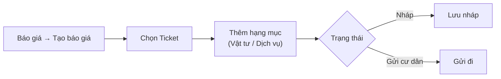
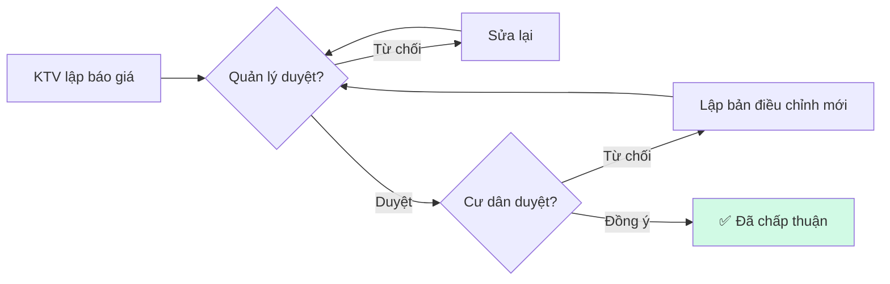

# 02 — Báo giá

> Mục tiêu: lập một báo giá cho ticket, thêm hạng mục (vật tư/dịch vụ), gửi cư dân và đi qua 2 cấp duyệt.

## A. Tạo báo giá

1. Menu trái → **Quản lý đơn hàng** → **"Báo giá"** → bấm **"Tạo báo giá"** (trang *"Tạo báo giá"*).
2. Mục **"Chọn Ticket"** → tìm và chọn ticket cần báo giá.
3. Thêm hạng mục: bấm **"Thêm hạng mục"**. Trong cửa sổ *"Thêm hạng mục"* điền:
   - **"Hạng mục"** (tên)
   - **"Loại"**: **"Vật tư"**, **"Dịch vụ"**, hoặc **"Dịch vụ tùy chọn"**
   - **"Số lượng"**, **"Đơn vị"**, **"Đơn giá"**
   - **"Giá mua"** (với vật tư — là giá vốn nội bộ)
   - Bấm lưu hạng mục.
4. Bảng hạng mục hiển thị cột **"Hạng mục"**, **"Loại"**, **"SL"**, **"ĐVT"**, **"Đơn giá"**, **"Thành tiền"**. Có thể **"Sửa"** / **"Xoá"** từng dòng.
5. Ở mục **"Trạng thái"** chọn:
   - **"Nháp"** — lưu để hoàn thiện sau, hoặc
   - **"Gửi cư dân"** — gửi luôn.
6. Bấm **"Tạo báo giá"**.

> **Giá bán** hiển thị cho cư dân; **giá mua/giá vốn** là số nội bộ, chỉ dùng tính lợi nhuận — không hiện cho cư dân.

## B. Duyệt 2 cấp

Báo giá không gửi thẳng — phải **quản lý duyệt trước**, rồi **cư dân duyệt**:

Trên trang chi tiết báo giá, dùng các nút tương ứng: **duyệt báo giá** (quản lý), **gửi cư dân**, **duyệt xác nhận** (thay cư dân khi được đồng ý qua điện thoại), hoặc **từ chối**.

## C. Các trạng thái báo giá

| Trạng thái | Nghĩa |
|------------|-------|
| **"Nháp"** | Đang soạn |
| **"Đã gửi"** | Đã gửi cư dân |
| **"QL đã duyệt"** | Quản lý đã duyệt (chờ cư dân) |
| **"Đã chấp thuận"** | Cư dân đồng ý — sẵn sàng lên đơn |
| **"QL từ chối"** / **"Cư dân từ chối"** | Bị từ chối |
| **"Đã huỷ"** | Đã huỷ |

Cột **"Hiệu lực"**: **"Còn hiệu lực"** (bản đang dùng) hoặc **"Đã thay thế"** (bản cũ).

> **Bản điều chỉnh:** nếu cư dân từ chối, lập **báo giá mới** thay bản cũ. Tại một thời điểm chỉ có **một báo giá còn hiệu lực**.

## D. Sau khi được chấp thuận

Báo giá **"Đã chấp thuận"** → tạo đơn hàng từ báo giá đó (xem [bài 01, mục E](./01-tiep-nhan-va-xu-ly-don.md#e-tạo--thực-hiện-đơn-hàng)).

## Liên quan

- Trước đó: [01 — Tiếp nhận & xử lý đơn](./01-tiep-nhan-va-xu-ly-don.md)
- Tiếp theo: [03 — Công nợ & thu tiền](./03-cong-no-va-thu-tien.md)
- Nền tảng nghiệp vụ: [flows/platform/01 — Ghi nhận đơn hàng](../flows/platform/01-ghi-nhan-don-hang.md)
