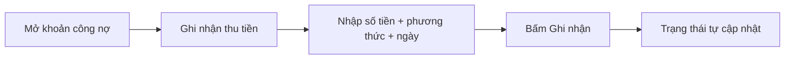
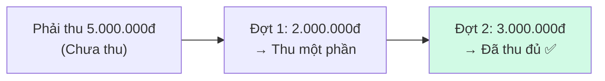

# 03 — Công nợ & thu tiền

> Mục tiêu: thu tiền cho một khoản công nợ (một hoặc nhiều đợt), hoàn tiền khi cần, và theo dõi nợ quá hạn.

## A. Xem danh sách công nợ

1. Menu trái → **Kế toán/Tài chính** → **"Công nợ phải thu"** (trang *"Quản lý công nợ phải thu từ đơn hàng"*).
2. Đầu trang có các thẻ KPI: **"Tổng phải thu"**, **"Đã thu"**, **"Còn nợ"**, **"Số khoản"**.
3. Bảng có cột: **"Đơn hàng"**, **"Dự án"**, **"Phải thu"**, **"Đã thu"**, **"Còn nợ"**, **"Trạng thái"**, **"Hạn TT"**, **"Tuổi nợ"**, **"Thao tác"**.
4. Tìm bằng *"Tìm theo mã đơn, khách hàng..."*; lọc theo **"Trạng thái"**, **"Dự án"**.

> Khoản công nợ **tự sinh** khi xác nhận đơn (xem [bài 01](./01-tiep-nhan-va-xu-ly-don.md)), bằng đúng giá trị đơn.

## B. Ghi nhận thu tiền

1. Bấm vào một khoản (trang **"Công nợ {mã đơn}"**).
2. Bấm **"Ghi nhận thu tiền"**. Cửa sổ hiện ra, điền:
   - **"Số tiền"**
   - **"Phương thức"**: **"Tiền mặt"** hoặc **"Chuyển khoản"**
   - **"Ngày"**
   - **"Ghi chú"** (tuỳ chọn)
3. Bấm **"Ghi nhận"** → báo *"Ghi nhận thu tiền thành công"*.

Mỗi lần thu hiển thị trong bảng phiếu: **"Loại"**, **"Ngày"**, **"Số tiền"**, **"Phương thức"**, **"Người thực hiện"**, **"Đối soát"**, **"Ghi chú"**. Có thể sửa qua **"Chỉnh sửa phiếu thu"**.

> Khi thanh toán chuyển khoản, hệ thống tạo **mã QR** từ tài khoản đã cấu hình (xem [bài 05](./05-cai-dat-he-thong.md)).

## C. Thu nhiều đợt — ví dụ đơn 5.000.000đ

## D. Các trạng thái công nợ

| Trạng thái | Nghĩa |
|------------|-------|
| **"Chưa thu"** | Chưa thu đồng nào |
| **"Thu một phần"** | Đã thu nhưng chưa đủ |
| **"Đã thu đủ"** | Đã thu đủ giá trị đơn |
| **"Thu thừa"** | Thu dư — cần hoàn lại phần dư |
| **"Quá hạn"** | Đến hạn mà chưa thu đủ |
| **"Hoàn thành"** | Đã thu đủ & đối soát xong |
| **"Xóa nợ"** | Khó đòi — đã xoá nợ (cần phê duyệt) |

## E. Hoàn tiền & xoá nợ

- **Hoàn tiền:** trên khoản công nợ → bấm **"Ghi nhận trả tiền"** (khi thu dư hoặc cư dân huỷ dịch vụ) → báo *"Ghi nhận trả tiền thành công"*.
- **Xoá nợ:** với khoản quá hạn lâu, khó đòi → đề nghị xoá nợ kèm lý do; **cần quản lý phê duyệt** rồi mới chuyển sang **"Xóa nợ"**.

## F. Tuổi nợ (theo dõi quá hạn)

Cột **"Tuổi nợ"** giúp ưu tiên nhắc/đòi: chưa đến hạn → 1–7 ngày → 8–30 → 31–60 → trên 60 ngày (nguy cơ khó đòi).

> Mốc tuổi nợ và **hạn thanh toán 30 ngày** hiện là giá trị cố định của hệ thống — chưa có trang để chỉnh.

## Liên quan

- Trước đó: [02 — Báo giá](./02-bao-gia.md)
- Tiếp theo: [04 — Hoa hồng & chốt kỳ](./04-hoa-hong-va-chot-ky.md)
- Nền tảng nghiệp vụ: [flows/platform/02 — Tính tiền](../flows/platform/02-tinh-tien.md)
