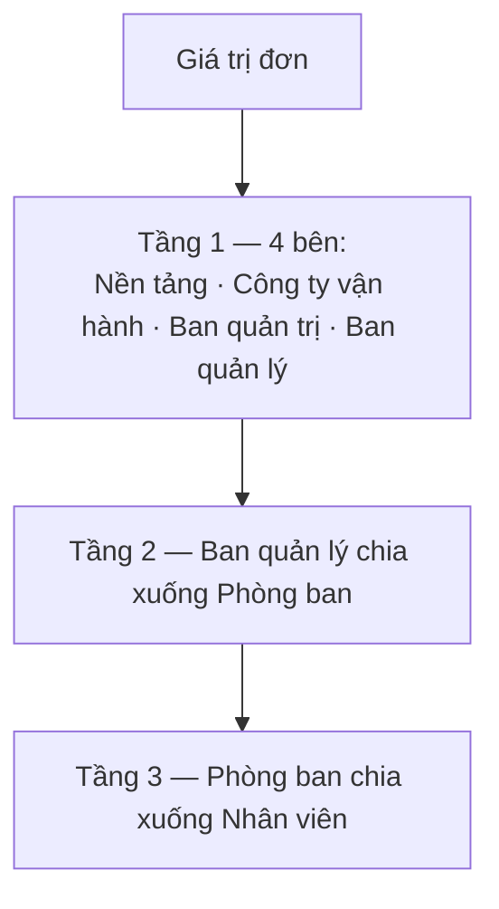

# 04 — Hoa hồng & chốt kỳ

> Mục tiêu: thiết lập cách chia hoa hồng, chốt sổ một kỳ kế toán để đóng băng số liệu, và chi hoa hồng.

## A. Cấu hình chia hoa hồng

1. Menu trái → **Kế toán/Tài chính** → **"Cấu hình hoa hồng"** (trang *"Cấu hình chia hoa hồng — Thiết lập quy tắc chia tiền hoa hồng theo dự án"*).
2. Mỗi **dự án** là một thẻ, gắn nhãn **"Đã cấu hình"** hoặc **"Chưa cấu hình"**.
3. Mở dự án để đặt tỷ lệ chia theo **3 tầng**:

- Mỗi mức đặt theo **phần trăm**, **tiền cố định**, hoặc **cả hai**.
- **Nền tảng cố định 5% + 1.000đ/đơn** (mức hệ thống, không sửa).
- **Ban quản lý** và **Phòng ban** chỉ là bước phân bổ trung gian — tiền thực chi về **Nhân viên**.

## B. Chốt kỳ kế toán

Hoa hồng được tính & đóng băng khi **chốt kỳ**.

1. Menu trái → **Kế toán/Tài chính** → **"Kỳ kế toán"** (trang *"Quản lý kỳ quyết toán…"*).
2. Bấm **"Tạo kỳ mới"** → cửa sổ *"Tạo kỳ kế toán mới"*: điền **"Tên kỳ"**, **"Từ ngày"**, **"Đến ngày"**, **"Dự án"** → tạo (*"Đã tạo kỳ chốt"*).
3. Mở kỳ → bấm **"Thêm đơn"** → cửa sổ *"Chọn đơn hàng"* → chọn các đơn → **"Thêm [n] đơn vào kỳ"** (*"Đã thêm n đơn vào kỳ"*).
4. Khi đủ → bấm **"Chốt kỳ"** → cửa sổ *"Xác nhận chốt kỳ"*, nhập **"Ghi chú"** → bấm **"Chốt"** (*"Đã chốt kỳ"*).

- Chốt kỳ → **khoá sửa đơn** trong kỳ và **đóng băng snapshot hoa hồng**. Sau khi chốt, chỉnh cấu hình tỷ lệ **không làm đổi** kỳ đã chốt.
- Cần sửa? Bấm **"Mở lại kỳ"** → *"Xác nhận mở lại kỳ"* → **"Mở lại"**. Lưu ý: nếu trong kỳ còn hoa hồng **"Đã thanh toán"**, phải chuyển về **"Chưa thanh toán"** ở trang **"Tổng hợp hoa hồng"** trước khi mở lại được.

## C. Chi hoa hồng

1. Menu trái → **Kế toán/Tài chính** → **"Tổng hợp hoa hồng"**.
2. Xem hoa hồng từng người theo kỳ đã chốt; mỗi dòng có trạng thái **"Chưa thanh toán"** / **"Đã thanh toán"**.
3. Sau khi chi tiền, chuyển dòng sang **"Đã thanh toán"**.

> Đây là **hoa hồng nội bộ** cho đơn dịch vụ tự thực hiện — khác với hoa hồng từ đơn của nhà cung cấp ngoài (Marketplace), tính riêng.

## Liên quan

- Trước đó: [03 — Công nợ & thu tiền](./03-cong-no-va-thu-tien.md)
- Tiếp theo: [05 — Cài đặt hệ thống](./05-cai-dat-he-thong.md)
- Nền tảng nghiệp vụ: [flows/platform/03 — Chia hoa hồng](../flows/platform/03-hoa-hong.md)
