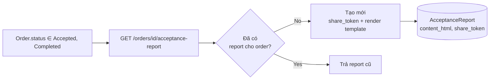

# Màn `/pmc/orders/[id]` — Tab biên bản nghiệm thu

Entity: `App\Modules\PMC\AcceptanceReport\Models\AcceptanceReport`. Gắn **0..1** cho mỗi `Order`. Không có màn list độc lập — luôn truy cập từ màn Order detail.

Chi tiết workflow đầy đủ xem [docs/flows/06-acceptance-warranty.md](../flows/06-acceptance-warranty.md). File này chỉ mô tả entry points sinh record.

## Entry points để có record

### 1. Get-or-create (single entry point duy nhất)

- **Actor**: KTV, Admin (tenant auth).
- **Route**: `GET /orders/{id}/acceptance-report` — `app/Modules/PMC/routes/api.php:117`.
- **Service**: `AcceptanceReportService::getOrCreateForOrder()` — `app/Modules/PMC/src/AcceptanceReport/Services/AcceptanceReportService.php:45`.
- **Điều kiện**:
  - Order tồn tại thuộc tenant.
  - **Không** bắt buộc Order phải ở status cụ thể khi GET (chỉ điều kiện khi confirm/upload về sau).
- **Record sinh (chỉ lần đầu gọi)**:
  - `order_id`, `content_html` (render từ tenant setting `acceptance_report.template_html`), `share_token = Str::random(40)`, `created_by_account_id`.
  - Lần gọi thứ 2 trở đi: trả record cũ, không tạo mới.

## Update vs sinh record phụ

| Thao tác | Route | Ghi chú |
|----------|-------|---------|
| Update content/customer info | `PUT /orders/{id}/acceptance-report` | Chỉ update field; nếu đổi party-A mà không sửa tay content → tự re-render |
| Regenerate template | `POST /orders/{id}/acceptance-report/regenerate` | Overwrite `content_html`, giữ share_token + customer fields |
| Upload bản ký | `POST /orders/{id}/acceptance-report/signed` | Cập nhật `signed_file_*` fields — **không tạo AR mới**. Yêu cầu Order ≥ Accepted. PDF/JPEG/PNG ≤ 20MB |
| Xoá bản ký | `DELETE /orders/{id}/acceptance-report/signed` | Null các `signed_file_*` fields |
| Cư dân confirm từ xa | `POST /public/acceptance-reports/{token}/confirm` | Cập nhật `confirmed_at`, `confirmed_signature_name`, `confirmed_note`. Yêu cầu chưa confirm trước đó + Order ≥ Accepted |
| Cư dân update qua link | `PATCH /public/acceptance-reports/{token}` | Update content/customer info/note |
| Xoá report | `DELETE /orders/{id}/acceptance-report` | Soft-delete; lần GET sau sẽ tạo report mới |

## Lưu ý

- Không thể tạo `AcceptanceReport` **độc lập với Order** — luôn phải qua `/orders/{id}/acceptance-report`.
- `share_token` (chuỗi 40 ký tự) là **nguồn duy nhất** để cư dân truy cập public endpoint — không sinh lại token khi regenerate.
- Guard `assertOrderAllowsAcceptance` chỉ áp dụng cho confirm/upload/delete-signed, **không** áp dụng cho GET/PUT/regenerate.
