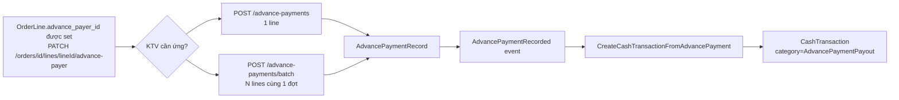

# Màn `/pmc/finance/advance-payments` — Ứng vật tư

Entity: `App\Modules\PMC\Order\AdvancePayment\Models\AdvancePaymentRecord`. Mỗi record = 1 lần KTV ứng tiền vật tư cho 1 `OrderLine` cụ thể.

## Entry points để có record

### 1. Ứng 1 line (single)

- **Actor**: Admin, Kế toán, Điều phối.
- **Route**: `POST /advance-payments` — `app/Modules/PMC/routes/api.php:129`.
- **Service**: `AdvancePaymentService::recordSingle()` — `app/Modules/PMC/src/Order/AdvancePayment/Controllers/AdvancePaymentController.php:66`.
- **Request**: `order_line_id`, `account_id` (KTV nhận ứng), `amount`, `occurred_at`, `note`.
- **Điều kiện**:
  - `OrderLine` thuộc Order đang ở `Confirmed` hoặc `InProgress`.
  - `OrderLine.advance_payer_id` đã được set (qua `PATCH /orders/{id}/lines/{lineId}/advance-payer`).
  - `amount` không vượt quá line_amount chưa ứng.
  - Order **chưa khoá** tài chính (không nằm trong ClosingPeriod Closed).
- **Side effect**:
  - Tạo 1 `AdvancePaymentRecord`.
  - Dispatch `AdvancePaymentRecorded` → listener tạo `CashTransaction` (outflow) — xem [treasury.md](treasury.md).

### 2. Ứng batch (nhiều line cùng lúc)

- **Route**: `POST /advance-payments/batch` — `app/Modules/PMC/routes/api.php:130`.
- **Service**: `AdvancePaymentService::recordBatch()`.
- **Use case**: KTV đi mua vật tư 1 lần cho cả lô line của 1 Order → tạo N record trong cùng transaction.
- **Side effect**: Mỗi record dispatch event riêng → N `CashTransaction` phát sinh.

## Các thao tác KHÔNG sinh record mới

| Thao tác | Route | Ghi chú |
|----------|-------|---------|
| List | `GET /advance-payments` | Read-only |
| Stats | `GET /advance-payments/stats` | Aggregate |
| History | `GET /advance-payments/history` | Lịch sử theo KTV |
| Delete | `DELETE /advance-payments/{id}` | Xoá record (rollback CashTransaction tương ứng qua listener/ service, nếu áp dụng) — không tạo mới |

## Pre-req: phải set `advance_payer_id` trước

Trước khi tạo `AdvancePaymentRecord`, mỗi `OrderLine` cần gán người chịu trách nhiệm ứng:

- Route: `PATCH /orders/{id}/lines/{lineId}/advance-payer` — `app/Modules/PMC/routes/api.php:111`.
- Đây là update trên `OrderLine`, không sinh record mới ở màn advance-payments.
