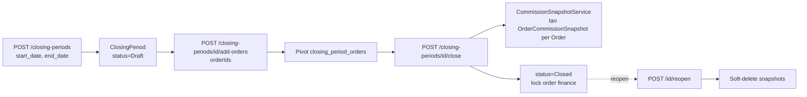

# Màn `/pmc/finance/closing-periods` — Kỳ chốt sổ

Entity: `App\Modules\PMC\ClosingPeriod\Models\ClosingPeriod` + pivot `closing_period_orders` + `OrderCommissionSnapshot` (sinh khi close).

## Entry points để có record

### 1. Tạo kỳ chốt (Kế toán)

- **Actor**: Kế toán, Admin.
- **Route**: `POST /closing-periods` — `app/Modules/PMC/routes/api.php:168`.
- **Service**: `ClosingPeriodService::create()`.
- **Request**: `name`, `start_date`, `end_date`, `note`.
- **Điều kiện**: Range ngày không chồng với kỳ `Closed` đã tồn tại (guard business rule).
- **Record sinh**:
  - `ClosingPeriod` status `Draft`, chưa có order nào.

### 2. Gán Order vào kỳ

- **Route**: `POST /closing-periods/{id}/add-orders` — `app/Modules/PMC/routes/api.php:172`.
- **Pre-query**: `GET /closing-periods/{id}/eligible-orders` — trả về Order đã `Completed` trong khoảng start/end và chưa bị kỳ nào khác ôm.
- **Record sinh**: Pivot `closing_period_orders` (order_id ↔ closing_period_id). Không sinh snapshot ở bước này.
- **Xoá lẻ**: `DELETE /closing-periods/{id}/orders/{orderId}`.

### 3. Close kỳ → sinh `OrderCommissionSnapshot`

- **Actor**: Kế toán.
- **Route**: `POST /closing-periods/{id}/close` — `app/Modules/PMC/routes/api.php:174`.
- **Service**: `ClosingPeriodService::close()` → iterate pivot orders → `CommissionSnapshotService::createSnapshotsForOrder()`.
- **Side effect sinh record**:
  - Với **mỗi Order** trong kỳ, tạo 1 hoặc nhiều `OrderCommissionSnapshot` (1 snapshot / recipient: party-A/B/C, phòng ban, KTV).
  - Nguồn tính hoa hồng có 2 nhánh:
    - `OrderCommissionOverride` nếu đơn có override (ưu tiên cao hơn).
    - Default: `CommissionConfig` của project (party + dept + staff).
  - ClosingPeriod chuyển `status = Closed` → các Order trong kỳ bị `isFinanciallyLocked=true`.

### 4. Reopen kỳ → rollback snapshot

- **Route**: `POST /closing-periods/{id}/reopen` — `app/Modules/PMC/routes/api.php:175`.
- **Side effect**: Soft-delete toàn bộ `OrderCommissionSnapshot` thuộc kỳ (giúp tính lại khi close lần sau). ClosingPeriod về `Draft`.

### 5. Xoá kỳ

- **Route**: `DELETE /closing-periods/{id}` — `app/Modules/PMC/routes/api.php:170`.
- **Điều kiện**: Kỳ còn `Draft`, không có snapshot.
- Không sinh mới.

## Record con: `OrderCommissionSnapshot`

Xem chi tiết entry point & logic tính ở [commission-summary.md](commission-summary.md). Snapshot **KHÔNG** có đường tạo trực tiếp — chỉ qua close/reopen.

## Record con: pivot `closing_period_orders`

- Không hiển thị độc lập trên màn. Chỉ tạo qua `add-orders`, xoá qua `/orders/{orderId}` DELETE hoặc `reopen`.
