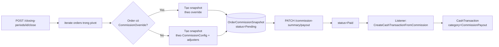

# Màn `/pmc/finance/commission-summary` — Tổng hợp hoa hồng

Entity hiển thị: `App\Modules\PMC\ClosingPeriod\Models\OrderCommissionSnapshot` (aggregate theo recipient).

## Entry points để có record

**Không có route `POST /commission-summary`**. Snapshot **chỉ sinh** khi `ClosingPeriod` được close (xem [closing-periods.md](closing-periods.md)).

### 1. Sinh snapshot — Close ClosingPeriod

- **Service**: `CommissionSnapshotService::createSnapshotsForOrder()` — `app/Modules/PMC/src/ClosingPeriod/Services/CommissionSnapshotService.php:25`.
- **Với mỗi Order** trong kỳ:
  - Xác định recipients theo 3 cấp: Party (A/B/C), Department, Staff (KTV).
  - Nếu order có `OrderCommissionOverride` → dùng override làm nguồn.
  - Nếu không → đọc `CommissionConfig` của project + adjusters (phụ cấp / phụ trừ).
  - Tính `amount` theo công thức của commission engine.
  - Insert 1 `OrderCommissionSnapshot` per recipient.
- **Field**: `order_id`, `closing_period_id`, `recipient_type` (Party/Department/Staff), `account_id` hoặc `department_id`, `amount`, `status=Pending`.

### 2. Recalc snapshot — Reopen ClosingPeriod (sau đó close lại)

- **Service**: `CommissionSnapshotService::recalculateForOrder()` — gọi khi reopen → close lại.
- Xoá (soft) snapshot cũ của order trong kỳ, insert lại theo config hiện tại.

### 3. Payout — Đánh dấu đã chi

- **Route**: `PATCH /commission-summary/payout` — `app/Modules/PMC/routes/api.php:179`.
- **Service**: `CommissionSummaryController::updatePayout()` — cập nhật 1 hoặc nhiều snapshot sang `Paid` với `paid_at`.
- **Side effect**:
  - Listener `CreateCashTransactionFromCommission` lắng nghe event snapshot-paid → sinh `CashTransaction` category `CommissionPayout` (outflow) — xem [treasury.md](treasury.md).

## Đọc snapshot theo Order

- `GET /orders/{id}/commission-snapshot` — read-only, trả snapshot của 1 Order bất kỳ.

## Commission config (nguồn tính hoa hồng)

Config **không phải snapshot** — là dữ liệu cố định của project, quản lý riêng ở màn `/pmc/commission`. Xem [fixed-records.md](fixed-records.md). Config thay đổi **không** tự rebuild snapshot; phải reopen + close lại kỳ.

## Không có entry point tạo snapshot tay

- Không có route `POST` nào cho snapshot.
- Muốn có snapshot cho Order X → phải (1) add Order X vào ClosingPeriod, (2) close period.
