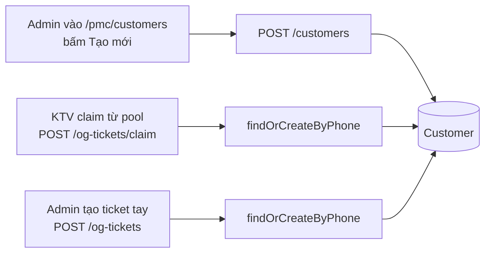

# Màn `/pmc/customers` — Danh bạ cư dân

Entity: `App\Modules\PMC\Customer\Models\Customer` (tenant-level, duy nhất theo SĐT trong 1 tenant). Khác với `Platform\Customer` (central-level, dùng cho submit ticket public).

## Entry points để có record

### 1. Admin tạo trực tiếp ở màn danh bạ

- **Actor**: Admin, Điều phối.
- **Route**: `POST /customers` — `app/Modules/PMC/routes/api.php:47`.
- **Service**: `CustomerService::create()`.
- **Điều kiện**:
  - SĐT chưa tồn tại trong tenant (unique constraint partial cho soft-delete).
- **Side effect**:
  - Tạo record với `source` = `manual` (mặc định) hoặc theo input.

### 2. Auto find-or-create khi **claim** ticket

- **Trigger**: `OgTicketService::claim()` gọi `CustomerService::findOrCreateByPhone($phone, $name)` — `app/Modules/PMC/src/OgTicket/Services/OgTicketService.php:82`.
- **Side effect**:
  - Nếu SĐT đã có → trả về customer cũ, gọi `markContacted()` update `last_contacted_at`.
  - Nếu chưa có → tạo customer mới bằng SĐT + tên từ ticket.
- **Ghi chú**: Customer này có thể chưa có đủ metadata (địa chỉ, email…) — admin cần bổ sung sau ở màn customer detail.

### 3. Auto find-or-create khi **admin tạo ticket tay**

- **Trigger**: `OgTicketService::create()` gọi `findOrCreateByPhone()` — `app/Modules/PMC/src/OgTicket/Services/OgTicketService.php:148`.
- **Điều kiện giống** path 2.

## Record phụ: PMC customer **không phải** Platform customer

Có 2 entity Customer khác nhau:

| Tầng | Module | Mục đích | Sinh khi |
|------|--------|----------|---------|
| Tenant | `App\Modules\PMC\Customer\Models\Customer` | Danh bạ cư dân của 1 tổ chức dịch vụ | 3 path ở trên |
| Central | `App\Modules\Platform\Customer\Models\Customer` | Sổ cái cư dân cross-tenant (phục vụ form submit public) | Khi cư dân submit `POST /api/tickets` lần đầu |

`PMC\Customer.phone` và `Platform\Customer.phone` không đồng bộ hoá tự động. `Platform\Customer` chỉ expose `GET` qua authenticated platform API (`/platform/customers`), không có route tạo tay.

## Các thao tác KHÔNG sinh record mới

| Thao tác | Route | Ghi chú |
|----------|-------|---------|
| List | `GET /customers` | |
| Detail | `GET /customers/{id}` | |
| Update | `PUT /customers/{id}` | |
| Delete | `DELETE /customers/{id}` | Soft; có `check-delete` kiểm tra ticket/order/payment đã gắn customer |
| Tickets/Orders/Payments của customer | `GET /customers/{id}/tickets`, `/orders`, `/payments` | Read-only aggregate |
