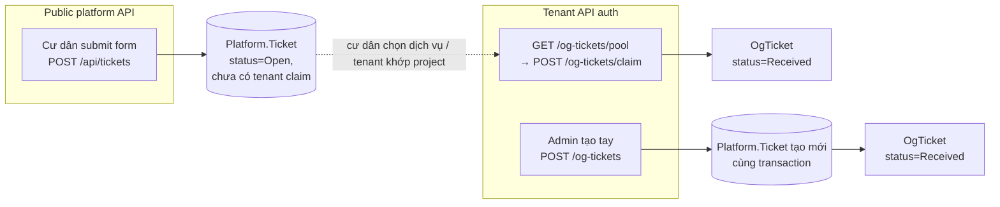

# Màn `/pmc/og-tickets` — Danh sách ticket nội bộ

Entity: `App\Modules\PMC\OgTicket\Models\OgTicket` (tenant DB). Mỗi record luôn gắn với 1 `Platform\Ticket` (central DB) qua `ticket_id`.

## Entry points để có record

OgTicket được sinh theo **3 con đường**, tương ứng 3 kịch bản nghiệp vụ:

### 1. Claim từ pool (KTV/Admin nhận ticket cư dân đã gửi)

- **Actor**: KTV hoặc Admin có quyền trên tenant.
- **Flow**: Cư dân submit form ở kênh public → ticket vào pool platform → KTV vào màn `/pmc/og-tickets` xem pool → bấm nhận.
- **Route**: `POST /og-tickets/claim` (tenant).
- **Service**: `OgTicketService::claim()` — `app/Modules/PMC/src/OgTicket/Services/OgTicketService.php:56`.
- **Điều kiện**:
  - Ticket tồn tại trên platform, chưa bị tenant khác claim (lock check → throw `TICKET_ALREADY_CLAIMED` nếu fail).
  - Tenant có `project_id` khớp với ticket (ticket đã được cư dân chọn dự án).
- **Side effect**:
  - Auto `Customer::findOrCreateByPhone(phone, name)` → có `customer_id` (sinh `Customer` mới nếu SĐT chưa có).
  - `OgTicketLifecycleService::openFirst()` mở segment đầu tiên.
  - `sla_quote_due_at = now() + setting('og_ticket.sla_quote_minutes', 60)`.
  - Status khởi tạo: `Received`.
- **Rollback**: Nếu tạo `OgTicket` fail → gọi `ticketExternalService->releaseTicket()` trả ticket về pool.

### 2. Cư dân submit form public (chưa có OgTicket, chỉ tạo `Ticket` central)

- **Actor**: Cư dân (không auth, throttle).
- **Route**: `POST /api/tickets` (Platform public) — `app/Modules/Platform/routes/api.php:10`.
- **Service**: `Platform\Ticket\Services\TicketService::submit()` — tạo `Platform\Ticket` model ở platform DB.
- **Điều kiện**:
  - Cư dân có thể chọn dịch vụ (liên kết `service_category`) để routing tới tenant phù hợp.
- **Side effect**:
  - Tạo `Platform\Customer` hoặc match SĐT cũ.
  - **Chưa** tạo `OgTicket` trên tenant — chỉ xuất hiện ở màn pool `GET /og-tickets/pool` chờ claim.
- **Ghi chú**: bản ghi ở màn `/pmc/og-tickets` **chưa có** tại bước này. Chỉ khi có tenant claim mới xuất hiện.

### 3. Admin tạo tay (tính năng mới — hotline / walk-in)

- **Actor**: Admin, Điều phối (quyền tenant).
- **Route**: `POST /og-tickets` (tenant) — `app/Modules/PMC/routes/api.php:71`.
- **Request**: `CreateOgTicketRequest` — yêu cầu `requester_name`, `requester_phone`, `subject`, `channel`, `priority`. Optional: `description`, `address`, `apartment_name`, `project_id`, `assigned_to_ids[]`, `category_ids[]`, `attachments[]`, `internal_note`, `received_by_id`.
- **Service**: `OgTicketService::create()` — `app/Modules/PMC/src/OgTicket/Services/OgTicketService.php:128`.
- **Flow 2 phase**:
  1. Tạo `Platform\Ticket` (connection platform, ngoài tenant transaction) qua `TicketExternalService::createTicketForOrg()`.
  2. Tenant transaction: `Customer::findOrCreateByPhone` → `OgTicket` → sync assignees/categories → upload attachments.
- **Điều kiện**:
  - `project_id` (nếu có) phải thuộc tenant.
  - `assigned_to_ids` (nếu có) phải là account active trong tenant → lifecycle auto-transition `Received → Assigned`.
- **Side effect**:
  - Tạo `Customer` nếu SĐT chưa tồn tại.
  - `OgTicketLifecycleSegment` mở từ status `Received`, nếu có assignee sẽ đóng segment cũ và mở `Assigned`.
  - Upload attachment → `HasTenantAttachments` trait.
  - Nếu tenant transaction fail → **gọi `ticketExternalService->deleteTicket()` dọn orphan Platform\\Ticket**.

## Các thao tác KHÔNG sinh record mới

| Thao tác | Route | Ghi chú |
|----------|-------|---------|
| Update ticket | `PUT /og-tickets/{id}` | Chỉ sửa field; chặn nếu đã `Cancelled` |
| Transition trạng thái | `PUT /og-tickets/{id}/transition` | Không tạo `OgTicket` mới, nhưng tạo `OgTicketLifecycleSegment` |
| Release (trả về pool) | `PUT /og-tickets/{id}/release` | Soft-return cho tenant khác claim lại |
| Sync categories | `PUT /og-tickets/{id}/categories` | Chỉ update pivot |
| Delete | `DELETE /og-tickets/{id}` | Soft delete (có `check-delete` trước) |

## Phụ trợ: OgTicketLifecycleSegment

Mỗi `OgTicket` có N lifecycle segment, **tự sinh** theo status transition:

- **Lần đầu**: `OgTicketLifecycleService::openFirst()` khi tạo ticket (cả 2 path claim/admin).
- **Mỗi transition**: `OgTicketLifecycleService::transition()` đóng segment cũ (`ended_at = now()`) và mở segment mới.
- **Backtrack cycle**: nếu chuyển workflow ngược (ví dụ `Rejected → Quoted`), tăng `cycle` counter.
- Không có entry point tạo tay — luôn auto.

## Platform.Ticket đối xứng

Record trên màn pool (`GET /og-tickets/pool`) trỏ tới `Platform\Ticket`, **chưa phải** `OgTicket`. Các nguồn sinh `Platform\Ticket`:

| Nguồn | Chi tiết |
|-------|---------|
| Cư dân submit form public | `POST /api/tickets` |
| Admin tạo tay trên tenant | `POST /og-tickets` → gọi `TicketExternalService::createTicketForOrg` tạo song song |

Tức là `Platform\Ticket` không được tạo độc lập từ tenant — luôn kèm `OgTicket` (path 3) hoặc đứng độc lập chờ claim (path 2).
