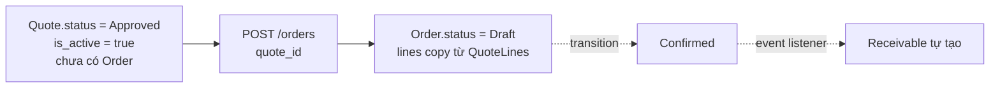

# Màn `/pmc/orders` — Đơn hàng

Entity: `App\Modules\PMC\Order\Models\Order` + `OrderLine` (detail). Gắn 1-1 với 1 `Quote` đã `Approved`.

## Entry points để có record

Chỉ **1 con đường** tạo `Order`: từ 1 `Quote` đã được cư dân (hoặc manager) duyệt.

### 1. Tạo Order từ Quote `Approved` (Admin)

- **Actor**: Admin (kế toán / quản trị).
- **Route**: `POST /orders` — `app/Modules/PMC/routes/api.php:123`.
- **Service**: `OrderService::create()` — `app/Modules/PMC/src/Order/Services/OrderService.php:61`.
- **Điều kiện**:
  - `quote_id` tham chiếu `Quote` active (`is_active=true`) và `status = Approved`.
  - Ticket liên kết **chưa có Order nào active khác** (guard tại service).
- **Side effect**:
  - Tự copy toàn bộ `QuoteLine` → `OrderLine` (snapshot giá gốc).
  - `total_amount = sum(line_amount)`.
  - Status khởi tạo `Draft`. Chưa có `Receivable`.

## Transition sinh record phụ

Order transition qua `POST /orders/{id}/transition` — các nhánh sinh record phụ:

| Transition | Record phụ sinh | Trigger |
|-----------|-----------------|---------|
| `Draft → Confirmed` | **Receivable** tự tạo 1 bản | `OrderService::transition()` gọi `ReceivableService::createFromOrder()` (inline, không qua event). Idempotent — `findByOrderId` trước khi tạo. |
| `Confirmed → InProgress` | — | Chỉ đổi status |
| `InProgress → Accepted` | — | Không tạo gì. Order cần ở Accepted TRƯỚC mới confirm/upload AcceptanceReport (xem [acceptance-reports.md](acceptance-reports.md)). |
| `Accepted → Completed` | `completed_at = now()` | Không tạo record, nhưng trigger downstream: Receivable có thể auto-complete khi đủ tiền |
| `* → Cancelled` | — | Có thể trigger `ReceivableService::handleOrderCancelled()` để huỷ receivable liên quan |

## Records con thuộc Order

### OrderLine
- Tạo **cùng lúc** với Order (copy từ QuoteLine). Không có entry point tạo riêng.
- Update: `PATCH /orders/{id}/lines/{lineId}/advance-payer`, `PATCH /orders/{id}/lines/{lineId}/prices`. Không tạo mới, chỉ sửa.

### OrderCommissionOverride
- **Actor**: Admin / Kế toán (override hoa hồng cho 1 đơn đặc biệt).
- **Route**: `PUT /orders/{id}/commission-override` — `app/Modules/PMC/routes/api.php:114`.
- **Điều kiện**: Order chưa nằm trong `ClosingPeriod` đã `Closed` (xem `isFinanciallyLocked`).
- **Side effect**: Lần gọi đầu tiên tạo record; lần sau là update. Xoá qua `DELETE /orders/{id}/commission-override`.

### OrderCommissionSnapshot
- **Không tạo qua API thông thường** — chỉ sinh kèm khi close `ClosingPeriod` (xem [closing-periods.md](closing-periods.md)).
- Read-only endpoint: `GET /orders/{id}/commission-snapshot`.

### AcceptanceReport
- Tạo qua `GET /orders/{id}/acceptance-report` (get-or-create). Yêu cầu Order ở `Accepted` hoặc `Completed` mới thao tác tiếp được (confirm/upload signed). Xem [acceptance-reports.md](acceptance-reports.md).

## Các thao tác KHÔNG sinh record Order mới

| Thao tác | Route | Ghi chú |
|----------|-------|---------|
| Update | `PUT /orders/{id}` | Sửa note/lines (nếu chưa khoá tài chính) |
| Delete | `DELETE /orders/{id}` | Soft; có `check-delete` (kiểm receivable, reconciliation, closing period) |
| Transition | `POST /orders/{id}/transition` | Đổi status; sinh record phụ theo bảng trên |
