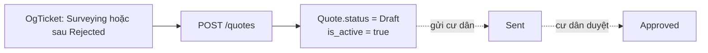

# Màn `/pmc/quotes` — Báo giá

Entity: `App\Modules\PMC\Quote\Models\Quote` + `QuoteLine` (detail). Mỗi `Quote` gắn 1 `OgTicket` qua `og_ticket_id`; 1 `OgTicket` có N version quote nhưng chỉ 1 `is_active = true`.

## Entry points để có record

Chỉ **1 con đường** tạo `Quote`: qua API admin/tenant từ 1 `OgTicket` đang ở trạng thái phù hợp.

### 1. Tạo báo giá từ OgTicket (KTV hoặc Admin)

- **Actor**: KTV được assign ticket, hoặc Admin.
- **Route**: `POST /quotes` — `app/Modules/PMC/routes/api.php:105`.
- **Service**: `QuoteService::create()` — `app/Modules/PMC/src/Quote/Services/QuoteService.php:73`.
- **Điều kiện**:
  - `og_ticket_id` hợp lệ, thuộc tenant.
  - OgTicket **chưa hoàn tất** và hiện chưa có Quote `Approved`.
  - Nếu ticket đã có active quote và caller truyền `replace_active=true` → service sẽ deactivate quote cũ (`is_active=false`, giữ lại làm version history). Không truyền flag này → throw.
- **Request fields**:
  - `og_ticket_id`, `title`, `note`, `lines[]` (mỗi line: `line_type`, `reference_id`?, `name`, `quantity`, `unit`, `unit_price`, `purchase_price`).
- **Side effect**:
  - Quote mới khởi tạo `status = Draft`, `is_active = true`, `version = max(existing) + 1`.
  - Tự tính `total_amount = sum(line_amount)`.
  - OgTicket status: **không tự động chuyển**. KTV vẫn cần trigger transition `Surveying → Quoted` sau (guard yêu cầu active quote status ≥ `Sent`).

### 2. Tạo revision (v2, v3...) sau khi cư dân reject

- Dùng cùng route `POST /quotes` với `replace_active=true`.
- Dành cho flow: cư dân từ chối v1 → KTV chỉnh lines → tạo v2.
- Quote cũ chuyển `is_active=false` nhưng **không bị xoá**, dùng làm history ở màn quote versions (`GET /quotes/versions/{ogTicketId}`).

## Các thao tác KHÔNG sinh record Quote mới

| Thao tác | Route | Ghi chú |
|----------|-------|---------|
| Update | `PUT /quotes/{id}` | Sửa lines/title/note khi còn `Draft` |
| Transition status | `POST /quotes/{id}/transition` | `Draft → Sent → Approved/ResidentRejected/ManagerApproved`… Không tạo Quote mới. Guard: đổi `Approved` yêu cầu `is_active=true`. |
| Delete | `DELETE /quotes/{id}` | Soft delete; có `check-delete` kiểm tra đã dùng tạo Order chưa |

## Cascade từ Quote

Khi Quote chuyển `Approved`, **không** tự động tạo Order. Việc tạo `Order` là hành động riêng của admin (xem [orders.md](orders.md)). Danh sách quote đủ điều kiện tạo Order: `GET /orders/available-quotes`.
