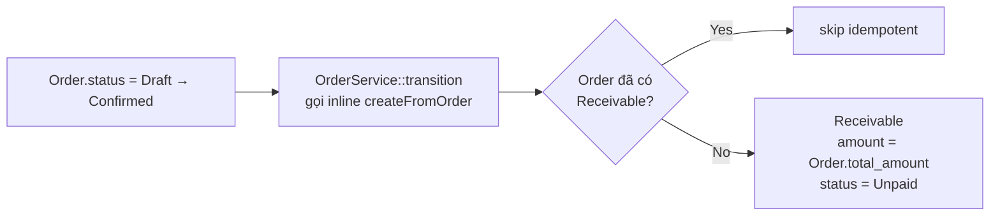

# Màn `/pmc/receivables` — Công nợ phải thu

Entity: `App\Modules\PMC\Receivable\Models\Receivable`. Gắn 1-1 với `Order`. Bản thân Receivable có các record con: `PaymentReceipt`, `RefundReceipt`.

## Entry points để có record

**Không có route `POST /receivables`**. Bản ghi được sinh hoàn toàn từ **hệ thống** (auto-create), không có tạo tay từ UI.

### 1. Auto-create khi Order chuyển `Confirmed`

- **Actor**: Hệ thống (inline service call, không qua event bus).
- **Trigger**: `OrderService::transition()` — `app/Modules/PMC/src/Order/Services/OrderService.php:168`.
- **Service**: `ReceivableService::createFromOrder(Order $order)` — `app/Modules/PMC/src/Receivable/Services/ReceivableService.php:286`.
- **Điều kiện**:
  - Order chuyển sang `Confirmed`.
  - Quote liên kết đã `Approved` (guard upstream).
  - Idempotent: `findByOrderId()` trước — nếu đã có thì skip.
- **Field sinh**:
  - `order_id` = Order.id
  - `amount` = Order.total_amount
  - `status` = `Unpaid`
  - `paid_amount = 0`

### 2. Seeder (môi trường dev)

- **Nguồn**: `ReceivableSeeder` — tạo Receivable cho các Order đã ở `Confirmed/InProgress/Accepted/Completed` trong seed data.
- **Chỉ chạy khi seed tenant**, không phải entry point production.

## Record con của Receivable

Từ detail receivable (`/pmc/receivables/[id]`) có thể phát sinh **`PaymentReceipt`** và **`RefundReceipt`**.

### PaymentReceipt — ghi nhận khách thanh toán

- **Actor**: Kế toán.
- **Route**: `POST /receivables/{id}/payments` — `app/Modules/PMC/routes/api.php:136`.
- **Service**: `ReceivableService::recordPayment()`.
- **Điều kiện**:
  - Receivable chưa `Completed` / `WrittenOff`.
  - Số tiền hợp lệ (không vượt còn nợ).
- **Side effect**:
  - Tạo `PaymentReceipt` con.
  - Cộng dồn `paid_amount` trên Receivable; nếu đủ → status `Paid` (hoặc auto-complete nếu settings cho phép).
  - **Tạo 1 `FinancialReconciliation`** (status `Pending`) qua `ReconciliationService::createFromPaymentReceipt()` — xem [reconciliations.md](reconciliations.md).

### Update PaymentReceipt

- Route: `PUT /receivables/{id}/payments/{paymentId}`. Không tạo mới, chỉ sửa số tiền / ghi chú.

### RefundReceipt — hoàn tiền cho khách

- **Route**: `POST /receivables/{id}/refund` — `app/Modules/PMC/routes/api.php:138`.
- **Service**: `ReceivableService::recordRefund()`.
- **Side effect**: Tạo `FinancialReconciliation` (category `CustomerRefund`).

### Actions không sinh Receivable mới

| Action | Route | Ý nghĩa |
|--------|-------|---------|
| Complete thủ công | `POST /receivables/{id}/complete` | Đóng receivable khi đã thu đủ |
| Write-off | `POST /receivables/{id}/write-off` | Ghi nhận không thu được |

## Thao tác bị chặn

- **Không có** route create/update/delete cho `Receivable` bản thân. `apiResource` chỉ mở `['index', 'show']` (`app/Modules/PMC/routes/api.php:141-143`).
- Muốn huỷ Receivable → phải huỷ Order tương ứng (`OrderService::transition(Cancelled)` → `ReceivableService::handleOrderCancelled`).
