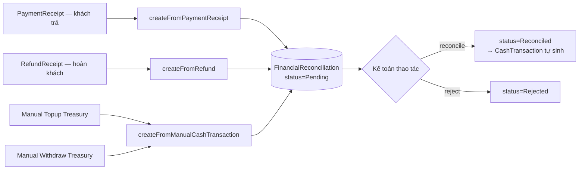

# Màn `/pmc/finance/reconciliation` — Đối soát tài chính

Entity: `App\Modules\PMC\Reconciliation\Models\FinancialReconciliation`. Mỗi bản ghi là 1 giao dịch tiền cần được kế toán xác nhận (approve) hoặc từ chối (reject).

## Entry points để có record

**Không có route `POST /reconciliations`**. Toàn bộ record sinh **tự động** từ các nguồn khác, ở trạng thái `Pending`.

### 1. Từ PaymentReceipt (khách trả tiền)

- **Trigger**: `ReceivableService::recordPayment()` → `ReconciliationService::createFromPaymentReceipt()` — `app/Modules/PMC/src/Reconciliation/Services/ReconciliationService.php:157`.
- **Actor**: Hệ thống (sau khi kế toán ghi nhận PaymentReceipt tại màn Receivable).
- **Record sinh**:
  - `amount = PaymentReceipt.amount`
  - `direction = Inflow`
  - `category = ReceivableCollection`
  - `status = Pending`
  - `source_type = PaymentReceipt`, `source_id = <id>`

### 2. Từ RefundReceipt (hoàn tiền cho khách)

- **Trigger**: `ReceivableService::recordRefund()`.
- **Record sinh**: `direction = Outflow`, `category = CustomerRefund`.

### 3. Từ manual Treasury topup/withdraw

- **Trigger**: `TreasuryService::recordManualTopup()` / `recordManualWithdraw()` → `ReconciliationService::createFromManualCashTransaction()` — `app/Modules/PMC/src/Treasury/Services/TreasuryService.php:356`.
- **Actor**: Hệ thống (sau khi admin nhập topup/withdraw tại màn Treasury).
- **Record sinh**: `category = ManualTopup` hoặc `ManualWithdraw`, status `Pending`.

## Actions đổi status

| Route | Service | Side effect |
|-------|---------|-------------|
| `POST /reconciliations/{id}/reconcile` | `ReconciliationService::reconcile()` | status `Reconciled` → dispatch event `FinancialReconciliationApproved` → listener `CreateCashTransactionFromReconciliation` sinh `CashTransaction` (xem [treasury.md](treasury.md)) |
| `POST /reconciliations/{id}/reject` | `ReconciliationService::reject()` | status `Rejected`; không sinh CashTransaction |
| `POST /reconciliations/batch-reconcile` | Reconcile hàng loạt | Dispatch nhiều event song song |

## Không thể tạo reconciliation tay

- Không có route `POST /reconciliations` độc lập.
- Muốn có 1 reconciliation xuất hiện ở màn → phải đi qua 1 trong 4 upstream: PaymentReceipt, RefundReceipt, Treasury topup, Treasury withdraw.
