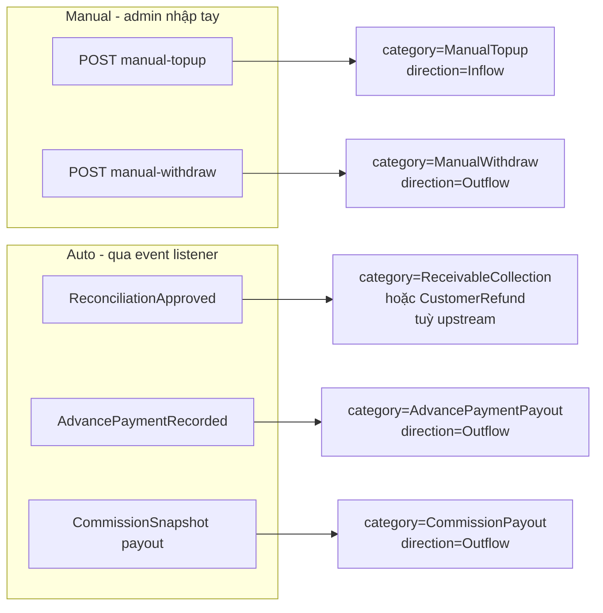

# Màn `/pmc/finance/treasury` — Quỹ (Cash Transaction)

Entity: `App\Modules\PMC\Treasury\Models\CashTransaction`. Mỗi record là 1 dòng tiền in/out của 1 `CashAccount`.

## Entry points để có record

CashTransaction có **6 category**, phân 2 nhóm:

### 1. Manual topup (Admin nạp quỹ)

- **Actor**: Admin, Kế toán.
- **Route**: `POST /treasury/transactions/manual-topup` — `app/Modules/PMC/routes/api.php:195`.
- **Request**: `ManualTopupRequest` — `cash_account_id`, `amount`, `occurred_at`, `note`.
- **Service**: `TreasuryService::recordManualTopup()` — `app/Modules/PMC/src/Treasury/Services/TreasuryService.php:91`.
- **Side effect**:
  - Tạo `CashTransaction` (category `ManualTopup`, inflow).
  - Tạo `FinancialReconciliation` (status `Pending`) qua `createFromManualCashTransaction()` — xem [reconciliations.md](reconciliations.md). → Ghi chú: dòng tiền sẽ *chỉ* thực sự được "approved" khi kế toán reconcile.

### 2. Manual withdraw (Admin rút quỹ)

- **Route**: `POST /treasury/transactions/manual-withdraw` — `app/Modules/PMC/routes/api.php:196`.
- **Service**: `TreasuryService::recordManualWithdraw()`.
- **Side effect**: CashTransaction `ManualWithdraw` + `FinancialReconciliation` pending tương tự.

### 3. Auto từ `FinancialReconciliationApproved` event

- **Trigger**: Kế toán bấm `POST /reconciliations/{id}/reconcile` → event `FinancialReconciliationApproved` → listener `CreateCashTransactionFromReconciliation` — `app/Modules/PMC/src/Treasury/Listeners/CreateCashTransactionFromReconciliation.php`.
- **Category**: Tuỳ upstream của reconciliation (`ReceivableCollection` nếu từ PaymentReceipt, `CustomerRefund` nếu từ refund…).
- **Ngoại lệ**: Reconciliation từ manual topup/withdraw **KHÔNG sinh** thêm CashTransaction khi approve (vì đã sinh ở bước manual).

### 4. Auto từ `AdvancePaymentRecorded` event

- **Trigger**: `AdvancePaymentService::recordSingle()` hoặc `recordBatch()` dispatch `AdvancePaymentRecorded` → listener `CreateCashTransactionFromAdvancePayment`.
- **Category**: `AdvancePaymentPayout`, outflow.
- **Lý do**: Khi KTV ứng vật tư, phải chi ngay từ quỹ công ty — không cần kế toán approve lại.

### 5. Auto từ commission payout

- **Trigger**: Khi `OrderCommissionSnapshot` chuyển sang `Paid` (payout) qua `PATCH /commission-summary/payout` → listener `CreateCashTransactionFromCommission`.
- **Category**: `CommissionPayout`, outflow.

## Enum `CashTransactionCategory`

| Value | Nguồn sinh |
|-------|-----------|
| `ManualTopup` | Route manual-topup |
| `ManualWithdraw` | Route manual-withdraw |
| `ReceivableCollection` | Reconciliation approved (upstream = PaymentReceipt) |
| `CustomerRefund` | Reconciliation approved (upstream = RefundReceipt) |
| `AdvancePaymentPayout` | Event AdvancePaymentRecorded |
| `CommissionPayout` | Listener từ snapshot paid |

## Actions không sinh record

| Action | Route | Ý nghĩa |
|--------|-------|---------|
| List | `GET /treasury/transactions` | Read-only |
| Show | `GET /treasury/transactions/{id}` | Read-only |
| Delete | `DELETE /treasury/transactions/{id}` | Xoá manual tx (có guard) — không tạo mới |

## CashAccount

- **Read-only** ở UI tenant (không có `POST /treasury/cash-accounts`).
- Sinh qua **seeder** hoặc setup ban đầu của tenant (xem `database/seeders/Tenant/*`).
- Endpoint chỉ có `GET index / show / default` — `app/Modules/PMC/routes/api.php:191-193`.
