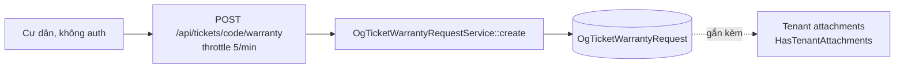

# Màn `/pmc/og-tickets/[id]` — Tab khiếu nại bảo hành

Entity: `App\Modules\PMC\OgTicket\Models\OgTicketWarrantyRequest`. Gắn N cho 1 `OgTicket` (cư dân có thể khiếu nại nhiều lần trong thời hạn bảo hành).

## Entry points để có record

**Không có route tạo từ UI tenant.** Bản ghi chỉ sinh từ 1 nguồn: cư dân submit form qua platform public API.

### 1. Cư dân submit form bảo hành (public)

- **Actor**: Cư dân (không auth).
- **Route**: `POST /api/tickets/{code}/warranty` — `app/Modules/Platform/routes/api.php:18`.
- **Middleware**: `throttle:5,1` (tối đa 5 request / phút / IP).
- **Controller**: `TicketWarrantyController::submit()`.
- **Service**: `OgTicketWarrantyRequestService::create(int $ogTicketId, string $requesterName, array $data, array $files)`.
- **Điều kiện**:
  - `code` là `OgTicket.code` tồn tại.
  - OgTicket đã ở `Completed` (trong thời hạn bảo hành nghiệp vụ — thường 3–12 tháng từ `completed_at`).
  - Cư dân có thể upload attachments (ảnh hư hỏng).
- **Record sinh**:
  - `OgTicketWarrantyRequest` với `og_ticket_id`, `requester_name`, `subject`, `description`, `created_at`.
  - Attachments qua `HasTenantAttachments` trait (lưu ảnh qua `StorageService`).

## Không có entry point tenant-side

- Admin / KTV **không thể** tạo warranty request từ UI tenant. Muốn ghi nhận khiếu nại, admin phải hướng dẫn cư dân submit qua link portal hoặc gọi API thay cư dân (chưa có UI).
- Đây là 1 gap có thể bổ sung sau (admin on-behalf).

## Downstream

Sau khi có `OgTicketWarrantyRequest`, KTV review và quyết định:

- **Trong phạm vi bảo hành** → tạo `OgTicket` mới liên kết (field link chưa chính thức hoá), status/priority do nghiệp vụ.
- **Ngoài phạm vi** → tạo `OgTicket` mới như ticket thường (tính phí).

Tức warranty request không tự động sinh OgTicket mới — là quyết định thủ công của KTV.
