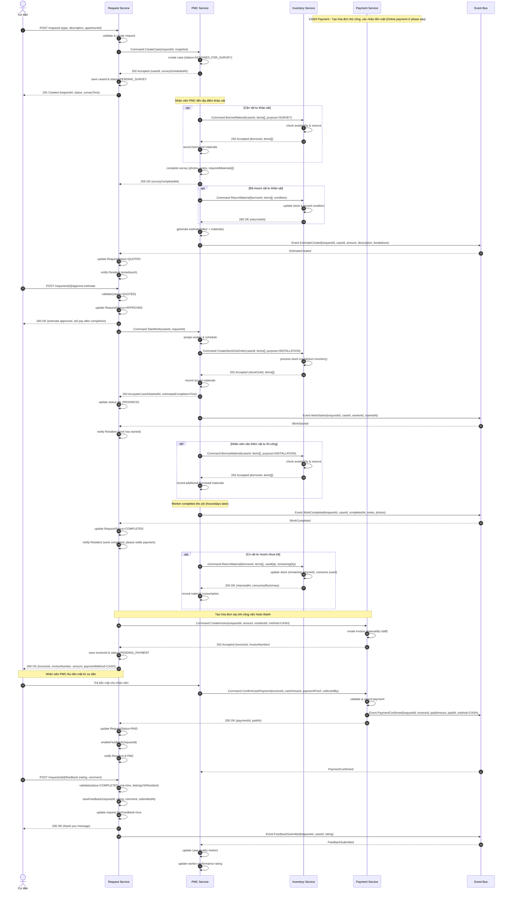
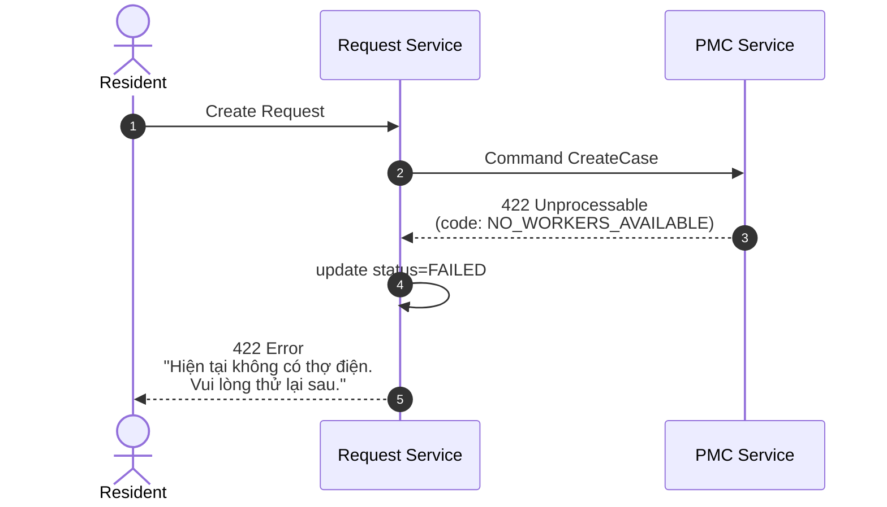
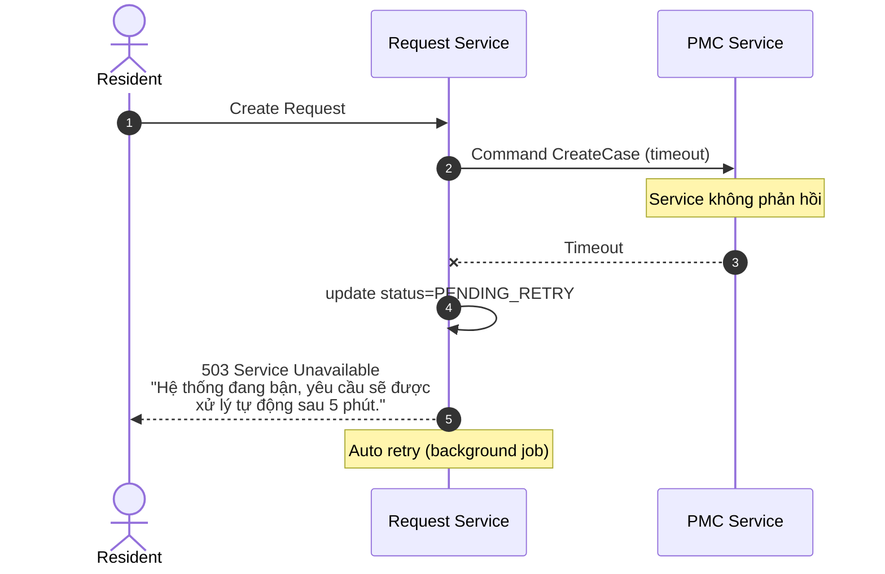
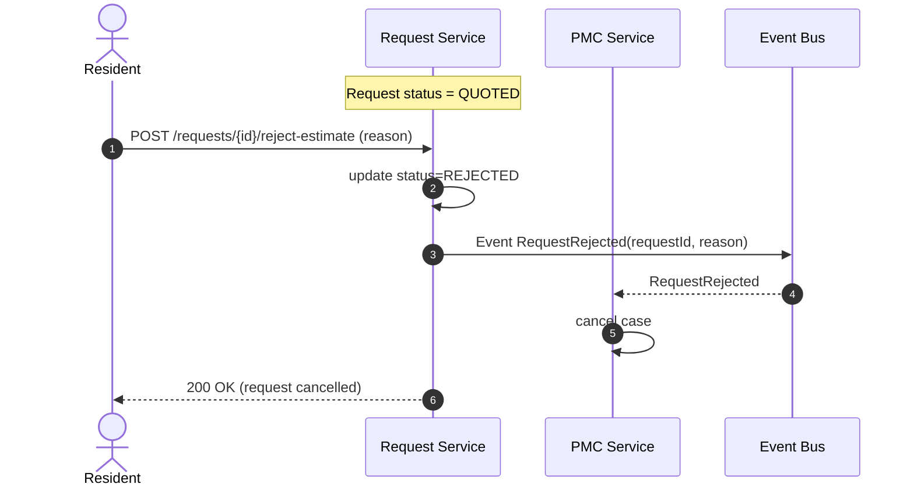
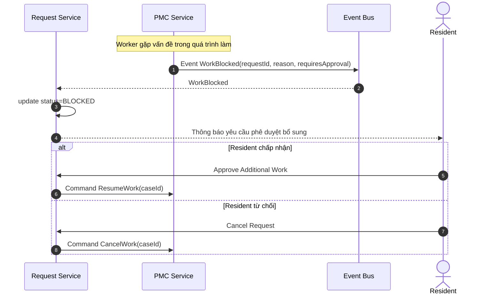
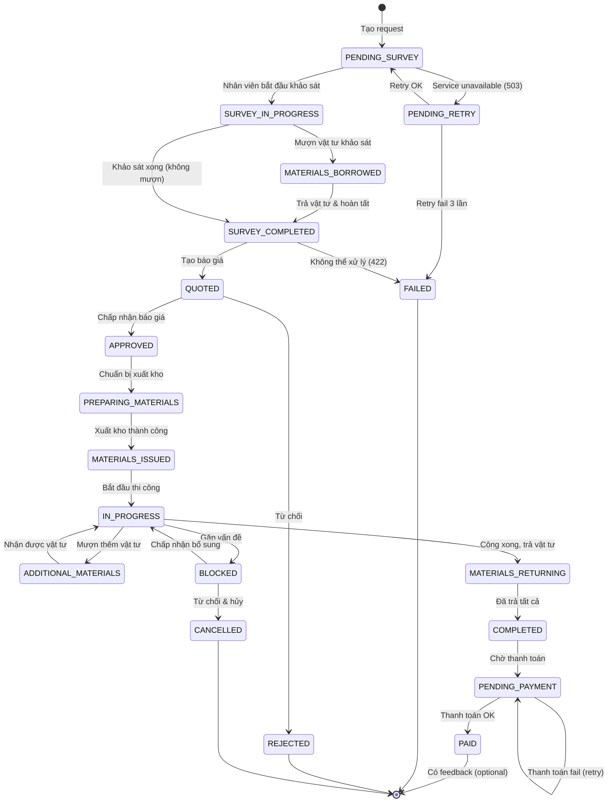
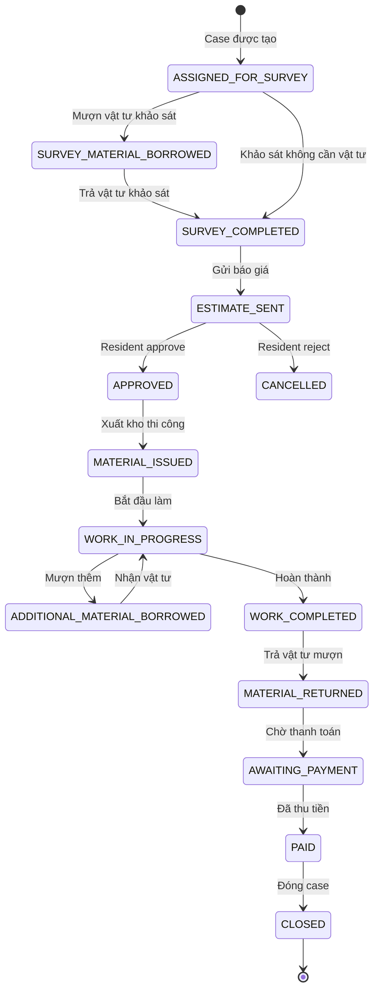

# Service Request Workflow - Residential Management System

Tài liệu mô tả luồng xử lý yêu cầu dịch vụ từ cư dân trong hệ thống quản lý chung cư.

---

## Happy Path - Luồng Thành Công (Full PMC Workflow)




---

## Error Scenarios - Ví Dụ Các Tình Huống Lỗi

### Ví Dụ 1: PMC Không Thể Xử Lý (Lý do nghiệp vụ)



**Các error codes khác**: `SERVICE_NOT_SUPPORTED`, `INSUFFICIENT_MATERIALS`, `AREA_NOT_COVERED`...

---

### Ví Dụ 2: PMC Service Unavailable (Lỗi kỹ thuật)



---

### Ví Dụ 3: Cư Dân Từ Chối Báo Giá


---

### Ví Dụ 4: Công Việc Gặp Vấn Đề



---

## Tóm Tắt Trạng Thái Request



---

## PMC Service - Internal States & Material Flow



---

## Error Codes Reference

### PMC Errors
| Error Code | Message Example |
|------------|-----------------|
| `NO_WORKERS_AVAILABLE` | "Hiện tại không có thợ điện. Vui lòng thử lại sau." |
| `SERVICE_NOT_SUPPORTED` | "Chúng tôi không hỗ trợ dịch vụ này." |
| `INSUFFICIENT_MATERIALS` | "Đang thiếu linh kiện. Dự kiến có hàng sau 3-5 ngày." |
| `AREA_NOT_COVERED` | "Khu vực này chưa được phục vụ." |

### Payment Errors (Cash - Phase hiện tại)
| Error Code | Message Example |
|------------|-----------------|
| `AMOUNT_MISMATCH` | "Số tiền thu được không khớp với hóa đơn. Cần: 800,000đ" |
| `INVOICE_EXPIRED` | "Hóa đơn đã hết hạn. Vui lòng liên hệ bộ phận hỗ trợ." |
| `DUPLICATE_PAYMENT` | "Hóa đơn này đã được thanh toán rồi." |
| `INVALID_PAYMENT_PROOF` | "Minh chứng thanh toán không hợp lệ." |

### Payment Errors (Online - Phase sau)
| Error Code | Message Example |
|------------|-----------------|
| `INSUFFICIENT_BALANCE` | "Tài khoản không đủ số dư." |
| `GATEWAY_ERROR` | "Cổng thanh toán tạm thời gián đoạn." |
| `PAYMENT_CANCELLED` | "Bạn đã hủy giao dịch." |
| `TIMEOUT` | "Giao dịch hết thời gian chờ." |

### Inventory Errors
| Error Code | Message Example |
|------------|-----------------|
| `MATERIAL_NOT_AVAILABLE` | "Vật tư trong kho không đủ. Vui lòng đặt PO trước." |
| `MATERIAL_BORROW_LIMIT_EXCEEDED` | "Đạt giới hạn mượn. Vui lòng trả vật tư trước." |
| `MATERIAL_RETURN_MISMATCH` | "Số lượng trả không khớp với đã mượn." |

---

## Ghi Chú

**Commands** (sync, cần response):

### Request Service → PMC
- `CreateCase(requestId, snapshot)` - Tạo case mới cho request

### Request Service → Payment
- `CreateInvoice(requestId, amount, residentId, method)` - Tạo hóa đơn (method: CASH/ONLINE)
- Phase hiện tại: `method=CASH`, tạo hóa đơn thủ công

### PMC → Payment
- `ConfirmCashPayment(invoiceId, cashAmount, paymentProof, collectedBy)` - Xác nhận thanh toán tiền mặt

### Request Service → PMC (Work)
- `StartWork(caseId, requestId)` - Bắt đầu thi công
- `ResumeWork(caseId)` - Tiếp tục công việc bị block
- `CancelWork(caseId)` - Hủy công việc

### PMC ↔ Inventory
- `BorrowMaterial(caseId, items[], purpose)` - Mượn vật tư (SURVEY/INSTALLATION)
- `ReturnMaterial(borrowId, items[], condition, usedQty)` - Trả vật tư
- `CreateStockOutOrder(caseId, items[], purpose)` - Xuất kho chính thức

**Events** (async, thông báo):
- `EstimateCreated` - Đã tạo báo giá
- `PaymentConfirmed` - Thanh toán thành công (CASH/ONLINE)
- `PaymentFailed` - Thanh toán thất bại
- `WorkStarted` - Bắt đầu làm
- `WorkCompleted` - Hoàn thành công việc
- `WorkBlocked` - Công việc bị block
- `RequestRejected` - Resident từ chối báo giá
- `FeedbackSubmitted` - Resident đã đánh giá

---

## Material Purposes

| Purpose | Mô tả | Trạng thái sau khi mượn |
|---------|-------|------------------------|
| `SURVEY` | Vật tư dùng cho khảo sát hiện trạng | Phải trả lại sau khi khảo sát xong |
| `INSTALLATION` | Vật tư dùng cho thi công | Trả lại phần dư, ghi nhận phần đã dùng |

---

## PMC Service - Material Flow Summary

```
┌─────────────────────────────────────────────────────────────────────────┐
│                        PMC SERVICE FULL WORKFLOW                         │
├─────────────────────────────────────────────────────────────────────────┤
│                                                                         │
│  PHASE 1: KHẢO SÁT                                                      │
│  ┌──────────────────┐      ┌──────────────────┐      ┌──────────────┐  │
│  │ Cần vật tư?      │──YES─→│ BorrowMaterial   │─────→│ Mượn & Dùng  │  │
│  └──────────────────┘      │ (purpose=SURVEY) │      └──────────────┘  │
│       │ NO                     └──────────────────┘            │       │
│       ▼                                                         ▼       │
│       └─────────────────────────────────────────────────→ ReturnMaterial│
│                                                                   │       │
│  PHASE 2: BÁO GIÁ ────────────────────────────────────────────┘       │
│       │                                                                 │
│       ▼                                                                 │
│  PHASE 3: CHẤP NHẬN BÁO GIÁ                                            │
│  ┌──────────────────┐                                                    │
│  │ Approve Estimate  │───→ APPROVED (không thanh toán ngay)             │
│  └──────────────────┘                                                    │
│       │                                                                 │
│       ▼                                                                 │
│  PHASE 4: CHUẨN BỊ THI CÔNG                                              │
│  ┌──────────────────┐                                                    │
│  │ CreateStockOut   │─────────────────────────────────────────┐         │
│  │ (Xuất kho chính) │                                           │         │
│  └──────────────────┘                                           │         │
│       │                                                        │         │
│       ▼                                                        ▼         │
│  PHASE 5: THI CÔNG                                               ┌──────────────┐
│  ┌──────────────────┐      ┌──────────────────┐              │ Cần thêm?    │
│  │ Worker thực hiện │──NEED─→│ BorrowMaterial   │──YES────────→│ (purpose=    │
│  └──────────────────┘      │ (purpose=INSTALL)│              │  INSTALL)    │
│                            └──────────────────┘              └──────────────┘
│       │                                                        │ NO         │
│       ▼                                                        │            │
│  PHASE 6: HOÀN THÀNH                                            │            │
│  ┌──────────────────┐      ┌──────────────────┐                │            │
│  │ WorkCompleted    │──MUST─→│ ReturnMaterial   │◀───────────────┘            │
│  └──────────────────┘      │ (return + used)  │                              │
│                             └──────────────────┘                              │
│       │                                                                 │
│       ▼                                                                 │
│  PHASE 7: THANH TOÁN (SAU KHI HOÀN THÀNH)                               │
│  ┌──────────────────┐      ┌──────────────────┐      ┌──────────────┐  │
│  │ CreateInvoice    │─────→│ Resident trả     │─────→│ ConfirmCash  │──→ PAID
│  │ (CASH, manual)   │      │ tiền mặt         │      │ Payment      │        │
│  └──────────────────┘      └──────────────────┘      └──────────────┘  │
│                                                                         │
│  PHASE 8: FEEDBACK ─────────────────────────────────────────────────────→ │
│                                                                         │
└─────────────────────────────────────────────────────────────────────────┘
```
